# CI/CD Fundamentals & Jenkins Pipeline Setup

## Table of Contents

* [Overview](#overview)
* [What Does CI/CD Mean?](#what-does-cicd-mean)
* [What Is a CI/CD Pipeline?](#what-is-a-cicd-pipeline)
* [Pipeline Stages](#pipeline-stages)
* [Webhook Concepts](#webhook-concepts)
* [Class Notes](#class-notes)
* [Timeline (class playback videos)](#timeline-class-playback-videos)
* [Automated Jenkins Setup (AMI / User Data)](#automated-jenkins-setup-ami--user-data)
* [Pipeline Runtime Prerequisites (Manual / Verification)](#pipeline-runtime-prerequisites-manual--verification)
  * [System Verification](#system-verification)
  * [Python](#python)
  * [Terraform](#terraform)
* [System Configuration Notes](#system-configuration-notes)
* [Create an IAM user group](#create-an-iam-user-group)

---

## Overview

This project demonstrates the setup of a **CI/CD pipeline using Jenkins on AWS EC2**, combining:

* Automated infrastructure provisioning (via EC2 user data + AMI)
* Manual pipeline creation and validation
* Integration with DevOps tooling (Terraform, AWS CLI, etc.)

The goal is to build a **reproducible CI/CD environment** and understand both:

* infrastructure automation
* pipeline execution flow

---

## What Does CI/CD Mean?

* **CI = Continuous Integration**

  * Developers frequently push code → system automatically builds and tests it
  * Goal: catch problems early

* **CD = Continuous Delivery / Deployment**

  * Continuous Delivery → Code is always ready to deploy (manual approval)
  * Continuous Deployment → Code is automatically deployed (no human step)
  * Goal: commit small, frequently, test fast, fix early

---

## What Is a CI/CD Pipeline?

A CI/CD pipeline is:

> An automated process that takes your code from “just written” → “running in production”

Think of it like an **assembly line for your application**.

---

## Pipeline Stages

```
plan → code → build → test → release → deploy → operate → monitor
```

[⬆ Back to Table of Contents](#table-of-contents)

---

## Webhook Concepts

**Webhook invocation** is a core CI/CD concept.

### Simple Definition

A webhook is when one system automatically sends a message (HTTP request) to another system when something happens.

### CI/CD + Webhook Flow

1. You push code to GitHub
2. GitHub triggers a webhook (invocation)
3. Jenkins receives the webhook
4. Jenkins starts the pipeline
5. Code is built, tested, and deployed

* **Webhook** = mechanism
* **Invocation** = the moment it is triggered

[⬆ Back to Table of Contents](#table-of-contents)

---

## Class Notes

**Class 7 (3/24/26) – Tuesday (working session)**
Week 29 (Jenkins Week 4)

### Goal

Provide a repository showing:

* Proof of successful pipeline execution
* Webhook invocation activity
* Terraform-based deployment
* Armageddon clearance

---

## Timeline (class playback videos)

* Tuesday 17th → [Pipeline setup](https://youtu.be/voKMsyNbAG8?si=l7G1rWzwTJmSEaES)
* Saturday 21st → Webhook creation

[⬆ Back to Table of Contents](#table-of-contents)

---

## Automated Jenkins Setup (AMI / User Data)

The Jenkins environment is **fully automated** using EC2 user data and captured in a reusable AMI.

This automation includes:

* System update (`dnf update`)
* Java 21 installation
* Jenkins installation and configuration
* Pre-installed Jenkins plugins (pinned versions)
* Swap memory configuration (4G)
* `/tmp` allocation increase (if mounted as tmpfs)

This allows rapid environment provisioning without manual setup.

---

## Pipeline Runtime Prerequisites (Manual / Verification)

These steps are only required **if not already baked into the AMI** or when validating the environment.

---

### System Verification

```bash
aws --version
```

Amazon Linux 2023 includes AWS CLI v2 by default.

---

### Python

```bash
sudo dnf install -y python3
python3 --version
```

---

### Terraform

```bash
sudo dnf install -y dnf-plugins-core
sudo dnf config-manager --add-repo https://rpm.releases.hashicorp.com/AmazonLinux/hashicorp.repo
sudo dnf install -y terraform
terraform version
```

Terraform CLI is required for infrastructure deployment in pipelines.

---

## System Configuration Notes

- extas I added in the user data
  
### /tmp Allocation

* Configured automatically via user data
* Increased to 4G when `/tmp` is mounted as `tmpfs` (memory-backed filesystem)
* Supports Jenkins builds and temporary file usage

### Swap Memory

* 4G swap file provisioned automatically
* Provides additional memory headroom
* Improves system stability during resource-intensive operations

---

to use Jenkins to create a pipeline you need
- software
- source code
- Jenkins file
- IAM users (allows Jenkins to deploy information into AWS)

---

## Create an IAM user group

go to AWS -> IAM -> User groups
- Create Group: dennis-jenkins-test-1
- Attach permissions policies: AdminisratorAccess

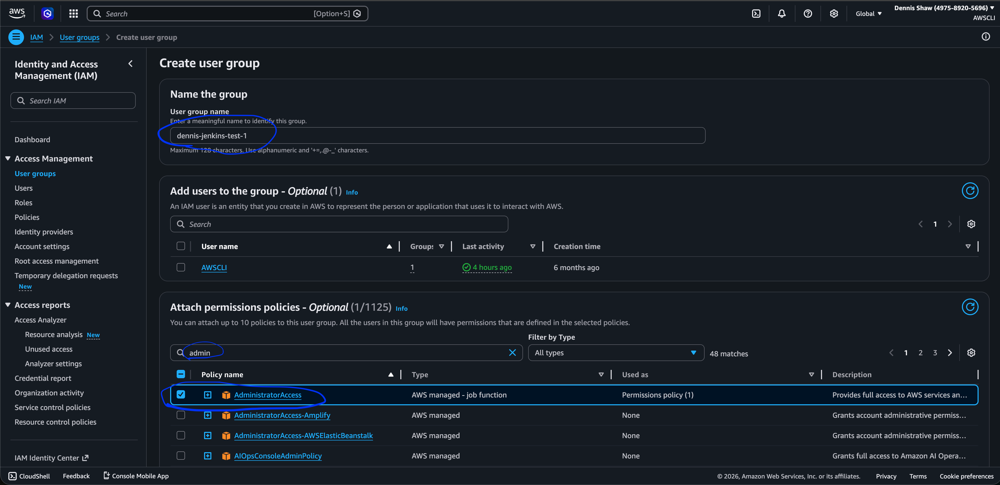

click - Create User group


go to users -> Create user
name it: jenkins-test-01
click - Next

Set permissions -> choose the user group
click - Next

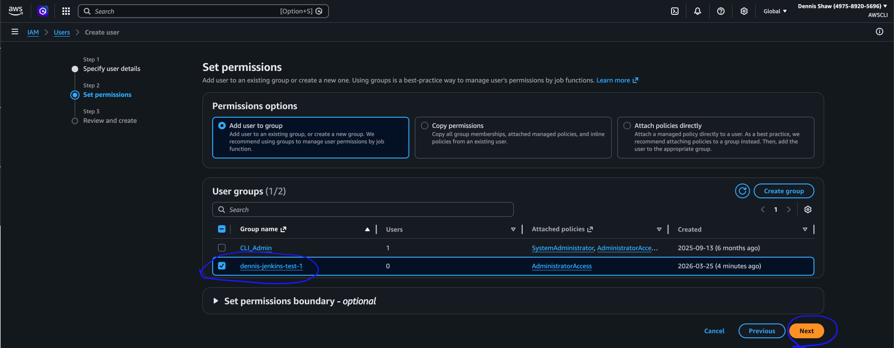

Review -> Create user

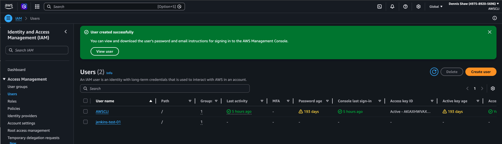

to get outputs after the instance launches run (in SSH):

```bash
cat /var/log/cloud-init-output.log
```

```bash
echo "Open Jenkins: http://$PUBLIC_IP:8080"
echo "To get initial password run:"
echo "sudo cat /var/lib/jenkins/secrets/initialAdminPassword"
```

Jenkins IP: http://************:8080/
Jenkins admin pw: 
Jenkins user (admin): Admin
Jenkins pw (admin): *********
Jenkins IAM username: jenkins-test-01
Jenkins IAM access key: *************
jenkins IAM secret key: *********************

create access key:

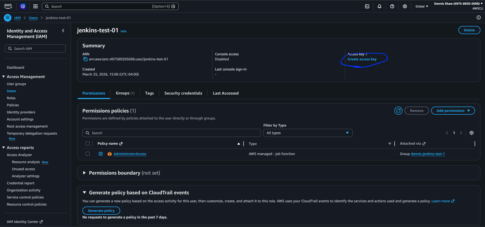

choose - Command Line Interface (CLI)
confirm
Next


Set description tag - add description
Create access key

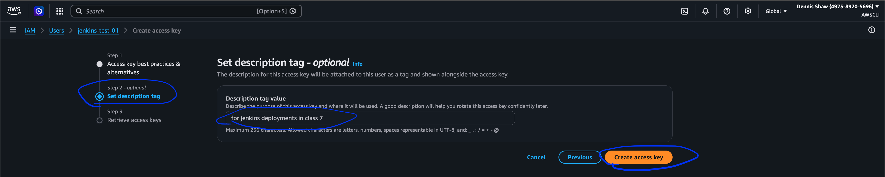

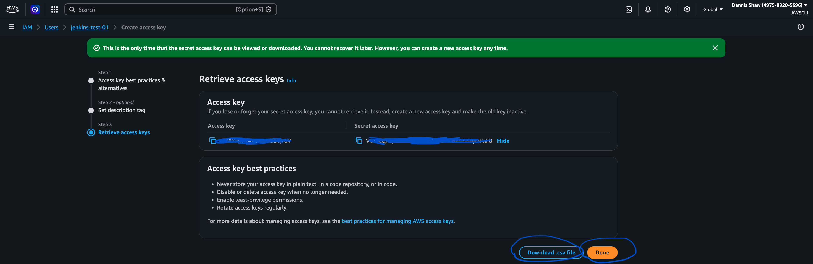

Don't share this with anyone. Take a screenshot or download the .cvs file. Put it somewhere safe. I recommend in the initial class setup folder

---

### Go to the Jenkins webpage

- manage Jenkins -> Credentials -> Add Credentials -> AWS Credentials 
Next
  - ID
  - Description
  - Access Key ID (whatever you want to name it)
  - Secret Access Key
  
  Create

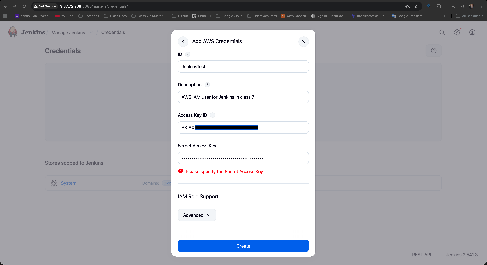

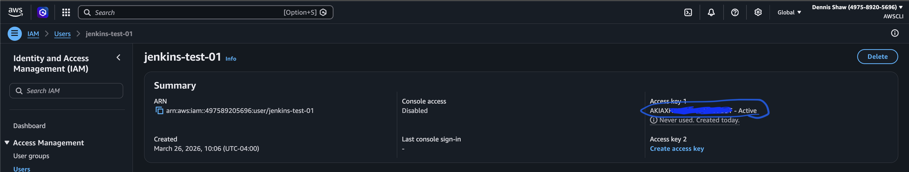

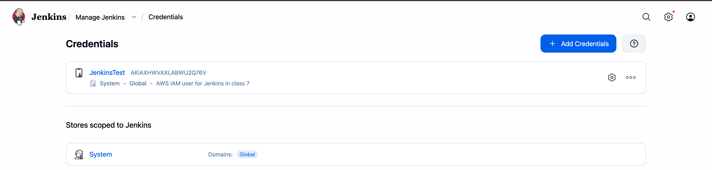

---

## Go to the AWS SSH

type:

```bash
aws configure
```

- access key:
- secret code:
- default region: us-east-1
- output format: json


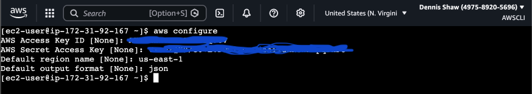

---

## Go to Github fork [Aaron's repo](https://github.com/DennistonShaw/AaronMcDonald_jenkins-s3-test/blob/main/Jenkinsfile)

- copy files
- in the Jenkins file delete the  stage('Testing') jfrog BLOCK
- make sure the regions align with your regions in all files

---

## Create an S3 Bucket in the AWS console

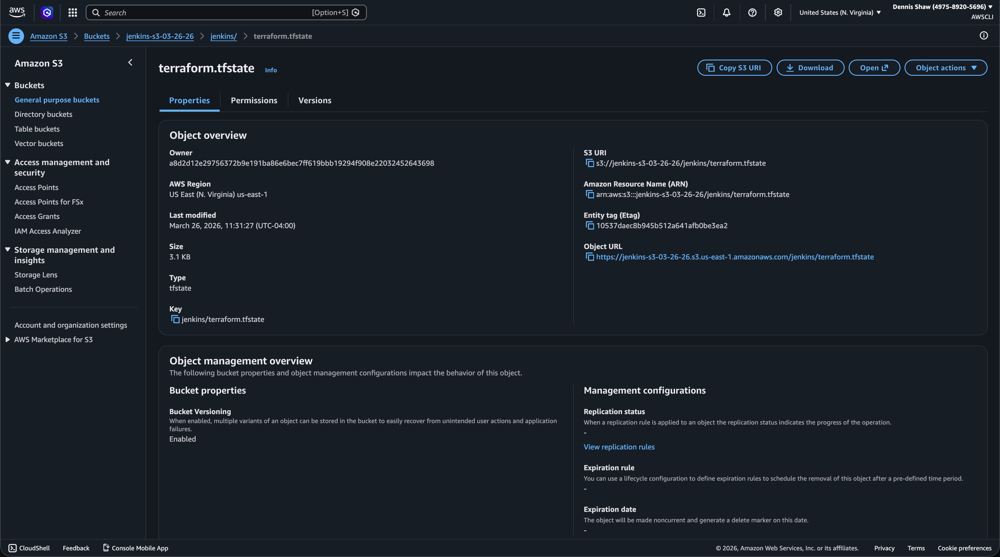

---

#### go to Jenkins webpage create a job
Jenkins -> New Item -> Enter an Item Name: - 03-25-26_test-pipeline-01
select Pipeline and hit OK

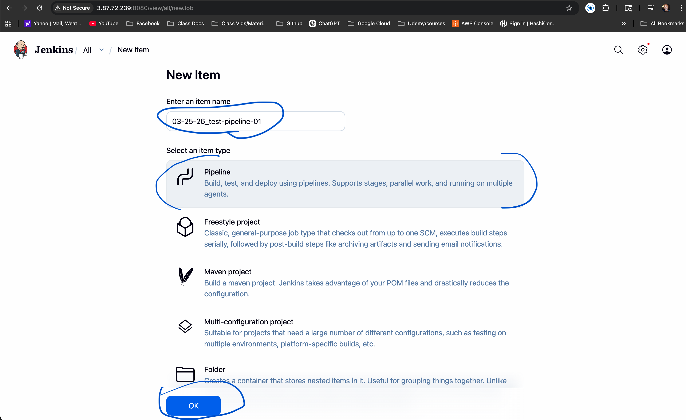

## Configure 

**make changes as you scroll down**
- General
  - Building our first pipeline for class 7 in Jenkins
- check GitHub project
  - past Project url: 
    - https://github.com/DennistonShaw/Class7-HW-Deliverables.git
- Pipeline -> Definition:
  - Pipeline script from SCM
- SCM:
  - Git
- Repository URL:
  - https://github.com/DennistonShaw/Class7-HW-Deliverables.git
- Branch Specifier (blank for 'any')
  - */main
- Script Path
  - week27-hw-jenkins/Jenkinsfile

- click Apply
- click Save

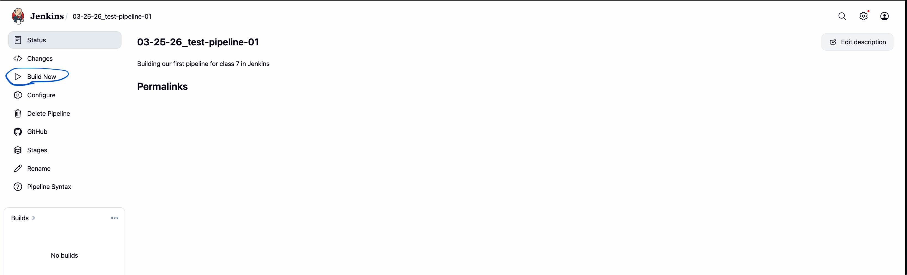

**Build Now**
- click build
- click #1
- Console Output

**During the run Jenkins:**
- will ask you to deploy or abort
  - click deploy

- will say `Input requested`
  - (click on it)
- next will ask you `Do you want to run terraform destroy?`
- choose yes or no
- submit

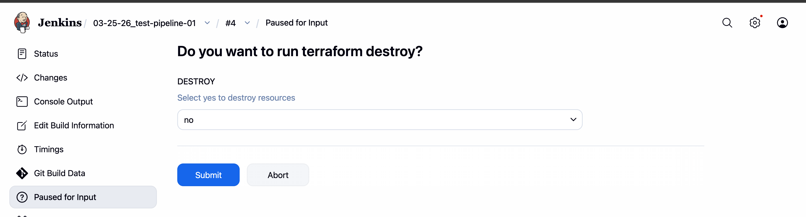

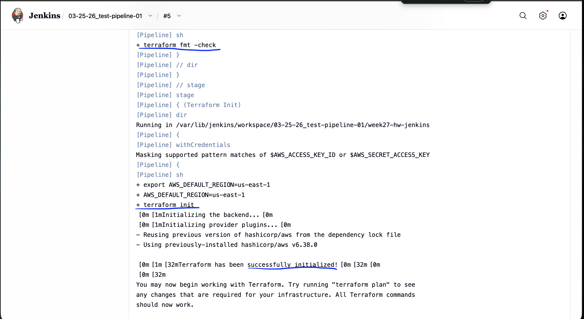

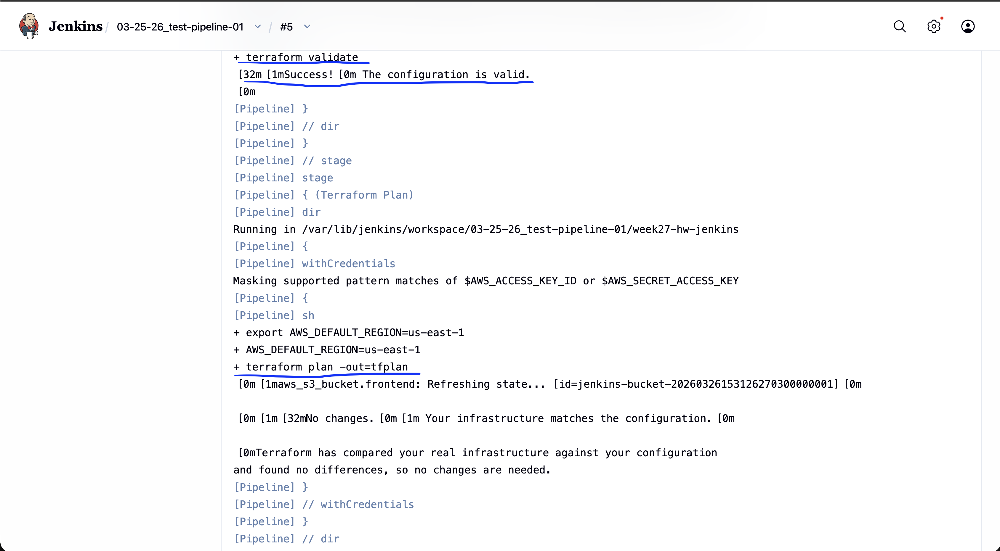

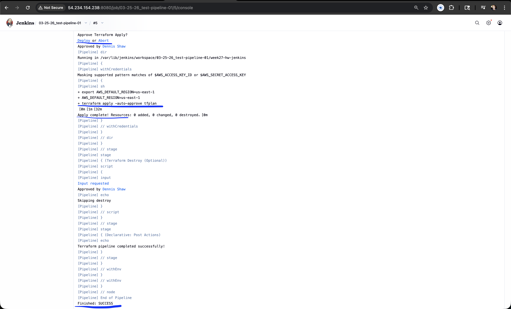

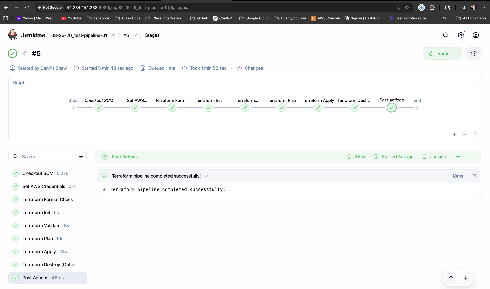

---

## [Webhooks & Triggers](https://github.com/aaron-dm-mcdonald/new-jenkins-s3-test/blob/main/trigger.md)


---

## Teardown checklist
1. Go to Jenkins (or SSH into your instance) and run:

```bash
cd week27-hw-jenkins
terraform destroy
```

type: yes
  - this deletes:
  - s3 bucket (from the log)
  - and any infrastructure created by Terraform

2. Delete IAM Access Key
3. Deactivate security key then Delete IAM User
4. Terminate EC2 Instance
5. 

---

[⬆ Back to Table of Contents](#table-of-contents)
