# Jenkins Installation on AWS EC2 (Manual + Automated Plugins)

## Overview

This guide documents how to manually install Jenkins on an AWS EC2 instance and extend the setup with automated plugin installation for repeatable rebuilds.

---

## Class Info

* **Date:** 03-10-26 (Tuesday)
* **Class:** 7: Zion
* **Teacher:** Black Muslim

---

## Important Career Insight

Understanding Jenkins manually like this is very valuable.

Many engineers only know:

* GitHub Actions

But Jenkins knowledge means you understand:

* CI/CD fundamentals
* Build servers
* Pipelines
* DevSecOps integration

This is strong DevOps knowledge.

---

## Table of Contents

- [Launch EC2 Instance](#1-launch-ec2-instance)
- [User Data Script (Jenkins Install)](#2-user-data-script-jenkins-install)
  - [Launch Instance](#launch-instance)
  - [Go to Jenkins Webpage](#go-to-jenkins-webpage)
  - [Increase Space Allotted](#increase-space-allotted)
- [Plugin List (Manual Reference)](#3-plugin-list-manual-reference)
- [Automating Plugin Installation](#4-automating-plugin-installation)
  - [Export Plugin List](#export-plugin-list-one-time)
  - [Automated Plugin Install Script](#automated-plugin-install-script)
- [Environment Validation](#5-environment-validation)
- [AMI (Amazon Machine Imaging)](#6-ami-amazon-machine-imaging)
- [How to Launch This Later](#7-how-to-launch-this-later)
  - [Set up after AMI](#set-up-after-ami)
- [Tear it Down (In the Console)](#8-tear-it-down-in-the-console)

---

## 1. Launch EC2 Instance

**Go to AWS Console**

* set up vpc or use the default
* EC2 → Instances → Launch Instance

---

### Instance Configuration

**Name**

* Choose a name for your instance

**Instance Type**

* `t3.small`

---

### Key Pair (Login)

* Choose existing key pair or create a new one

---

### Security Group

Go to:

* Network settings → Edit
* Select correct VPC
* Firewall (Security Group)

If creating a new one:

* EC2 → Security Groups → Create Security Group

| Type       | Port | Source    |
| ---------- | ---- | --------- |
| Custom TCP | 8080 | 0.0.0.0/0 |
| SSH        | 22   | 0.0.0.0/0 |

> Suggestion: Keep this security group for reuse (no cost to keep it)

---

### Storage

* Increase from default 8 GiB → **20 GiB**

go to Advanced details


### 2. User Data Script (Jenkins Install)

Paste into **Advanced Details → User Data**

Here is the new user data with the automated script

- [v2-user-data-w-jenkins-plugins.sh](/jenkins/v2-user-data-w-jenkins-plugins.sh)
- I made a few changes to the user data example:
  - Increased /tmp allocation to 4G to support Jenkins build workloads requiring temporary storage
  - Implemented a 4G swap file to enhance system stability during memory-intensive CI/CD operations

### Launch instance

connect to instance via
instance -> connect

make sure the system is running, run:

```bash
sudo systemctl status jenkins
```

* looking for that active (running)

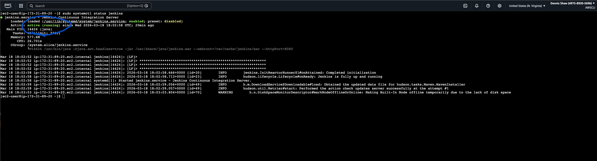

### Go to Jenkins webpage 

go to the instance get the public IP - 44.203.41.93
we need to get to the 8080 port

open new web browser http://44.203.41.93:8080

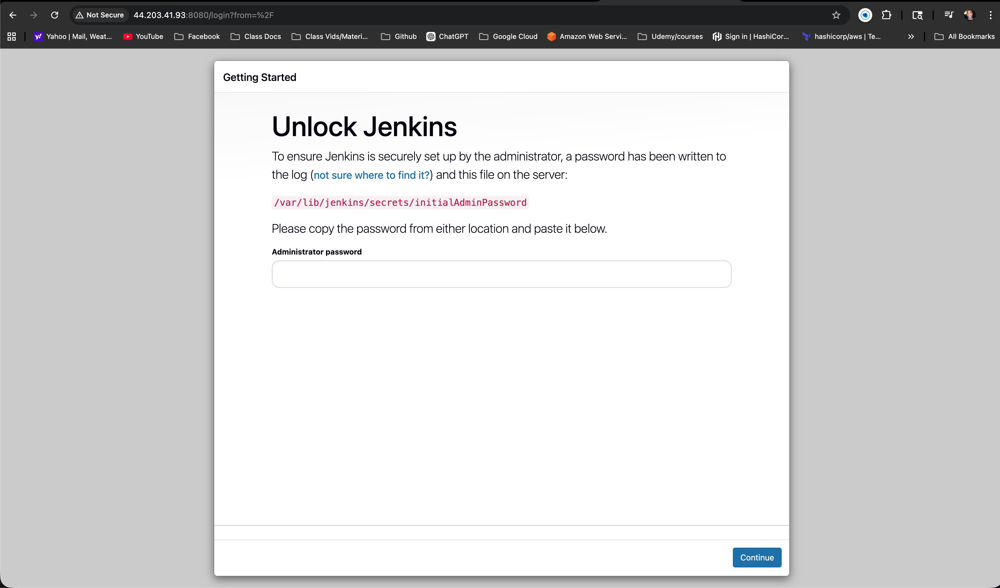

get the addministrator password from the ssh

```bash
sudo cat /var/lib/jenkins/secrets/initialAdminPassword
```

password: 1bbe87fa8a8a4fae92a6be5ce335a0a5

select installed suggested plugins

Create First Admin User:
save and continue

### Increase Space Allotted

- run this in SSH to determine how much space is aloted.

```bash
df -h /tmp
```

this command display available space on a file system df command

```
Filesystem      Size  Used Avail Use% Mounted on
tmpfs           957M  4.8M  952M   1% /tmp
```

as you can see there is only 952M available we want to increase this

```bash
mount | grep /tmp
```

increase the alotted space

```bash
sudo mount -o remount,size=4G /tmp
```

check in connect is the changes were made:

```
[ec2-user@ip-172-31-89-20 ~]$ df -h /tmp
Filesystem      Size  Used Avail Use% Mounted on
tmpfs           4.0G  4.8M  4.0G   1% /tmp
[ec2-user@ip-172-31-89-20 ~]$ 
```

refresh the Jenkins site and sign back in
first restart from the instance connect:

```bash
sudo systemctl restart jenkins
sudo systemctl status jenkins --no-pager
```

This will force you to sign back into Jenkins webpage

Back to Jenkins site
sign in  and go to system -> manage system -> nodes to ensure temp space changed then go back and go to Plugins and start downloading the list

---

# 3. Plugin List (Manual Reference)

### [Jenkin Plugin IDs](jenkins-plugin-ids.txt)

### [Jenkin Plugin names](jenkins-plugin-ids.txt)

**Go to:** Manage Jenkins → Script Console and run this

```groovy
Jenkins.instance.pluginManager.plugins.each {
  println("${it.getShortName()}:${it.getVersion()}")
}
```

What it does:

* Accesses the Jenkins instance
* Loops through all installed plugins
* Prints:

  * plugin name
  * plugin version
  
[🔝 Return to Table of Contents](#table-of-contents)

---

# 4. Automating Plugin Installation

Instead of manually searching plugins every time, you can automate installation using a **plugins.txt file + Jenkins Plugin Manager Tool**.

---

#### Export Plugin List (One-Time)

After installing plugins manually once:

Go to:

* Jenkins → Manage Jenkins → Script Console

Run:

```groovy
Jenkins.instance.pluginManager.plugins.each {
  println("${it.getShortName()}: ${it.getVersion()}")
}
```

Save output as:

`plugins.txt`

---

### Automated Plugin Install Script

Add this **after Jenkins install** in your user data:

use the partially automated user script that will run all the plugins

after launching the EC2 wait a few minutes and open the Jenkins page

* `http://<EC2-PUBLIC-IP>:8080`

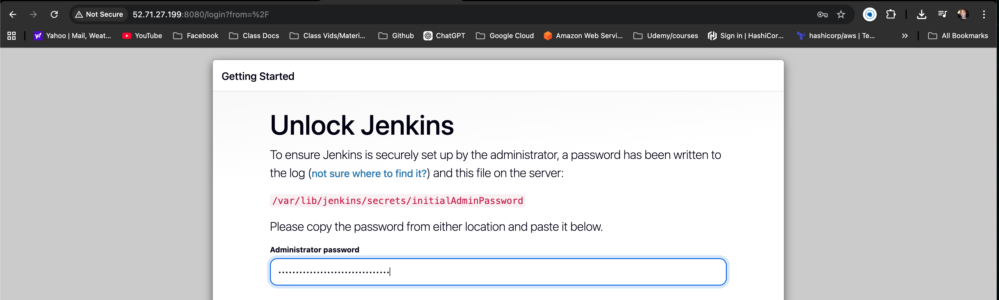

* get the password in the instance connect

```bash
sudo cat /var/lib/jenkins/secrets/initialAdminPassword
```

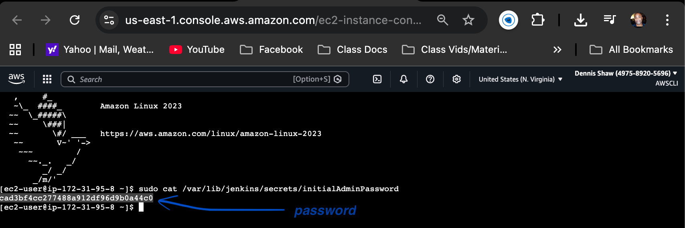

set up jenkins account: user, password, etc.

Increase size of database see the relevent steps as shown before

[🔝 Return to Table of Contents](#table-of-contents)

---

# 5. Environment Validation
*This is a Smoke Test Pipeline that proves the environment is ready to run real workloads*

Go to: Jenkins website
- from the dashboard -> **New Item** -> select **Pipeline**
- enter name ie. ci-cd-pipeline-test
- click **OK**
- scroll down to **Pipeline Definition**
- paste in the script box. The definition box should say Pipeline script:

```bash
pipeline {
    agent any
    stages {
        stage('Test Environment') {
            steps {
                sh 'echo "Jenkins is working"'
                sh 'whoami'
                sh 'java -version'
                sh 'git --version'
                sh 'df -h'
            }
        }
    }
}
```

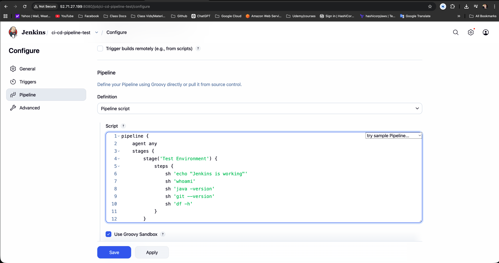

* click **save**
* takes you to the next page click **Build Now** on the left
  
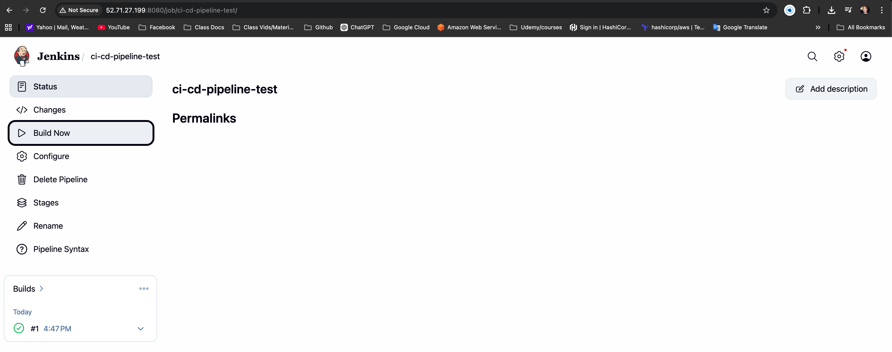

* see below, it is building, when it finishes click Build in that box
* click **#1** under the "Build Time Trend"
* click **Console Output** on the left

you will get something like this:

```
Started by user Dennis Shaw
[Pipeline] Start of Pipeline
[Pipeline] node
Running on Jenkins in /var/lib/jenkins/workspace/quick test
[Pipeline] {
[Pipeline] stage
[Pipeline] { (Test Environment)
[Pipeline] sh
+ echo 'Jenkins is working'
Jenkins is working
[Pipeline] sh
+ whoami
jenkins
[Pipeline] sh
+ java -version
openjdk version "21.0.10" 2026-01-20 LTS
OpenJDK Runtime Environment Corretto-21.0.10.7.1 (build 21.0.10+7-LTS)
OpenJDK 64-Bit Server VM Corretto-21.0.10.7.1 (build 21.0.10+7-LTS, mixed mode, sharing)
[Pipeline] sh
+ git --version
git version 2.50.1
[Pipeline] sh
+ df -h
Filesystem        Size  Used Avail Use% Mounted on
devtmpfs          4.0M     0  4.0M   0% /dev
tmpfs             957M     0  957M   0% /dev/shm
tmpfs             383M  436K  383M   1% /run
/dev/nvme0n1p1     20G  3.4G   17G  17% /
tmpfs             4.0G  4.8M  4.0G   1% /tmp
/dev/nvme0n1p128   10M  1.3M  8.7M  13% /boot/efi
tmpfs             192M     0  192M   0% /run/user/1000
[Pipeline] }
[Pipeline] // stage
[Pipeline] }
[Pipeline] // node
[Pipeline] End of Pipeline
Finished: SUCCESS
```

this proves all the important pieces work:

* Jenkins can run a pipeline
* the executor/node is working
* Jenkins runs as the jenkins user
* Java is installed and usable
* Git is installed and usable
* disk and /tmp space are healthy
* the job completed with Finished: SUCCESS

This is the environment validation stage where you verify that your Jenkins server is ready for real pipelines. Before you run:
- Terraform
- Docker builds
- Security scans
- AWS deployments

You MUST confirm:
- Tools exist
- Permissions work
- System is stable

otherwise piplelines fail later and debugging becomes messy.

[🔝 Return to Table of Contents](#table-of-contents)

---

# 6. AMI (Amazon Machine Imaging)
- create an AMI of the Jenkins EC2 for easy reproduction

1. go to EC2 Dashboard -> EC2 -> Instances
2. select instance and stop instance (prevents currupted snapshots)
3. Create Image:
   - Actions → Image and templates → Create image

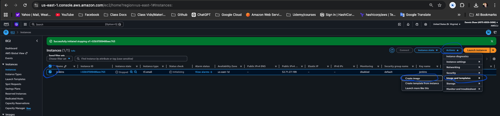

1. Fill in details:
   - name: jenkins-devsecops-v1
   - description: Jenkins with plugins + pipeline setup

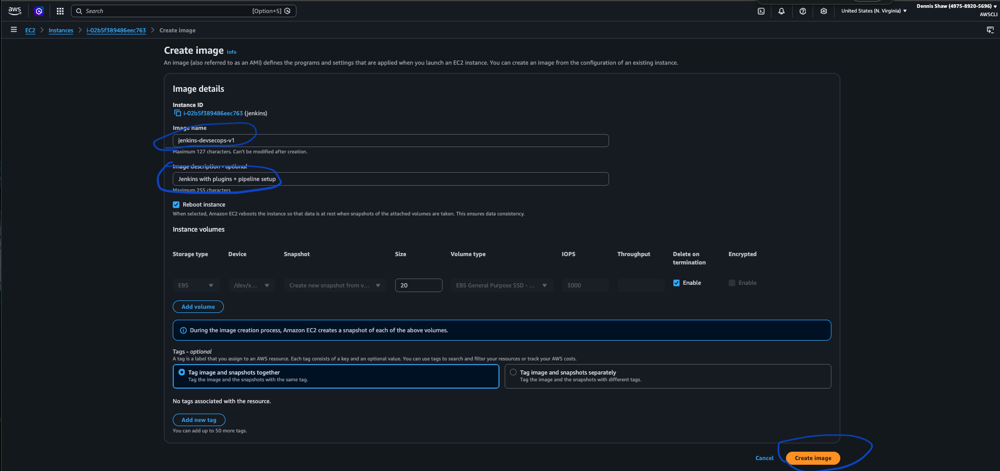

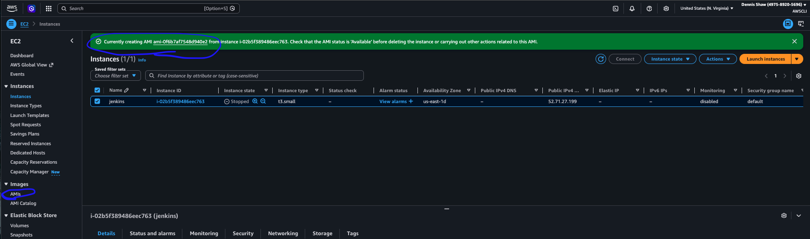

5. Create image
6. Go to: EC2 → AMIs
   - make sure status goes from pending → available

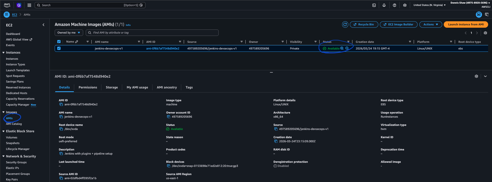

[🔝 Return to Table of Contents](#table-of-contents)

---

## 7. How to launch this later

1. Click Launch Instance
2. Go to My AMIs and select jenkins-devsecops-v2
3. Launch from AMI
      - Instance type
      - Key pair
      - Security group

*note: its better to create an AMI not to be confused with just doing a snapshot because the snapshot alone cannot launch an EC2 directly where an AMI = snapshot + boot configuration.

Snapshot is for backup
AMI is for reusable infrastructure

[🔝 Return to Table of Contents](#table-of-contents)

---

## Set up after AMI

go to AMI select and `Launch instance from AMI`


connect and check that its running:
`sudo systemctl status jenkins`

#### These validation commands were included in user data and executed at instance launch.

```bash
echo "===== SYSTEM INFO ====="
uname -a

echo ""
echo "===== AWS CLI ====="
aws --version

echo ""
echo "===== PYTHON ====="
python3 --version

echo ""
echo "===== TERRAFORM ====="
terraform version

echo ""
echo "===== JAVA ====="
java -version

echo ""
echo "===== GIT ====="
git --version

echo ""
echo "===== MEMORY ====="
free -h

echo ""
echo "===== DISK ====="
df -h

echo ""
echo "===== TMP ====="
df -h /tmp
```

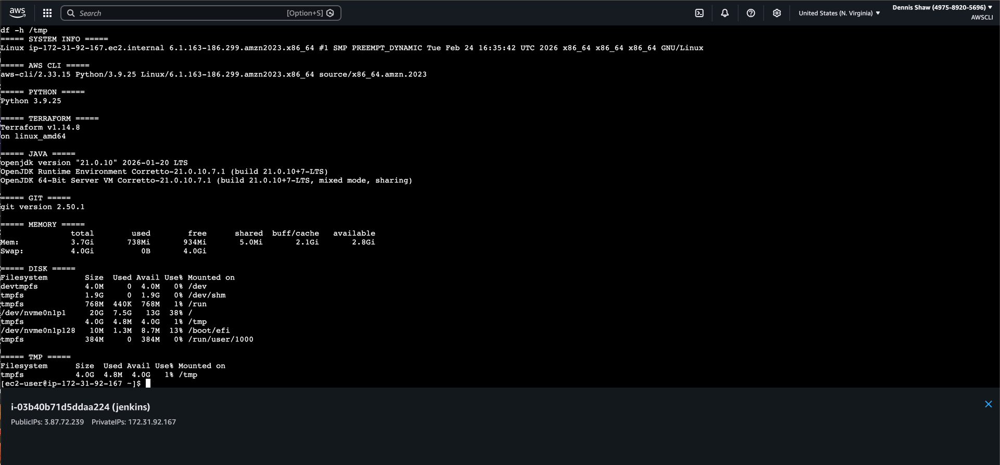

[🔝 Return to Table of Contents](#table-of-contents)

---

# 8. Tear it down (In the Console)

1. Go to:
AWS Console
→ EC2
→ Instances

Select your Jenkins instance.
Click:
Instance State
→ Terminate Instance
Confirm.

2. Security Group
EC2
→ Security Groups
→ Delete Jenkins SG

3. Elastic IP (if used)
EC2
→ Elastic IPs
→ Release

4. EBS Volumes (sometimes remain)
EC2
→ Volumes
→ Delete

[🔝 Return to Table of Contents](#table-of-contents)

---