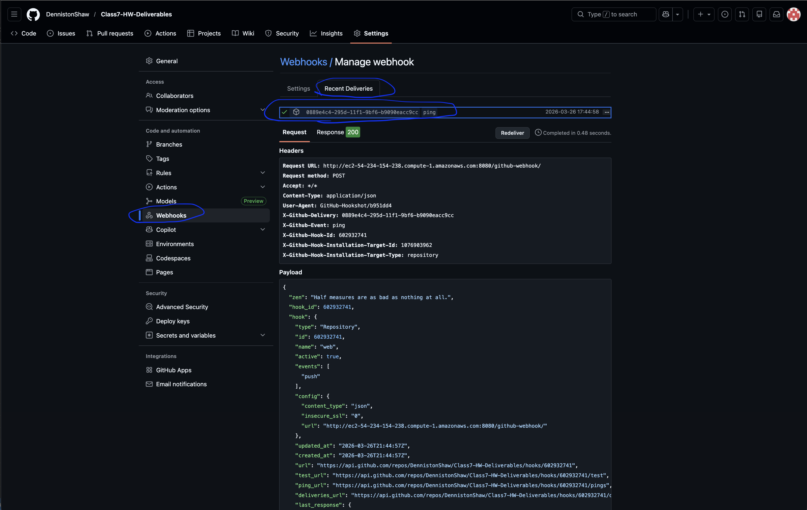
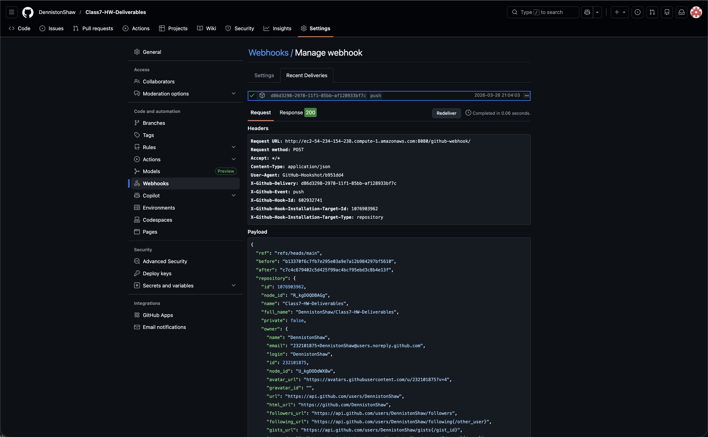
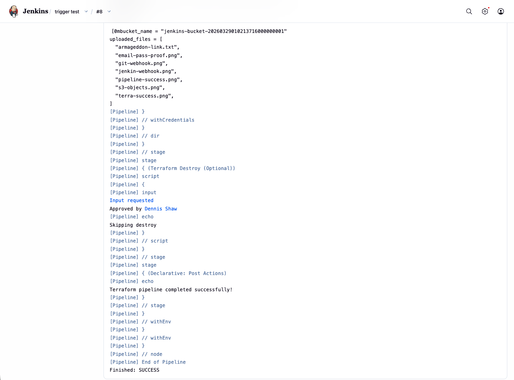

# [Webhooks & Triggers](https://github.com/aaron-dm-mcdonald/new-jenkins-s3-test/blob/main/trigger.md)

---

## Table of Contents

- [Add GitHub Webhook Trigger to Jenkins](#add-github-webhook-trigger-to-jenkins)
- [Prerequisites](#prerequisites)
- [Jenkins Config](#jenkins-config)
- [Add GitHub Webhook](#add-github-webhook)
- [Test](#test)
- [Troubleshooting](#troubleshooting)
- [What Is Happening and How It Works](#what-is-happening-and-how-it-works)
- [What a Webhook Is](#what-a-webhook-is)
- [What Happens Step by Step](#what-happens-step-by-step)
- [What the Webhook Sends](#what-the-webhook-sends)
- [Part 1 of 2](#part-1-of-2)
- [Part 2 of 2](#part-2-of-2)

---

## Add GitHub Webhook Trigger to Jenkins

## Prerequisites
- Jenkins running on EC2
- Jenkins reachable from the internet (e.g. `http://<EC2-PUBLIC-IP>:8080`)
- Repo with Jenkinsfile and terraform script 
- Github and git plugins

---

## Jenkins Config

### Make a pipeline 

1. Jenkins dashboard → New Item
2. Name it
3. Select: Pipeline
4. Click OK

### Enable GitHub Trigger 

In job configuration:

- Triggers → GitHub hook trigger for GITScm polling

### Configure

- Definition: Pipeline script from SCM
- SCM: Git
- Add HTTP repo URL
- Branch:
  `*/main`
- Script Path:
  Jenkinsfile

Save pipeline

[⬆ Back to Table of Contents](#table-of-contents)

---

## Add GitHub Webhook 
Go to Github

Repository → Settings → Webhooks → Add webhook

- Payload URL:
  `http://<YOUR-JENKINS-URL>/github-webhook/`

- Content type:
  `application/json`

- Events:
  Just the push event

Save

---

## Test

Option A:
```bash
git commit --allow-empty -m "test webhook"
git push origin main
```

Option B:
- GitHub → Webhook → Recent Deliveries
- Redeliver

[⬆ Back to Table of Contents](#table-of-contents)

---

## Troubleshooting

### Expected Result
- Push event occurs on repo
- Webhook sent from GitHub
- Jenkins job starts automatically

### Common issues
Jenkins not reachable:
- Ensure public IP or DNS
- Open port 8080 in security group

Incorrect webhook URL:
- Must end with `/github-webhook/`

No build triggered:
- Verify trigger enabled in Jenkins
- Check webhook delivery status (200 OK)

### What is a Webhook

A webhook is an HTTP callback.

- One system sends an HTTP request to another system when an event happens
- No polling is required
- It is event-driven

In this case:
- GitHub = sender
- Jenkins = receiver

What Happens Step by Step

1. You push code to GitHub
2. GitHub detects a `push` event
3. GitHub sends an HTTP POST request to:
   `http://<jenkins-url>/github-webhook/`
4. Jenkins receives the request
5. Jenkins matches the event to a configured job
6. Jenkins triggers the pipeline
7. Jenkins reads the `Jenkinsfile` from the repo
8. Pipeline runs

What the Webhook Sends

GitHub sends a JSON payload that includes:

- Repository name
- Branch
- Commit ID
- Commit message
- Author

Example (simplified):

```json
{
  "ref": "refs/heads/main",
  "repository": {
    "full_name": "aaron-dm-mcdonald/new-jenkins-s3-test"
  },
  "head_commit": {
    "id": "abc123",
    "message": "update"
  }
}
```

[⬆ Back to Table of Contents](#table-of-contents)

---

## Set up Jenkins to expect a Webhook

**The difference between the first Pipline and this is the Triggers**

Go to Jenkins -> name it -> choose Pipeline

**Configure:**
- in Tiggers select GitHub hook trigger for GITcm polling
  
**Pipeline:**

- Definition:
  - Pipeline script from SCM
    - SCM:
      - git
    - Repository URL:
      - https://github.com/DennistonShaw/Class7-HW-Deliverables.git
    - Brances to build:
      - */main
    - Script path:
      - week27-hw-jenkins/Jenkinsfile/
- Apply
- Save


**Tell Github to make a Webhook when the commits happen**

Go to Github -> Repository -> Settings


**Add Webhook** (might have to confirm access)

Payload URL: (http:// + URL + Port + Script Path)
- `http://ec2-54-234-154-238:8080/github-webhook/`

**Content Type**

- Application/json

Add Webhook


Go back to Jenkins and Build now to send a trigger



run this

```bash
git commit --allow-empty -m "test webhook"
git push origin main
```

expected results:





[⬆ Back to Table of Contents](#table-of-contents)

---

