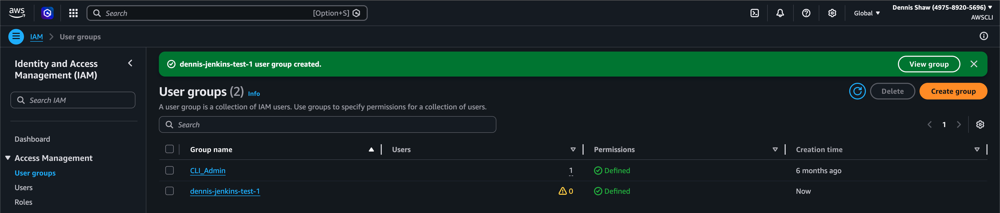
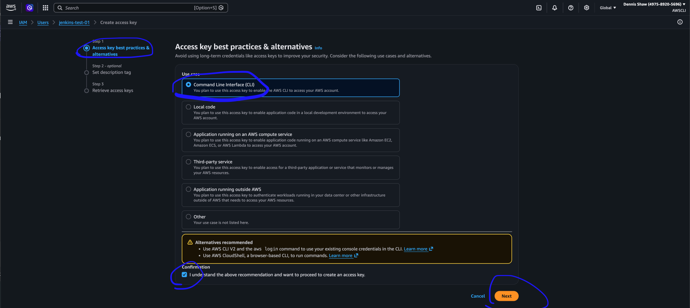
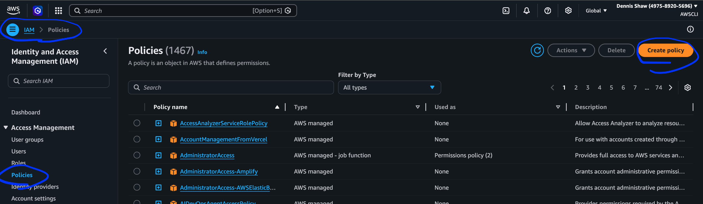
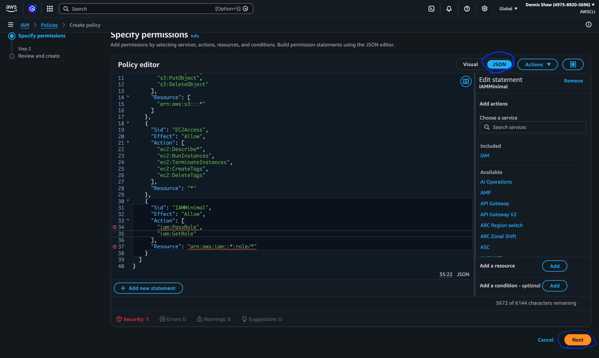
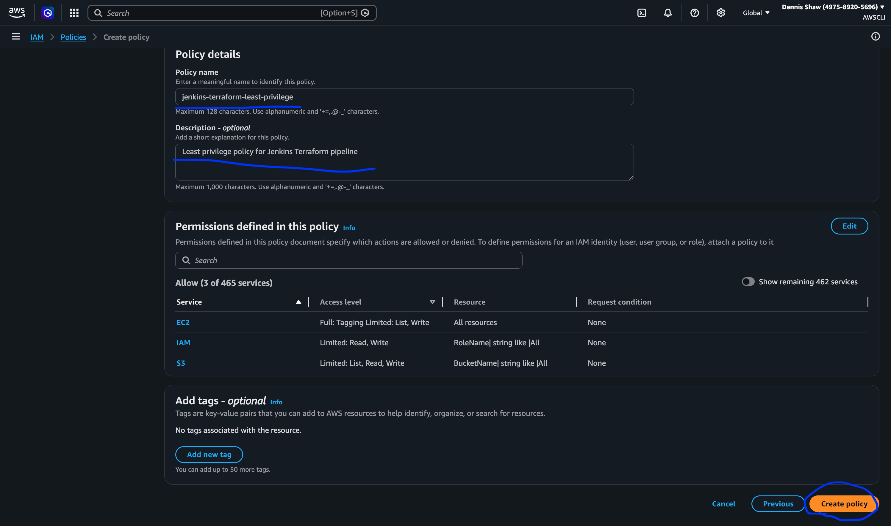
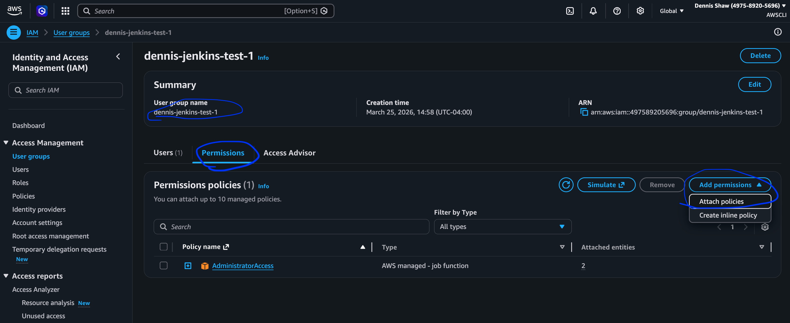
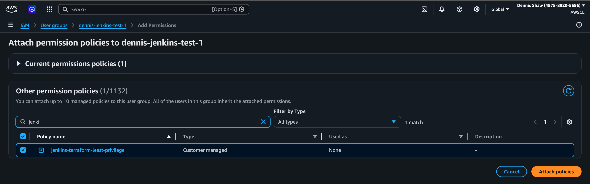
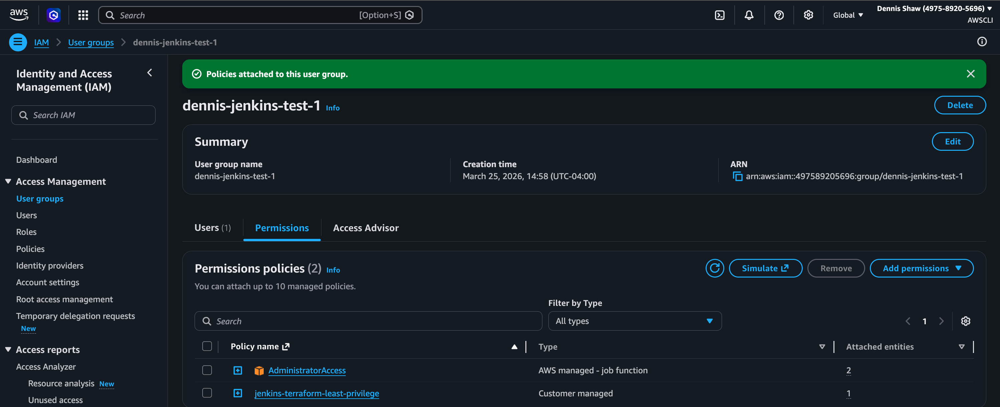

# Jenkins Installation on AWS EC2 (Manual + Automated Plugins)

---

## Table of Contents

- [IAM User & Group Setup](#iam-user--group-setup-initial-working-configuration)
- [Access Key Creation](#access-key-creation)
- [Pipeline Validation](#pipeline-validation)

- [BAM 2 — IAM Least Privilege](#bam-2--iam-least-privilege)
  - [Requirements](#requirements)
  - [Current Implementation](#current-implementation)
  - [Permissions (Current State)](#permissions-current-state)
  - [Why This Is Not Least Privilege](#why-this-is-not-least-privilege)
  - [Methodology](#methodology)
  - [Next Step (Hardening Plan)](#next-step-hardening-plan)

- [Create a Custom IAM Policy](#create-a-custom-iam-policy)
  - [Part 1 — Create the IAM Policy in AWS](#part-1--create-the-iam-policy-in-aws)

---

---

## IAM User & Group Setup (Initial Working Configuration)

### Steps

1. Go to AWS → IAM → User Groups
2. Create Group: `dennis-jenkins-test-1`
3. Attach policy: `AdministratorAccess`


1. Click **Create User Group**



5. Go to **Users → Create user**
6. Name: `jenkins-test-01`
7. Assign to the created user group


8. Review → Create user


[⬆ Back to Table of Contents](#table-of-contents)

---

## Access Key Creation

1. Create access key for Jenkins user
2. Select: **Command Line Interface (CLI)**
3. Add description
4. Create key





> ⚠️ Access keys should be stored securely and never committed to source control.

---

## Pipeline Validation

After instance launch:

```bash
cat /var/log/cloud-init-output.log
```

```bash
echo "Open Jenkins: http://$PUBLIC_IP:8080"
echo "sudo cat /var/lib/jenkins/secrets/initialAdminPassword"
```

---

# BAM 2 — IAM Least Privilege

## Requirements

* [x] Create an IAM user with least privilege to deploy infrastructure on the pipeline
* [x] Do your best to restrict access *(initial version uses Admin — needs refinement)*
* [x] List out the IAM permissions granted
* [x] Write out your methodology behind doing so

[⬆ Back to Table of Contents](#table-of-contents)

---

## Current Implementation

* IAM user created and used successfully by Jenkins
* Pipeline authenticated and executed Terraform against AWS
* Initial policy used: `AdministratorAccess`

---

## Permissions (Current State)

```text
AdministratorAccess (temporary for initial pipeline validation)
```

- Grants full access to all AWS services
- Allows all actions on all resources
- Used temporarily to validate Jenkins pipeline functionality

The initial implementation used the AWS managed AdministratorAccess policy to validate pipeline functionality.

As part of least-privilege hardening, this will be replaced with a custom policy restricted to only the resources and actions required by Terraform.

---

## Why This Is Not Least Privilege

`AdministratorAccess` provides full access to AWS services, which exceeds what is required for this Terraform pipeline.

[⬆ Back to Table of Contents](#table-of-contents)

---

## Methodology

After confirming the pipeline worked end-to-end, permissions were reduced by identifying the exact AWS services used by Terraform.

A custom IAM policy was created to allow only:
- S3 access for Terraform state management
- EC2 actions required for infrastructure provisioning
- Minimal IAM permissions for role usage

This approach follows the principle of least privilege by granting only the permissions required for the pipeline to function.

---

## Next Step (Hardening Plan)

* Replace `AdministratorAccess` with a custom IAM policy
* Limit access to:

  * specific S3 buckets (Terraform state)
  * required EC2 actions
  * minimal IAM role usage
* Test pipeline with reduced permissions

[⬆ Back to Table of Contents](#table-of-contents)

---

## Create a custom IAM Policy

Custom IAM Policy (Least Privilege)

- S3: Create, read, update, delete objects (Terraform state)
- EC2: Describe, create, and terminate instances
- IAM: PassRole and GetRole only

Replaced initial AdministratorAccess policy with scoped permissions required for Terraform pipeline execution.

## PART 1 — Create the IAM Policy in AWS
- AWS Console → IAM -> Policies (on the left side menu) -> Create policy



- click JSON
- paste policy:

note: IAM actions were scoped to role-based resources instead of using full wildcard access, reducing the permission surface and aligning with least privilege principles.


```bash
{
  "Version": "2012-10-17",
  "Statement": [
    {
      "Sid": "S3StateAccess",
      "Effect": "Allow",
      "Action": [
        "s3:CreateBucket",
        "s3:ListBucket",
        "s3:GetObject",
        "s3:PutObject",
        "s3:DeleteObject"
      ],
      "Resource": [
        "arn:aws:s3:::*"
      ]
    },
    {
      "Sid": "EC2Access",
      "Effect": "Allow",
      "Action": [
        "ec2:Describe*",
        "ec2:RunInstances",
        "ec2:TerminateInstances",
        "ec2:CreateTags",
        "ec2:DeleteTags"
      ],
      "Resource": "*"
    },
    {
      "Sid": "IAMMinimal",
      "Effect": "Allow",
      "Action": [
        "iam:PassRole",
        "iam:GetRole"
      ],
      "Resource": "arn:aws:iam::*:role/*"
    }
  ]
}
```



click next

- name the policy: jenkins-terraform-least-privilege
- description: Least privilege policy for Jenkins Terraform pipeline

click Create policy



IAM -> User groups
click user group

Go to Permissions tab
Click Add permissions



Choose attach policies
Search for and click on jenkins-terraform-least-privilege (I created)



click - Attach policy



[⬆ Back to Table of Contents](#table-of-contents)

---

The custom least-privilege policy has been created and attached to the IAM group.

AdministratorAccess is still temporarily attached to ensure uninterrupted pipeline execution during validation.

The next step is to remove AdministratorAccess after confirming the pipeline functions correctly with only the scoped policy.

## Launch from AMI

Steps:
1. Go to EC2 → AMIs
2. Select your custom Jenkins AMI
3. Click “Launch instance from AMI”
4. Choose instance type
5. Configure security group (port 8080 + SSH if needed)
6. Launch instance
7. Access Jenkins via public IP

[⬆ Back to Table of Contents](#table-of-contents)