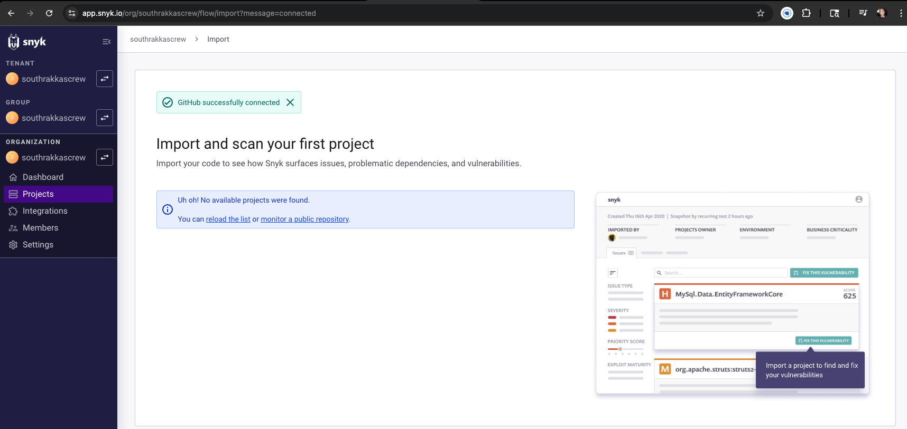
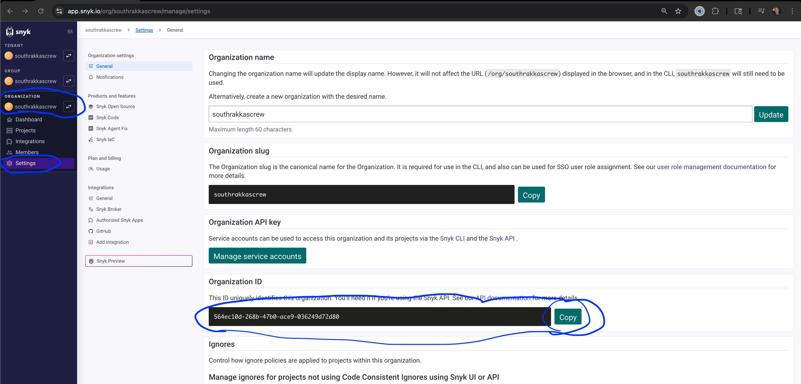
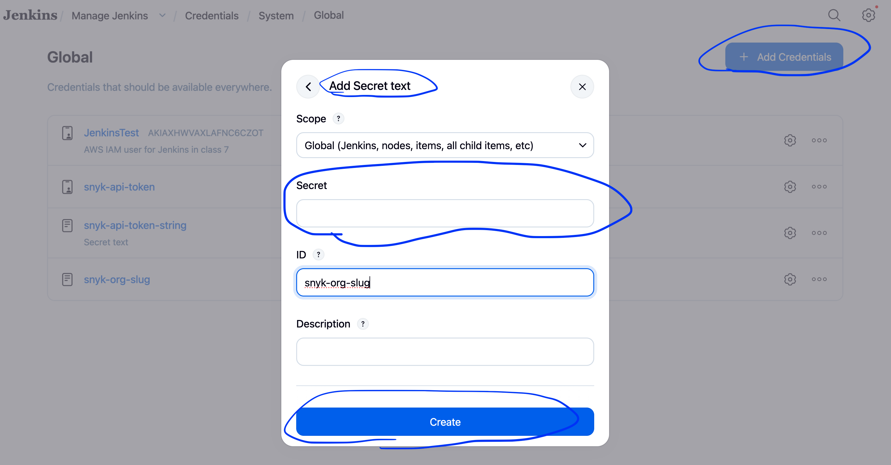
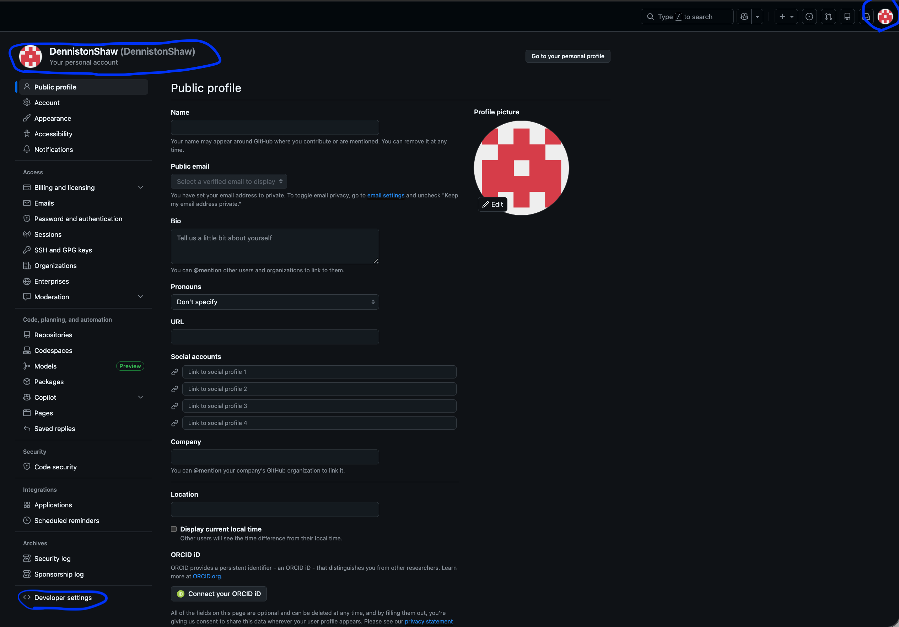
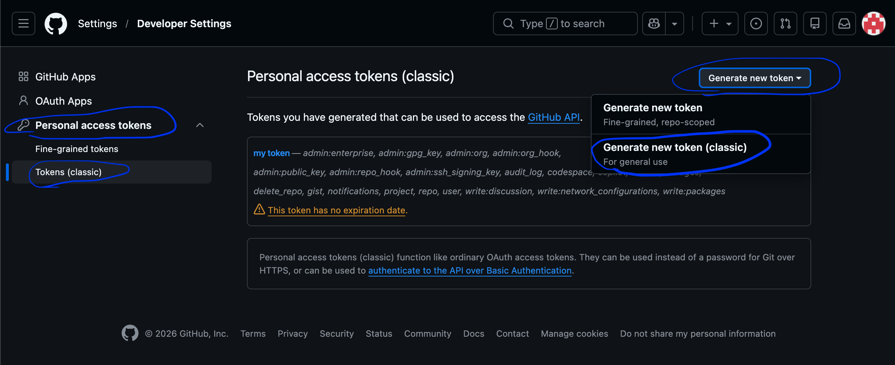
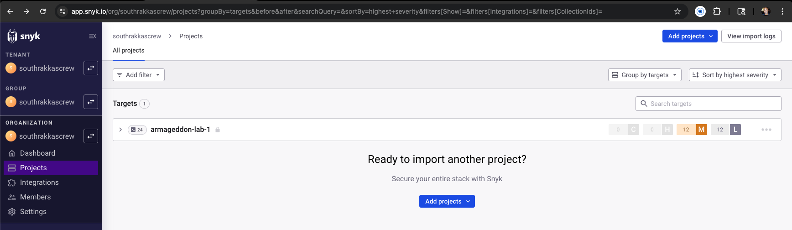
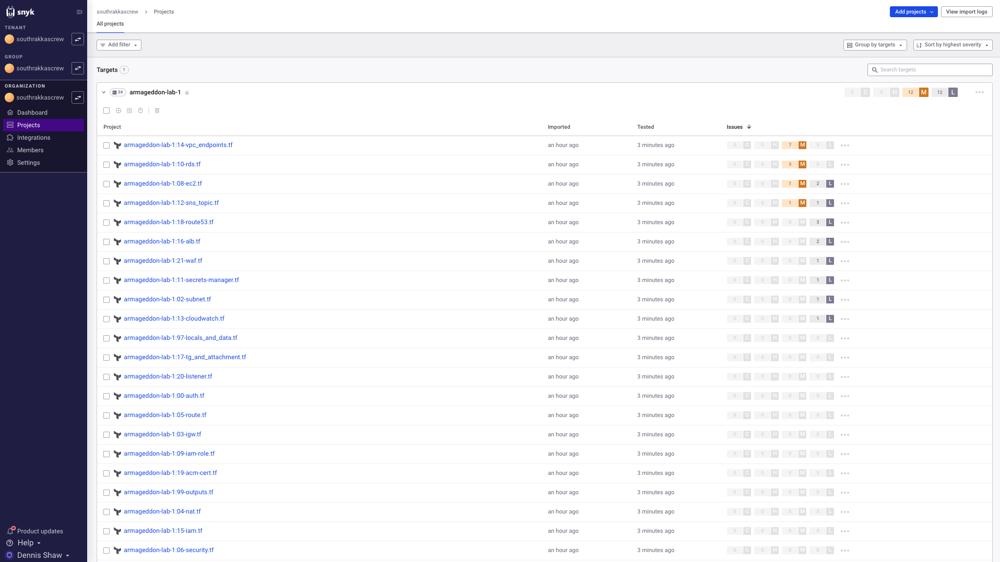
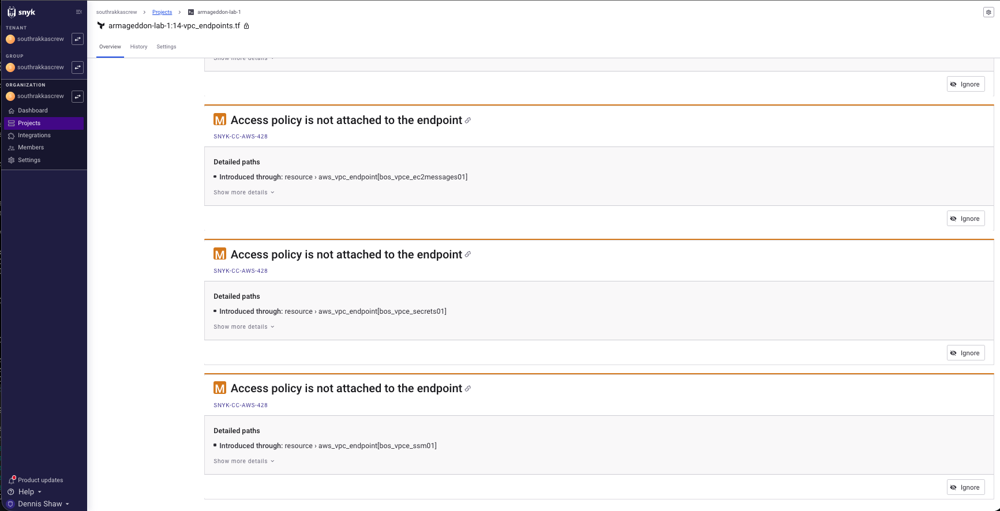

# Class 7 Zion
#### Week 30
#### Date: 03-31-2026
#### Teacher: Charles Manning
#### Topic: SYNK LAB
---

Theo spoke about over using or abusing AI

GO OVER SNYK CLASS!!!

for github actions we will have to know snyk

Class 7 (Tuesday)
Special guest Charles Manning (former student)
Topic: Snyk

# What is Snyk?

**Snyk** is a developer-focused security tool that helps you find and fix vulnerabilities in your code, dependencies, containers, and infrastructure (like Terraform or Kubernetes).

---

## What Snyk Does

Snyk acts as a **security scanner built for developers**, not just security teams.

It automatically checks your projects for known vulnerabilities and tells you:
- what’s wrong  
- how serious it is  
- how to fix it (often with exact code suggestions)

---

## What Snyk Scans

### 1. Dependencies

If you install packages (npm, pip, Maven, etc.), Snyk checks them against a vulnerability database.

**Example:**
- You install an outdated library  
- That library has a known vulnerability  
- Snyk flags it and suggests a safe version  

---

### 2. Source Code (SAST)

Snyk scans your code for common security issues:
- SQL injection  
- insecure authentication  
- exposed secrets  

---

### 3. Containers

If you are using Docker:
- Scans base images (Ubuntu, Node, etc.)  
- Detects OS-level vulnerabilities  

---

### 4. Infrastructure as Code (IaC)

Snyk can scan:
- Terraform  
- CloudFormation  
- Kubernetes  

**Example:**
- Misconfigured S3 bucket  
- Public access enabled unintentionally  
- Snyk flags it as a security risk  

---

## How to Use Snyk

Snyk integrates into your workflow:

- CLI (run locally)
- GitHub (pull request scanning)
- CI/CD pipelines (e.g., Jenkins)

---

## Example: Jenkins Integration

You can integrate Snyk into a Jenkins pipeline to automatically scan builds.

```groovy
stage('Snyk Security Scan') {
  steps {
    sh 'snyk test'
  }
}
```

## Example: Terraform Misconfiguration

resource "aws_s3_bucket_public_access_block" "frontend_pab" {
  block_public_acls       = false
  block_public_policy     = false
  ignore_public_acls      = false
  restrict_public_buckets = false
}

Snyk Result:
- WARNING: 
  - Public access is allowed 
  - potential data exposure risk

## Why Snyk Matters

Most real-world security breaches come from:

- outdated dependencies  
- misconfigured cloud resources  
- exposed secrets  

Snyk helps catch these issues **before deployment**.

---

## DevSecOps Context

Snyk is part of the **DevSecOps** model:

- Dev → build it  
- Ops → run it  
- Sec → secure it during development  

---

## Summary

- Snyk = security tool for developers  
- Scans code, dependencies, containers, and infrastructure  
- Integrates into CI/CD pipelines  
- Helps prevent vulnerabilities before production  

---

## Next Steps

- Install Snyk CLI  
- Connect to your GitHub repository  
- Add Snyk to your Jenkins pipeline  
- Scan your Terraform projects  

```bash
npm install -g snyk
snyk auth
snyk test
```

---

## Spin up Jenkins

- `go to manager -> installed plugins`
- verify Snyk Security Plugin is installed:
  -  `Manage Jenkins -> Plugins -> installed plugings -> search snyk`
- if not installed, install it.

go to management -> tools
scroll down to snyk installations click + `Synk`
in the dropdown type `snyk` (ALL LOWER CASE!)
got to OS platform architecture, in the dropdown select `Linux (amd64)`

hit `Add Snyk` (this is a secondary add)
dropdown, type `skyk` again (lower case again)
in OS plateform architecture leave it on `Auto-detection`

click `Apply` then `Save`

---

Log into your snyk account (an account was set up during class7 installation) 
- check your email search snyk
- sign in and authorize Snyk
- it will take you to your github to authorize, give permissions
- Authorize snyk through phone app
- it will take you back to https://app.snyk.io
- and show Github successfully connected



---

# Add Credentials

### Snyk Credentials

**Snyk API token**
- go back to Jenkins
- `Manage Jenkins` -> `Credentials`
- click `Global` then `Add Credential`
- scroll down to `Snyk API token` -> `Next`
- in the ID field type `snyk-api-token`
  - Auth Tokens
    - go back over to snyk browser
    - bottom left click your name -> Account settings
    - click in the box under Key and copy the code
    - save the code somewhere we will be using it more than once or you can keep going back to these steps to get the code.
- go back to Jenkins and past the code in the Token field-
- Create

**Secret text**
- go back to Add credentials 
- select `Secret text` -> next
- in ID field type `snyk-api-token-string` (all lower case)
- paste code
- Create

**Secret text (add another one)**
- go back to Add credentials 
- select `Secret text` -> next
- in ID field type `snyk-org-slug` (all lower case)



Go back to Snyk browser
go to Organization on the left side -> Settings -> Organization ID
copy ID and paste it in Jenkins Secret field



- `Create`

note: 
- Consistent naming conventions for Snyk credentials are critical in an organizational environment, where multiple integrations exist and credentials may need to be managed, rotated, or assigned across different teams, projects, or external entities.

---

### Github Credentials

**Username with password** 
- Next
- type in username: exact same as Github user name (DennistonShaw)
- Passord to github -> user navigation window (top right icon) -> settings 
- scroll down to developer settings
  


- go to Personal access tokens -> Tokens (classic) -> Generate new token -> Generate new token (classic)
- may have to confirm access here
- in the Note field: jenkins-github-token
- click Generate token
- next screen copy the token code because once you leave the screen you can't get it back. Paste it somewhere safe



- go back to Jenkins browser
- paste password/token
- ID: github-creds
- Create

---

### Jenkins file 

from Aaron's repo
- https://github.com/aaron-dm-mcdonald/new-jenkins-s3-test/blob/Charles-Snyk/Jenkinsfile

make sure the credentials map the code. I needed to change the 3 occurances of
`aws-iam-user-creds` with `JenkinsTest` because this was the name of my AWS credentials

---

### Set up a New pipeline

- go to Jenkins -> `+ New Item`
- enter a name: snyk-pipeline
- click Pipeline
- `Ok`

- scroll down to or click Pipeline in the left menu
- click under `Definitions` and change dropdown to `Pipeline script from SCM`
  - under `SCM` change dropdown to Git
    - under `Repository URL` print
      - Repository URL: https://github.com/DennistonShaw/Class7-HW-Deliverables.git
      - Branch: */main
      - Credentials: DennistonShaw/******
      - Script Path: week30-hw-snyk/Jenkinsfile

---

## Run the Pipeline and Debug Issues

After setting up the pipeline and credentials, the next step is to run the build and troubleshoot any issues that occur.

---

### Run the Pipeline

- go to Jenkins dashboard  
- select your pipeline: `week30-snyk`  
- click `Build Now`  

---

### Observe the Build

- click the build number (ex: #1, #2, etc.)  
- click `Console Output`  

This is where all pipeline activity is logged.

---

### Common Issues Encountered

During the first run, several issues occurred:

---

#### Issue: Command Not Found

Example:
```bash
snyk: command not found
```

Cause:
- Snyk CLI not available in Jenkins runtime  

Fix:
- do NOT rely on Jenkins tool config alone  
- use:
```bash
npx snyk
```

---

#### Issue: npm Not Found

Example:
```bash
npm: command not found
```

Cause:
- Node.js not available in Jenkins environment  

Fix:
- reference full path if needed:
```bash
/usr/bin/npm
```

---

#### Issue: Permission Denied (EACCES)

Example:
```bash
EACCES: permission denied
```

Cause:
- attempting global install without proper permissions  

Fix:
- avoid global install  
- use:
```bash
npx snyk
```

---

#### Issue: No IaC Files Found

Example:
```text
Could not find any valid IaC files
```

Cause:
- wrong working directory  

Fix:
- ensure pipeline runs in correct folder:
```text
week30-hw-snyk/armageddon-lab-1
```

---

### Update Jenkinsfile for Correct Execution

Ensure Snyk runs inside the correct directory:

```groovy
stage('Snyk IaC Scan Test') {
    steps {
        dir('week30-hw-snyk/armageddon-lab-1') {
            sh '''
                npx snyk auth $SNYK_TOKEN
                npx snyk iac test --org=$SNYK_ORG --severity-threshold=high || true
            '''
        }
    }
}
```

---

### Re-run the Pipeline

- click `Build Now` again  
- confirm all stages run successfully  

Expected stages:

- Checkout  
- Snyk IaC Scan Test  
- Snyk IaC Scan Monitor (if configured)  
- Terraform Init  
- Terraform Plan  
- Optional Destroy  

---

### Verify Snyk Results

#### In Jenkins

- open Console Output  
- review vulnerabilities and warnings  

---

#### In Snyk Dashboard

- go to:
  https://app.snyk.io  

- navigate to:
  - Organization  
  - Projects  

- confirm Terraform files appear with issues listed  

---

### Confirm Terraform Execution

- verify:
  - `terraform init` completes  
  - `terraform plan` runs successfully  

- ensure no unexpected errors  

---

### Manual Destroy Step

- pipeline may pause for input  
- approve destroy only if needed  

---

### Final Validation

A successful pipeline run should:

- complete all stages  
- show Snyk scan results  
- show Terraform plan output  
- optionally destroy infrastructure  

---

This confirms the Jenkins + Snyk + Terraform integration is working correctly.

---

## Important Note – Running Snyk with My Own Jenkinsfile

During this lab, I ran into an issue when trying to follow Charle's (instructor) Jenkinsfile directly.

My environment is already customized from previous labs (Terraform, Jenkins setup, credentials, plugins, and AMI builds), so using the Charles’s Jenkinsfile exactly as-is did not match my setup.

### Key Realization

I do not need to copy Terraform or project files into the same folder as the Jenkinsfile.

Instead, I can:

- Keep my Jenkinsfile in its own folder or repository
- Have Jenkins pull and scan code from other repositories or folders
- Use Snyk to scan those external projects

### Example Concept

- Jenkinsfile → defines the pipeline logic
- Target code → lives in another folder or repo (e.g., Terraform, Armageddon projects)

Jenkins workflow:

- Load Jenkinsfile
- Clone or access target repo
- Run Snyk scan on that code

### Why This Matters

This approach is:

- cleaner (no duplicated files)
- more flexible (can scan multiple projects)
- closer to real-world DevOps workflows

### Decision

For this lab, I will:

- Create my own Jenkinsfile
- Adapt it to my environment
- Use my existing Terraform projects as scan targets
- Keep my pipeline self-contained and fully within my control

### Insight

- I prefer to keep my pipelines self-contained and under my control, rather than relying on external structures or assumptions
- This allows me to solve problems directly in my environment instead of working around mismatches between setups

On youtube continue from here:
https://youtu.be/jbfbPNTPZao?list=PLzfyR91ut1X3Dtxbub2F2kUuRrPK7_-Gs&t=6404

---

## Improve Pipeline – Persist Results in Snyk Dashboard

Up to this point, Snyk scans were visible in Jenkins console output.

To ensure results are stored and tracked over time in Snyk, monitoring must be added.

---

### Add Snyk Monitor Command

Update your Jenkinsfile to include:

```bash
npx snyk iac monitor --org=$SNYK_ORG
```

---

### Updated Snyk Stage

```groovy
stage('Snyk IaC Scan Monitor') {
    steps {
        dir('week30-hw-snyk/armageddon-lab-1') {
            sh '''
                npx snyk auth $SNYK_TOKEN
                npx snyk iac monitor --org=$SNYK_ORG
            '''
        }
    }
}
```

---

### Run Pipeline Again

- click `Build Now`
- allow pipeline to complete

---

### Verify in Snyk Dashboard

- go to:
  https://app.snyk.io  

- click:
  - Organization  
  - Projects  

---

### Expected Result

You should now see:

- Terraform files listed as projects  
- vulnerability counts (Low / Medium / High)  
- last tested timestamp  

---

### Key Difference

- `snyk test` → temporary results (Jenkins only)  
- `snyk monitor` → persistent results (Snyk dashboard)  

---

## Optional – Fail Build on Vulnerabilities

To enforce security standards, you can configure the pipeline to fail when issues are detected.

---

### Example

Remove `|| true`:

```bash
npx snyk iac test --org=$SNYK_ORG --severity-threshold=high
```

---

### Behavior

- pipeline fails if high severity issues are found  
- prevents insecure infrastructure from being deployed  

---

## Final Verification Checklist

Before considering the lab complete, confirm:

- Jenkins pipeline runs successfully  
- Snyk scan executes without errors  
- Terraform init and plan succeed  
- Snyk results appear in dashboard  
- correct directory is used in pipeline  







---

## Cleanup

After completing the lab:

- terminate EC2 instance hosting Jenkins  
- verify no Terraform resources remain running  
- confirm no unexpected AWS charges  

---

This completes the full Jenkins + Snyk IaC pipeline implementation.