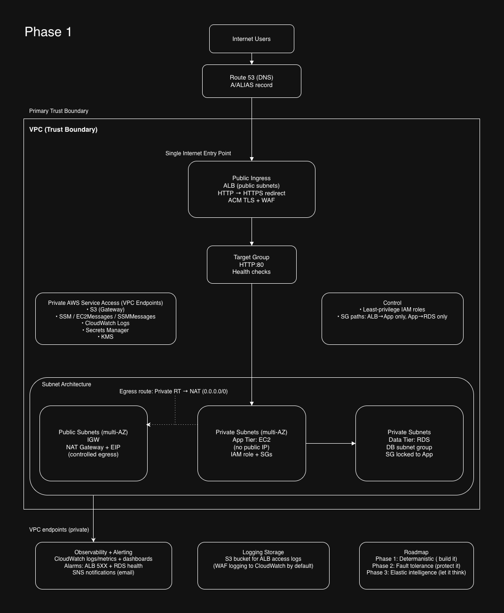

# Phase 1 – Senior Cloud Solutions Architect Interview Script with 3 approaches: a Whiteboard walkthrough and 2 Executive Architectrue walkthroughs, each followed by several questions a recruiter or potential employer may ask.

### Candidate: Dennis
### Role Positioning: Senior Cloud Solutions Architect
### Deployment Method: Terraform (Infrastructure as Code)
### Architecture Style: Secure 3-Tier AWS Architecture:

Phase 1: establishes deterministic infrastructure — networking, IAM, routing, and data stability. Elasticity and automation are layered in later phases once the foundation is validated. **Deterministic architecture means** every part of the system behaves predictably, ensuring consistent and repeatable outcomes.

---
# WALKTHROUGH 1: Phase 1 Architecture – Whiteboard walkthrough




### A whiteboard is a LIVE problem-solving conversation where you think out loud while modeling a system. It focuses on your flow and decisions and answers how you think. They want to see:
- Where you start
- What you prioritize
- What tradeoffs you consider
- How you evolve the system

---

# Phase 1 - (75-Second Whiteboard Explanation)

This is **Phase 1 of a production architecture roadmap**.  
The objective is to validate a secure, deterministic foundation before introducing elasticity or automation.

Starting at the top, users resolve DNS through **Route 53**, which directs traffic into the primary trust boundary and into a public **Application Load Balancer (ALB)**.

The **ALB** is the only internet-facing component (**Public Ingress**).  
It redirects **HTTP** to HTTPS, terminates TLS using **ACM (AWS Certificate Manager)**, applies **WAF inspection**, and forwards traffic to the **Target Group**.

The **Target Group** routes traffic to **EC2 instances** in **Private Subnets** (the **Application Tier**).  
There are no public IPs attached. Access is controlled using **Security Groups** and **IAM roles** to enforce **least-privilege**.

The **Application Tier** communicates with the **Data Tier**, which is **Amazon RDS**.  
RDS resides in private subnets and only accepts traffic from the application security group.  
There is no direct database exposure.

For controlled outbound communication, a **NAT Gateway** provides **controlled egress**.  
However, NAT dependency is reduced using **VPC Endpoints** for **S3**, **SSM**, **CloudWatch Logs**, **Secrets Manager**, and **KMS**, keeping management and service traffic on private AWS networking.

For operational maturity, **CloudWatch** provides **metrics, logs, and dashboards**.  
**Alarms** monitor **ALB 5XX errors** and **RDS health**, triggering notifications through **SNS (email alerts)**.

Separately, for long-term audit visibility, the ALB delivers **Access Logs to S3**, and **WAF logging** captures blocked traffic for forensic review.

**Phase 1:** validates networking, IAM trust boundaries, controlled ingress, deterministic traffic flow, and data-layer stability.
**Phase 2:** introduces high availability and disaster recovery.  
**Phase 3:** introduces elasticity through **Auto Scaling Groups** and event-driven automation with **Lambda**.

I do not scale uncertainty. I validate the foundation first, then layer resilience, then elasticity. **Build it, protect it, then let it think**.

---
# Whiteboard Q&A
# 1. Why is the ALB your single entry point?

### What they’re testing:
Ingress control and attack surface understanding.

### Strong Answer Example:

```text
Centralizing ingress through the ALB reduces attack surface and simplifies
TLS enforcement, WAF attachment, and logging. It ensures all internet
traffic is inspected and routed deterministically before reaching private 
infrastructure.
```

---

# 2. Why didn’t you put EC2 in public subnets?

### What they’re testing:
Network isolation and security modeling.

### Strong Answer Example:

```text
Public subnets expose resources to the internet via route tables. Application 
instances do not require direct inbound internet access. Keeping them private 
enforces controlled ingress through the ALB and reduces blast radius.
```

---

# 3. Why use NAT if you already have VPC endpoints?

### What they’re testing:
Understanding of gateway vs interface endpoints.

### Strong Answer Example:

```text
VPC endpoints handle private AWS service access, but NAT is still required 
for outbound internet traffic such as OS updates or external APIs. Endpoints 
reduce NAT dependency but do not eliminate the need for outbound internet 
entirely.
```

---

# 4. What happens if NAT fails?

### What they’re testing:
High availability awareness.

### Strong Answer Example:

```text
If a single NAT fails, outbound internet traffic from affected subnets fails. 
In production, I would deploy one NAT per AZ and align route tables 
accordingly to reduce single points of failure.
```

---

# 5. Why is Route 53 outside the VPC?

### What they’re testing:
Control plane vs data plane understanding.

### Strong Answer Example:

```text
Route 53 is a global managed service and part of the AWS control plane. It 
does not reside inside a VPC. It resolves DNS and directs traffic to 
VPC-based resources.
```

---

# 6. Why is the Target Group separate from the ALB?

### What they’re testing:
Load balancer architecture knowledge.

### Strong Answer Example:

```text
The target group abstracts backend instances and performs health checks. 
It decouples routing rules from compute resources and allows scaling or 
replacement without reconfiguring listeners.
```

---

# 7. What is your primary trust boundary?

### What they’re testing:
Security modeling.

### Strong Answer Example:

```text
The VPC is the primary trust boundary. Everything inside it is segmented 
further using subnets and security groups. The ALB acts as a controlled 
ingress boundary.
```

---

# 8. Why no Auto Scaling yet?

### What they’re testing:
Architectural sequencing maturity.

### Strong Answer Example:

```text
Phase 1 validates deterministic networking and data stability. I avoid 
introducing elasticity before confirming traffic flow and IAM boundaries. 
Scaling unstable systems amplifies instability.
```

---

# 9. What is your blast radius if the App tier is compromised?

### What they’re testing:
Zero-trust thinking.

### Strong Answer Example:

```text
Security groups restrict east-west traffic. The app can only communicate 
with RDS on required ports and AWS services via endpoints. It has no public 
IP and limited IAM permissions. Compromise is contained to its subnet and 
IAM scope.
```

---

# 10. How would you make this multi-region?

### What they’re testing:
Strategic scaling and disaster recovery planning.

### Strong Answer Example:

```text
I would replicate the VPC stack in another region, use Route 53 health checks 
with failover routing, implement cross-region data replication, and replicate 
logging infrastructure.
```

---

# 11. Why attach WAF at ALB and not CloudFront?

### What they’re testing:
Edge vs regional architecture decisions.

### Strong Answer Example:

```text
In this design, ALB is the internet entry point, so WAF is attached regionally. If CloudFront were introduced later, WAF would move to the edge 
for earlier traffic filtering.
```

---

# 12. If traffic increases 10x tomorrow, what breaks?

### What they’re testing:
Bottleneck identification.

### Strong Answer Example:

```text
The single EC2 instance and database IOPS would likely become bottlenecks. 
Phase 3 introduces Auto Scaling Groups and potential database scaling 
strategies to address this.
```

---

# 13. Why not use Lambda instead of EC2?

### What they’re testing:
Appropriateness of serverless.

### Strong Answer Example:

```text
Lambda is well-suited for event-driven workloads. This design assumes 
persistent processes and stable database connections. Introducing Lambda 
prematurely would add cold start and concurrency considerations without 
solving a defined constraint.
```

---

# 14. Where does IAM enforcement actually happen?

### What they’re testing:
Deep AWS understanding.

### Strong Answer Example:

```text
IAM enforcement occurs at the AWS service endpoint when it receives 
a signed API call. The service evaluates the caller’s IAM identity 
and attached policies before allowing access.
```

---

# 15. What’s missing from this diagram?

### What they’re testing:
Architectural self-awareness.

### Strong Answer Example:

```text
Disaster recovery policy, backup strategy, patch management automation,
centralized logging aggregation, CI/CD integration, and formalized security
scanning are not represented in Phase 1.
```

---

# Final Challenge Question

## Convince me this is production-ready.

### Strong Answer Example:

```text
It is production-ready for controlled load. It enforces least privilege, private
networking, deterministic ingress, monitored health, and structured logging. It 
is intentionally phased to introduce high availability and elasticity after
baseline validation.
```

---

# Senior Architect Principle

**I do not scale uncertainty. I validate networking, trust boundaries, traffic flow, and data stability first. Resilience and elasticity are layered after the foundation is proven stable.**

---
---
########################################################
########################################################

# WALKTHROUGH 2: Phase 1 Architecture Walkthrough  


# 60-Second Executive Walkthrough Script

This architecture represents a secure three-tier AWS deployment provisioned entirely with Terraform inside a single VPC trust boundary.

Internet users resolve DNS through Route 53, which aliases to a public Application Load Balancer deployed across multiple Availability Zones in public subnets. The ALB enforces HTTPS using ACM certificates, performs HTTP-to-HTTPS redirection, and integrates with AWS WAF for Layer 7 protection.

Traffic is forwarded to a target group backed by EC2 instances in private subnets. These instances do not have public IP addresses and are only reachable from the ALB security group. IAM roles are used for AWS API access instead of embedded credentials.

The data tier consists of Amazon RDS deployed in isolated private subnets within a DB subnet group. Security groups enforce strict least-privilege access: ALB → App only, and App → RDS only.

Private subnets use a default route (0.0.0.0/0) to a NAT Gateway for controlled outbound internet access. However, AWS service access such as S3, SSM, CloudWatch Logs, Secrets Manager, and KMS is handled through VPC endpoints to keep traffic on the AWS private backbone and reduce NAT exposure.

Observability is centralized through **CloudWatch** metrics and alarms, with SNS notifications for alerting.

This design is modular and prepared for Phase 2 enhancements such as Auto Scaling and high-availability improvements.

---

# Q&A

---

## 1. Why are you using a single NAT Gateway in a multi-AZ architecture?

## #What they’re testing: 
Availability tradeoffs and cost awareness.

### Strong Answer Example:

```text
In Phase 1, I deployed a single NAT Gateway for cost efficiency. For
production-grade high availability, I would deploy one NAT Gateway per
Availability Zone and associate each private subnet route table with 
the NAT in the same AZ to avoid cross-AZ dependencies and eliminate a 
single point of failure.
```

---

## 2. If you have VPC endpoints, why do you still need a NAT Gateway?

**What they’re testing:** Understanding of endpoint scope.

### Strong Answer Example:

```text
VPC endpoints only cover AWS service API access such as S3, SSM, Secrets Manager
and CloudWatch Logs. The NAT Gateway is still required for general outbound
internet access, such as OS updates, external APIs, package repositories, or
third-party integrations.
```

---

## 3. What happens if the ALB fails?

**What they’re testing:** Knowledge of managed service resilience.

### Strong Answer Example:

```text
The ALB is deployed across multiple Availability Zones. If one AZ fails, the 
ALB automatically routes traffic to healthy targets in the remaining AZs.
This provides built-in high availability at the load balancing layer.
```

---

## 4. How would you scale this architecture?

**What they’re testing:** Evolution and growth thinking.

### Strong Answer Example:

```text
I would replace standalone EC2 instances with an Auto Scaling Group using a 
Launch Template. The ASG would attach to the existing target group and scale 
based on CPU utilization or request count per target. This would provide 
horizontal elasticity and self-healing.
```

---

## 5. How is lateral movement prevented inside the VPC?

**What they’re testing:** Security architecture depth.

### Strong Answer Example:

```text
Security groups enforce strict east-west isolation.  
- The ALB security group allows inbound traffic from the internet.  
- The App security group only allows traffic from the ALB security group.  
- The RDS security group only allows traffic from the App security group.  

There are no CIDR-based internal trust rules, reducing the blast radius in 
case of compromise.
```

---

# Bonus Senior-Level Question

## What is your biggest architectural risk right now?

### Strong Answer Example:

```text
The primary availability risk is the single NAT Gateway. Additionally, the
application tier is not yet auto-scaled, so compute capacity is not horizontally
resilient. Phase 2 would address both concerns by implementing per-AZ NAT 
Gateways and an Auto Scaling Group for the application layer.
```

---

---

########################################################
########################################################

# WALKTHROUGH 3 — Executive Architecture Walkthrough


## Walk me through your architecture from DNS resolution to database interaction.

```text
When a user accesses the domain, Route 53 resolves DNS and directs the request to the 
internet-facing Application Load Balancer (ALB).

The ALB is the single public entry point. It redirects HTTP to HTTPS, terminates TLS 
using an ACM-issued certificate, and has a regional AWS WAF attached to filter malicious 
requests before they reach the application tier.

The ALB forwards traffic to a Target Group, which routes requests to EC2 instances 
running in private subnets with no public IPs. Security groups enforce that the 
application tier only accepts inbound traffic from the ALB.

Each EC2 instance assumes an IAM role via an instance profile. The application uses 
that role to retrieve database credentials securely from AWS Secrets Manager. The secret 
is encrypted at rest with KMS and decrypted transparently by Secrets Manager at retrieval 
time. In this phase, Terraform seeds the initial secret value; in production, I would 
generate credentials dynamically and enable rotation.

With credentials retrieved, the application connects to Amazon RDS, deployed in private 
subnets and not publicly routable. Database security groups restrict inbound access 
strictly to the application security group, typically limited to the database port.

For AWS service connectivity, VPC endpoints — including an S3 gateway endpoint and 
interface endpoints for SSM, CloudWatch Logs, Secrets Manager, and KMS — keep service 
traffic within private AWS networking and minimize NAT usage. NAT remains the controlled 
egress path for required internet-bound traffic such as OS updates or external APIs.

CloudWatch alarms monitor ALB 5XX errors and an application-level database connection 
error metric, with notifications delivered via SNS.

Overall, the design emphasizes segmentation between public and private subnets, 
least-privilege IAM, tightly scoped security groups, controlled ingress and egress 
paths, and defense in depth through WAF, monitoring, and logging.
```
---

# Q&A

## 1. Why did you use an Application Load Balancer instead of exposing EC2 directly?

**What they’re testing:** Ingress design and security boundary awareness.

### Strong Answer Example:

```text
Using an ALB provides:

- TLS termination via ACM
- Integration with AWS WAF
- Health checks
- Abstraction of compute from ingress
- Scalability flexibility
- Improved security posture

Exposing EC2 directly would increase attack surface
and tightly couple compute to public ingress.
```

---

## 2. Why are EC2 and RDS deployed in private subnets?

**What they’re testing:** Network isolation and attack surface reduction.

### Strong Answer Example:

```text
Private subnets prevent direct internet access.

EC2 instances receive traffic only through the ALB, 
not from the internet.

RDS is isolated from public exposure and can only 
be accessed from the application tier via security 
group rules.

This reduces attack surface and enforces least 
exposure principles.
```
---

## 3. Explain your VPC and subnet design.

**What they're testing:** Network segmentation and routing clarity.

### Strong Answer Example:

```text
The VPC is segmented into public and private subnets.

**Public subnets contain:**
- Application Load Balancer
- NAT Gateway

**Private subnets contain:**
- EC2
- RDS

Public subnets route 0.0.0.0/0 to the Internet Gateway.

Private subnets route outbound traffic through the 
NAT Gateway, allowing outbound internet access without 
inbound exposure.
```

---

## 4. What would break if the NAT Gateway failed?

**What they’re testing:** Failure domain awareness and dependency mapping.

### Strong Answer Example:

```text
Private EC2 instances would lose outbound internet
connectivity.

Impacts may include:

- OS patching failures
- Package installation failures
- External API connectivity issues
- Potential Secrets Manager API calls failing if no
VPC endpoint exists

Inbound traffic from the ALB would still function.
```

---

## 5. How does the EC2 instance securely retrieve database credentials?

**What they’re testing:** Secret management and IAM integration depth.

### Strong Answer Example:
```text
The EC2 instance is associated with an 
IAM role via an instance profile.

The role grants scoped permissions to retrieve 
a specific secret ARN from AWS Secrets Manager.

The application makes an API call to Secrets 
Manager at runtime to retrieve credentials securely.

No static credentials exist in Terraform code, 
user data scripts, or the AMI.

This supports secure rotation and prevents 
credential leakage.
```

---

## 6. Explain the IAM trust relationship used in your design.

**What they’re testing:** IAM fundamentals and least-privilege implementation.

### Strong Answer Example:

```text
The IAM role includes a trust policy 
allowing the EC2 service principal to assume it.

The permissions policy attached to the role 
grants least privilege access to Secrets Manager.

Permissions are scoped to specific resource 
ARNs rather than wildcard access.
```

---

## 7. Why did you choose RDS instead of self-managed MySQL on EC2?

**What they’re testing:** Managed service tradeoff reasoning and operational maturity.

### Strong Answer Example:

```text
RDS provides:

- Automated backups
- Managed patching
- Monitoring
- Failover capability (if Multi-AZ enabled)
- Reduced operational overhead

Self-managing MySQL would increase administrative 
complexity and risk.
```

---

## 8. How is the database protected from direct access?

**What they’re testing:** Database isolation and network security enforcement.

### Strong Answer Example:

```text
RDS is deployed in private subnets.

It has no public IP.

Security groups allow inbound access only from the 
EC2 security group on the required port.

There is no route from the internet to the RDS subnet.
```
---

## 9. Is this database highly available?

**What they’re testing:** High availability awareness and design tradeoff reasoning.

### Strong Answer Example:

```text
If deployed Single-AZ, it is not fully highly available 
and would experience downtime during AZ failure.

In production, I would enable Multi-AZ deployment to 
allow automatic failover.

This phaseprioritizes architectural design over full 
HA implementation.
```

---

## 10. What monitoring mechanisms are implemented?

**What they’re testing:** Observability strategy and operational readiness.

### Strong Answer Example:

```text
CloudWatch monitors:

- EC2 CPU utilization
- ALB target health
- RDS metrics
- Network throughput

CloudWatch alarms trigger SNS notifications when 
thresholds are exceeded.

This provides operational visibility and proactive 
alerting.
```
---

## 11. How does the alarm-to-notification flow work?

**What they’re testing:** Event-driven monitoring flow and service integration understanding.

### Strong Answer Example:

```text
CloudWatch detects a metric threshold breach.

The alarm changes state.

The SNS topic is triggered.

Subscribers receive notifications for operational response.
```
---

## 12. What security layers protect your system?

**What they’re testing:** Defense-in-depth awareness and layered security reasoning.

### Strong Answer Example:

```text
Defense in depth includes:

- Route 53 DNS control
- HTTPS via ACM
- AWS WAF at ALB layer
- Security groups (stateful firewall)
- Private subnets
- IAM least privilege policies
- Secrets Manager credential isolation
- CloudWatch monitoring

Each layer reduces exposure and enforces segmentation.
```
---

## 13. What is the biggest scalability limitation in this architecture?

**What they’re testing:** Scalability bottleneck identification and growth planning.

### Strong Answer Example:

```text
The architecture currently uses a single EC2 instance 
without an Auto Scaling Group.

This introduces a compute bottleneck and single point 
of failure.

In production, I would implement an ASG across multiple AZs.
```
---

## 14. How would you redesign this for 10x traffic growth?

**What they’re testing:** Scalability strategy and architectural evolution thinking.

### Strong Answer Example:

```text
- Implement Auto Scaling Group
- Deploy EC2 across multiple AZs
- Enable Multi-AZ RDS
- Add read replicas if needed
- Consider ElastiCache for read-heavy workloads
- Introduce CloudFront for edge caching

The goal would be horizontal scaling and removal 
of single points of failure.
```
---

## 15. What is likely the most expensive component?

**What they’re testing:** Cost awareness and cloud economics understanding.

### Strong Answer Example:

```text
The NAT Gateway typically incurs significant cost due to 
hourly charges and data processing.

RDS and ALB also contribute meaningfully to cost.

Understanding cost drivers is essential in production
architecture.
```

---

## 16. How would you reduce cost responsibly?

**What they’re testing:** Cost optimization strategy balanced with reliability and security.

### Strong Answer Example:

```text
- Use VPC endpoints to reduce NAT traffic
- Rightsize instances
- Implement autoscaling
- Use Savings Plans or Reserved Instances
- Evaluate Aurora Serverless for variable workloads

Cost optimization must not compromise security or reliability.
```

---

## 17. Is this production-ready?

**What they’re testing:** Architectural maturity and recognition of gaps between lab and production.

### Strong Answer Example:

```text
The architecture demonstrates production-grade security
segmentation and infrastructure-as-code discipline.

However, to be fully production-ready, it would require:

- Auto Scaling Group
- Multi-AZ deployment across all tiers
- Centralized log aggregation
- CI/CD pipeline
- Backup testing validation
- WAF rule tuning

It is architecturally sound but requires resilience 
enhancements.
```

---

## 18.  What Was Your Primary Contribution?

```text
example 1 (simple):
-“I led the documentation and architecture visualization 
for the project, translated the infrastructure design into 
Terraform scripts, and executed the full deployment of 
the environment.”

example 2 (pro):
-“I took ownership of the architectural documentation and
diagramming to clearly articulate the system design. I
translated the infrastructure requirements into Terraform
modules, authored the deployment scripts, and executed the 
full environment provisioning. I also validated network
segmentation IAM role assumptions, and service integrations
to ensure the build aligned with secure, production-style
architecture principles.”
```

## 19. Did you just deploy it, or did you design parts of it?
```text
You can say:

“While we collaborated on the conceptual design, I was 
primarily responsible for formalizing the architecture into
documentation and diagrams, implementing the Terraform
configuration, and executing the infrastructure deployment.
ensured the final implementation matched the intended security
and networking design.”
```

---