## Table of Contents

- [WEEK 32 — 2026-04-14 Assignments](#week-32--2026-04-14-assignments)
  - [Reading / Coursework](#reading--coursework)
  - [Practice](#practice)
  - [Watch](#watch)
  - [Discuss](#discuss)

- [Week 32 – Class 7 Homework](#week-32--class-7-homework)
  - [Overview](#overview)
  - [Class Structure Update – Henry Group](#class-structure-update--henry-group)
  - [Expectations & Accountability](#expectations--accountability)
  - [Teamwork vs Working Alone](#teamwork-vs-working-alone)
  - [AWS Lambda Introduction](#aws-lambda-introduction)
  - [AWS Lambda Fundamentals](#aws-lambda-fundamentals)
  - [Event-Driven Architecture](#event-driven-architecture)
  - [Architecture Mapping](#architecture-mapping)
  - [Lambda Core Concepts](#lambda-core-concepts)

- [LAB – AWS Lambda Implementation](#lab--aws-lambda-implementation)
  - [Step 1: Create Lambda Function](#step-1-create-lambda-function)
  - [Step 2: Add Code](#step-2-add-code)
  - [Step 3: Deploy Code](#step-3-deploy-code)
  - [Step 4: Create IAM Role](#step-4-create-iam-role)
  - [Step 5: Attach Role to Lambda](#step-5-attach-role-to-lambda)
  - [Step 6: Create Function URL](#step-6-create-function-url)
  - [Step 7: Test Lambda](#step-7-test-lambda)
  - [Step 8: Check Logs](#step-8-check-logs)
  - [Step 9: Modify Lambda Output (Code Update)](#step-9-modify-lambda-output-code-update)
  - [Step 10: Deploy Changes](#step-10-deploy-changes)
  - [Step 11: Verify Updated Logs](#step-11-verify-updated-logs)
  - [Step 12: Verify Updated HTTP Output](#step-12-verify-updated-http-output)

- [SNS](#sns)
- [SNS Email Fix (Quick Reproduce Steps)](#sns-email-fix-quick-reproduce-steps)
- [Lambda SNS Test](#lambda-sns-test)
- [Troubleshooting (SNS Email)](#troubleshooting-sns-email)
- [Step 13: Add SNS Publish to Lambda](#step-13-add-sns-publish-to-lambda)
- [Step 14: Test SNS Through Function URL](#step-14-test-sns-through-function-url)
- [Step 15: Verify SNS Emails](#step-15-verify-sns-emails)
- [SNS Email Subscription Fix](#sns-email-subscription-fix)
- [Key Takeaways](#key-takeaways)

# WEEK 32 — 2026-04-14 Assignments

---

## Reading / Coursework

- Complete **Sections 17–20** in Maarek (App Services → Serverless Solution Architecture)
  - Some sections may already be done
  - If not, complete them

- If Maarek is incomplete:
  - Over the next **10 weeks**, finish all remaining sections

---

## Practice

- Replicate the **base Lambda lab**
  - Generate default Lambda text
  - Access it via your Lambda’s **custom URL**

- Run the **Lambda SNS lab**
  - Trigger it enough times to generate **6 separate SNS emails**

- Modify the Lambda SNS lab outputs:
  - Change **email subject**
  - Change **email message**
  - Change **HTTP page output**

---

## Watch

- Maarek Udemy:
  - Sections **17–20 (Serverless)**

- YouTube:
  - [Indians in Texas](https://www.youtube.com/watch?v=ralf0yL1Tfw)

---

## Discuss

Paramount was recently hacked, and the Avatar movie was leaked:  
https://cosmicbook.news/paramount-avatar-aang-last-airbender-leaks-online-fans-rip-voice-acting

**Scenario:**
- Assume the movie file was stored in S3

**Question:**
- How would you use **AWS Lambda** to:
  - Prevent unauthorized access
  - Modify characteristics of files
  - Notify the security team of potential vulnerabilities

---

## Code from Class

import json
def lambda_handler(event, context):
    print("Hello from Lambda")
    print(f"Event: {event}")
    return {
        'statusCode': 200,
        'body': json.dumps('Hello from Lambda!')
    }

---

- go to source code - Lambda -> Function -> Code
- customize add or change print so when we run the service or visit the website (visiting the website is a Lambda and it triggers cloudwatch log to show up) again it 
- hit Deploy
- go to Function URL and copy Function URL and paste it in a browser


go to Cloudwatch -> Log events 
---
---

# Week 32 – Class 7 Homework

## Overview

This class covered:

- New class structure (Henry Group)
- Expectations and accountability
- Teamwork vs working alone
- AWS Lambda fundamentals
- Event-driven architecture
- Hands-on AWS Lambda lab

---

## Class Structure Update – Henry Group
**(1:36 – 3:30)**

- New group: **Henry Group**
- For students who pass **Armageddon**
- Acts as a bridge between:
  - Zion → Baller Cloud

### Notes
- Not all students move forward immediately
- Certifications still matter:
  - SAA
  - PCA
- Some may remain in Henry longer

---

## Expectations & Accountability
**(4:50 – 7:30)**

### Required
- Attend meetings
- Participate
- Complete homework

### If not
- Moved to **Cloud Proving Grounds**

### Key Idea
- No shortcuts
- No exceptions without proof of work

---

## Teamwork vs Working Alone
**(7:40 – 10:45)**

- Working alone = high risk
- Industry = teamwork

### Important Points
- Teams help recover from mistakes
- Collaboration increases job security
- Isolation leads to failure in real environments

---

## AWS Lambda Introduction
**(14:45 – 15:30)**

- Goal: Prepare for Lambda lab
- Focus: deeper understanding + hands-on practice

---

## AWS Lambda Fundamentals
**(15:54 – 23:30)**

### What is Lambda?
- Run code without managing servers
- Pay only when code runs

### Compute Models

#### 1. EC2 (Servers)
- Full control
- You manage everything

#### 2. Containers (Microservices)
- Docker, Kubernetes
- Scalable and portable

#### 3. Serverless (Lambda)
- No infrastructure management
- Event-driven execution

---

## Event-Driven Architecture
**(23:30 – 29:30)**

### Concept
Event → Trigger → Action

### Examples
- Motion detected → camera notification
- Garage sensor → door reopens
- Alarm clock → triggers sound
- Git push → webhook → pipeline runs

---

## Architecture Mapping
**(30:25 – 37:30)**

### Traditional 3-Tier

- Layer 1: Load Balancer
- Layer 2: EC2 (Compute)
- Layer 3: RDS (Database)

### Serverless Equivalent

- Layer 1: API Gateway
- Layer 2: Lambda
- Layer 3: DynamoDB

---

## Lambda Core Concepts
**(42:00 – 49:00)**

- Functions = small units of code
- Stateless (no memory)
- Requires external storage (DynamoDB, S3)

### Triggers
- HTTP requests
- File uploads (S3)
- Timers
- Database changes

---

# LAB – AWS Lambda Implementation
**Video Reference (~52:00):** 
Article: [How serverless works?](https://www.geeksforgeeks.org/system-design/function-as-a-service-faas-system-design/)

---

## Step 1: Create Lambda Function
**(52:15 – 53:40)**

- Go to AWS Lambda
- Click **Create Function**
- Select:
  - Author from scratch

### Configuration
- Name: any (example: `week32-lambda-basic`)
- Runtime: Python 3.14
- building in default region (us-east-1)

Click **Create Function**


---

## Step 2: Add Code
**(57:30 – 59:30)**

Basic example:

```python
import json

def lambda_handler(event, context):
    print("Hello from Lambda")
    print("Event:", event)

    return {
        'statusCode': 200,
        'body': json.dumps('Hello from Lambda')
    }
```

---

## Step 3: Deploy Code
**(59:30 – 1:00:05)**

- Click **Deploy**

⚠️ Required or function will not update
- if you have made any changes in your code this is the equivalent of save in vscode

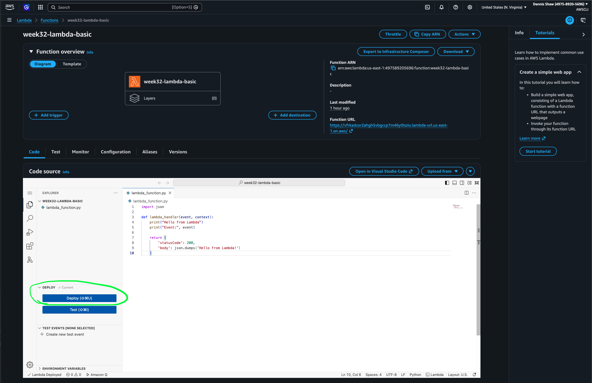

---

## Step 4: Create IAM Role
**(1:00:20 – 1:02:50)**

- open up another tab
- Go to IAM → Roles → Create Role

### Settings
- Trusted entity: AWS Service
- Use case: Lambda
- click **Next**

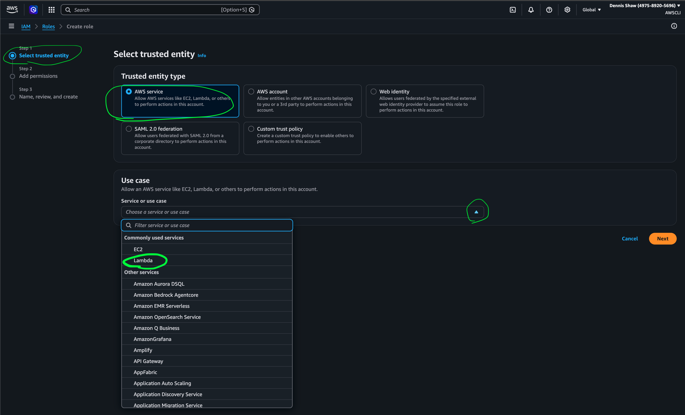

### Add Permissions
- search and select lambdabasicexecutionrole 

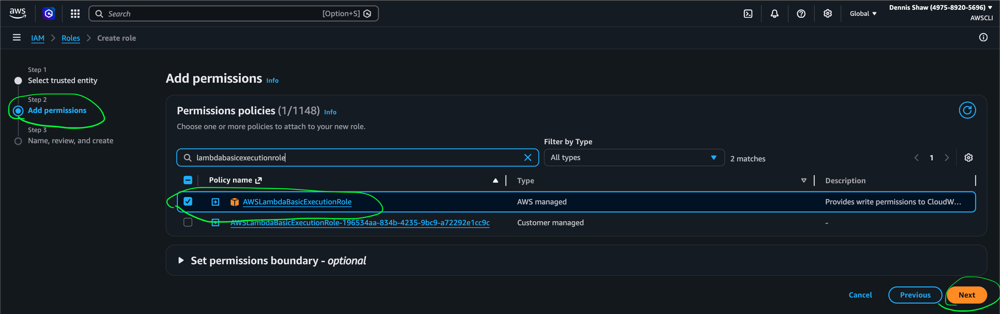

- click **Next**

⚠️ Must be AWS managed

### Name, review, and create
- Role name: week32_lambda_basic_role
- click **Create role**

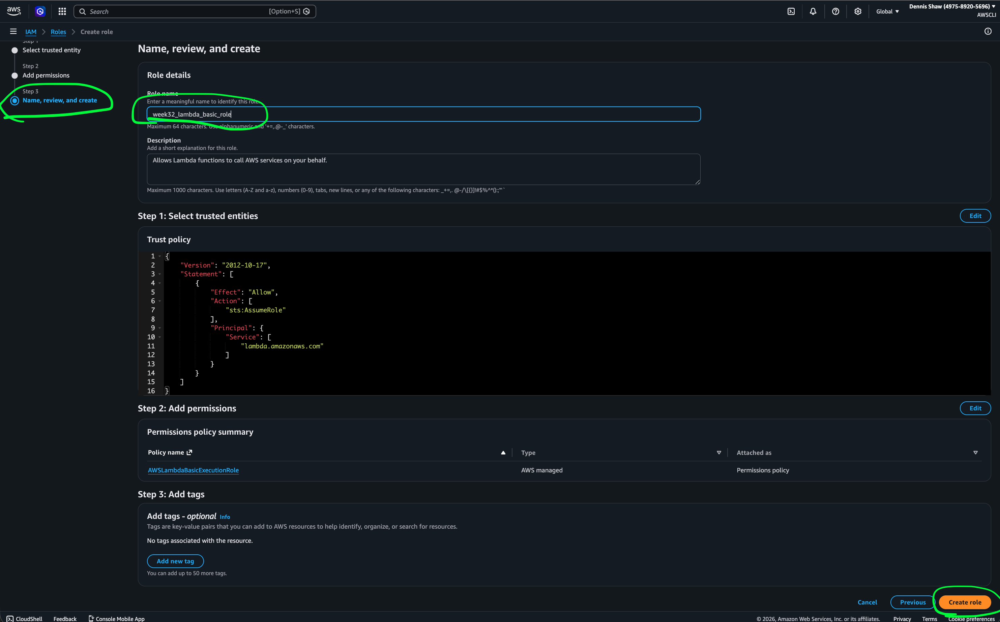

- copy role name: week32-lambda-basic-role
- go back to the Lambda | Functions  tab

---

## Step 5: Attach Role to Lambda
**(1:08:10 – 1:09:10)**

- Go to Lambda → Configuration (tab) → edit

### Update
- change Timeout from 3 -> 15 seconds

```
"timeout" in Lambda = maximum time your function is allowed to run
If it exceeds that time AWS kills the function and you get an error

Why 3 seconds can be a problem:

- Even for simple code, Lambda isn’t always instant
- There’s hidden overhead. You risk this:

[Start Lambda]
→ Cold start (2 sec)
→ Run code (1 sec)
→ Timeout hits
→ Function killed

so 15 seconds is your buffer
```

- Execution role (select created role): week32_lambda_basic_role

Click **Save**

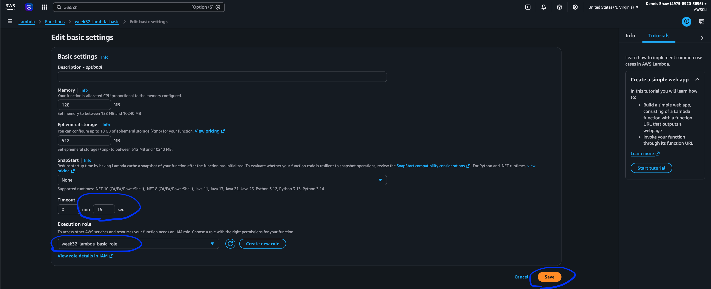

---

## Step 6: Create Function URL
**(missing - video assumes you already have a Function URL)**

- Go to Configuration → Function URL → `Create function URL`

### Settings
- Authentication: NONE

Click **Save**

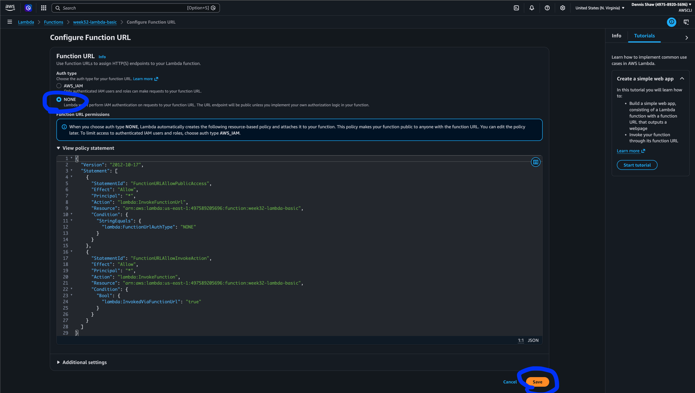

---

## Step 7: Test Lambda
**(1:16:20 – 1:16:40)**

- Copy Function URL

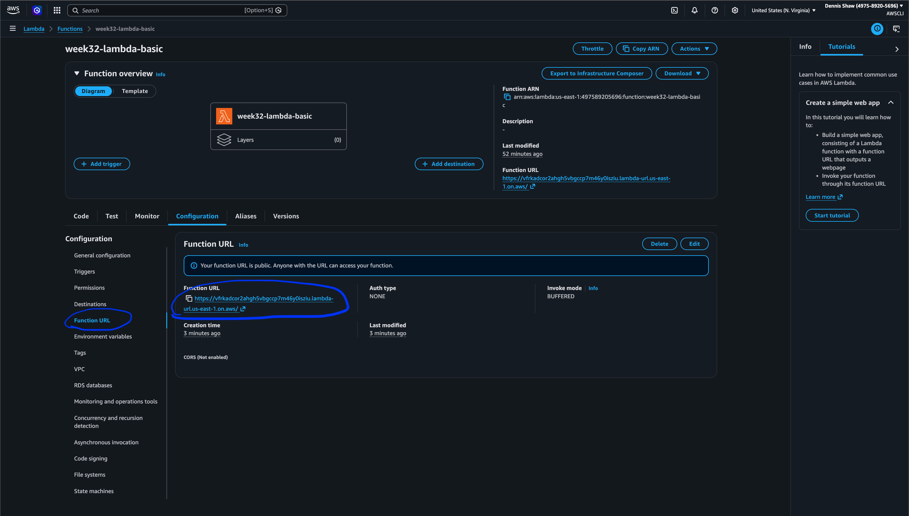

- Open in browser

### Expected Output

```
Hello from Lambda
```

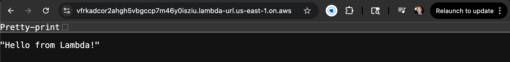

---

## Step 8: Check Logs
**(1:16:45 – 1:17:20)**

- Go to CloudWatch -> Logs -> log Management -> the log group you created

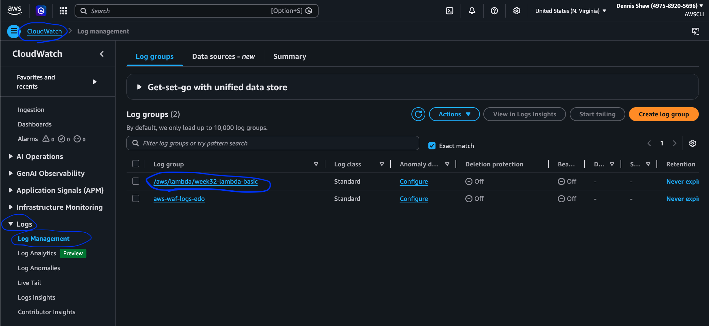

- go to Log streams -> click the date

### Verify
- Function executed
- Output includes:
  - Hello from Lambda

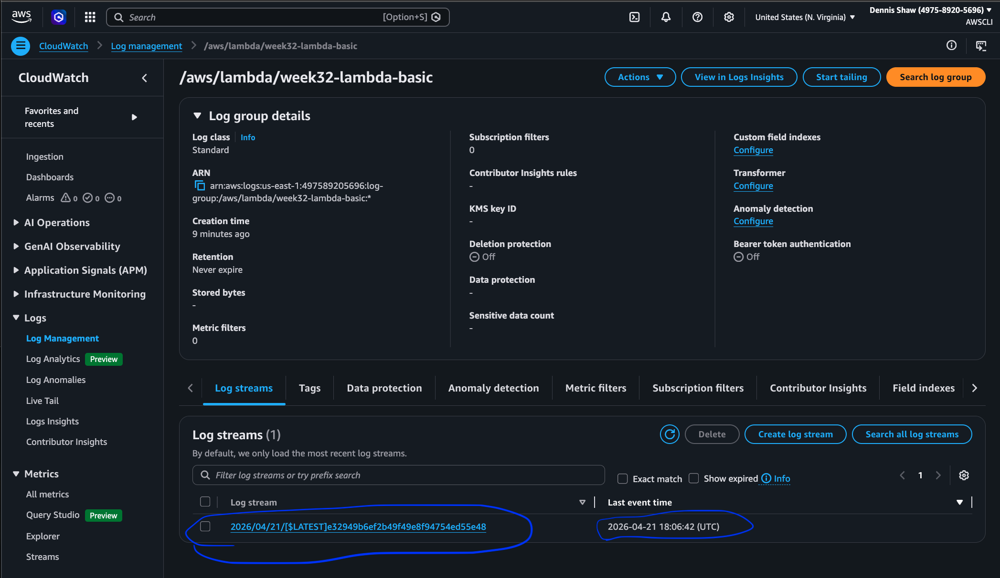

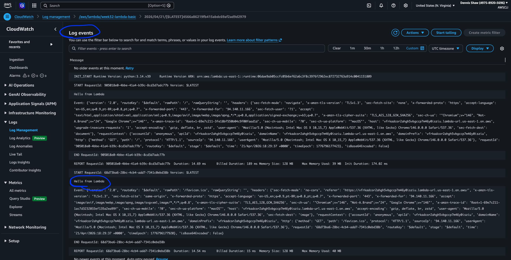

---

## Step 9: Modify Lambda Output (Code Update)

- Go to Lambda -> Functions -> your function -> Code tab

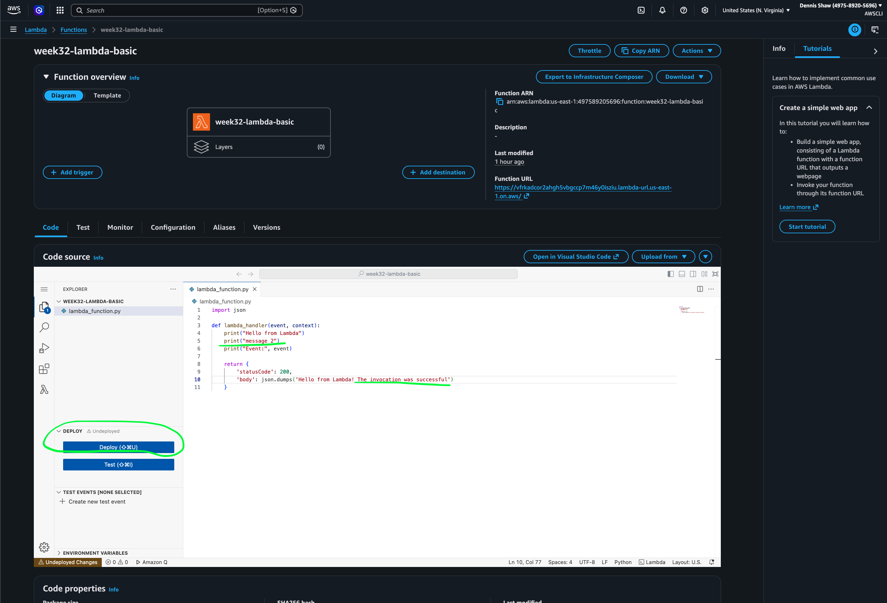

- Modify print statements and HTTP response body

### Example Changes

- Updated print messages:
  - Hello from Lambda, Lambda, Lambda and Omega Moos
  - message 3 lets get some more reps in

- Updated HTTP output:

```
Hello from Lambda! The invocation was successful
```

---

## Step 10: Deploy Changes

- Click Deploy after making code changes


### Verify
- Deployment completes successfully
- No errors shown

---

## Step 11: Verify Updated Logs

- Go to CloudWatch -> Logs -> Log group -> Log streams
- Open latest log stream

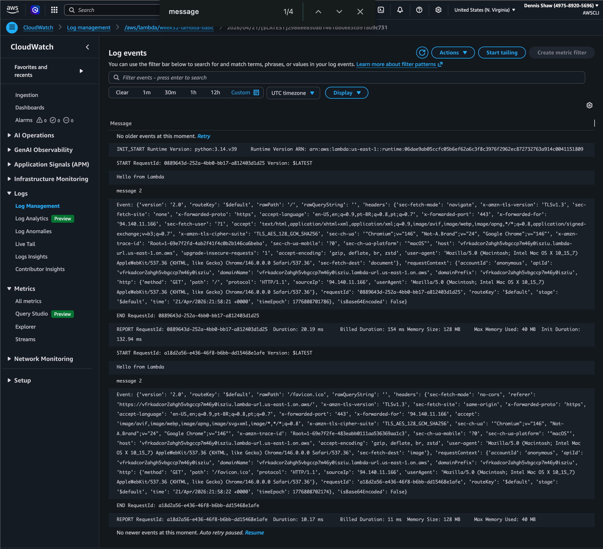

### Verify
- New print statements appear:
  - Hello from Lambda, Lambda, Lambda and Omega Moos
  - message 3 lets get some more reps in
- Event data still present
- Function executed successfully

---

## Step 12: Verify Updated HTTP Output

- Open Function URL again in browser

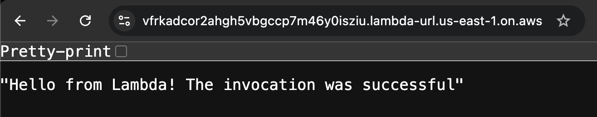

### Verify
- Updated message appears:
  - Hello from Lambda! The invocation was successful

---

### Why SNS is used in this lab

In this lab, AWS Lambda publishes messages to an SNS topic after execution.

This demonstrates event-driven architecture:
- Lambda executes code
- SNS distributes notifications
- Email acts as the subscriber endpoint

This simulates real-world systems where:
- events trigger actions
- systems communicate asynchronously

---

## SNS (Lambda → Notification Integration)

- Go to Functions → Code and replace your code with:

```python
import json
import boto3

sns = boto3.client('sns')

def lambda_handler(event, context):
    print("Hello from Lambda, Lambda, Lambda and Omega Moos")
    print("message 3 lets get some more reps in")
    print("Event:", event)

    sns.publish(
        TopicArn='PASTE_YOUR_TOPIC_ARN_HERE',
        Subject='Lambda Test 1',
        Message='This is SNS email #1 from Lambda'
    )

    return {
        'statusCode': 200,
        'body': json.dumps('Hello from Lambda! Lets just keep going')
    }
```

- search and go to Amazon SNS -> Topics
- Create Topic
  - Details
    - type: Standard
  - name: week32-lambda-sns
- click `Create topic`

- Go to the `Subscription tab` -> `Create subscription`

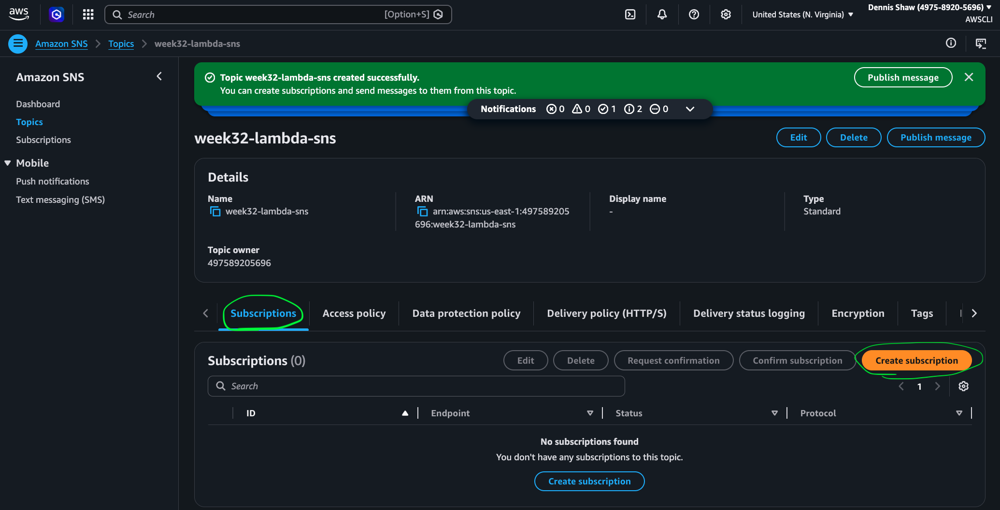

in Create subscription
- Protocol
  - choose Email
- Endpoint
  - use your email
- `Create subscription`

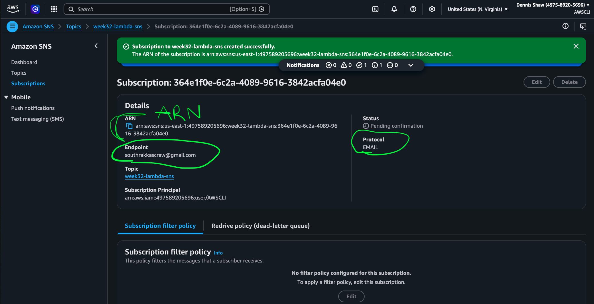

- go to email notification and confirm your aws subscription
  
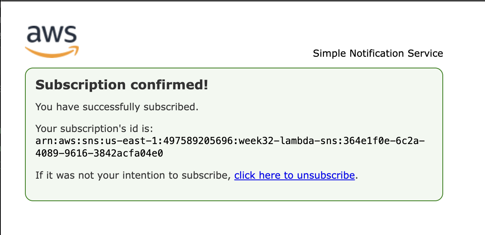

---

go to Lambda and replace my code with this. Make sure you copy and paste your Topic ARN in this code.
  - go to Amazon SNS -> Topics -> topics (Under dashboards on the left)
  - copy ARN here

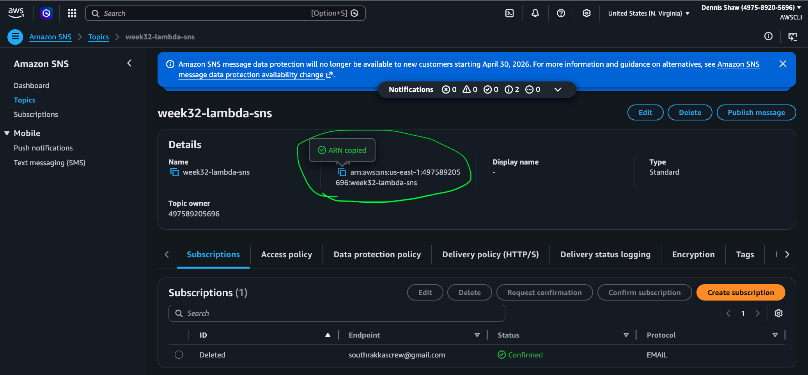

```python
import json
import boto3

sns = boto3.client('sns')

def lambda_handler(event, context):
    print("Lambda SNS test running")

    sns.publish(
        TopicArn='arn:aws:sns:us-east-1:497589205696:week32-lambda-sns',
        Subject='Lambda Test 1',
        Message='This is SNS email #1 from Lambda'
    )

    return {
        'statusCode': 200,
        'body': json.dumps('Lambda SNS test successful')
    }
```

- Attach AmazonSNSFullAccess to your Lambda role in IAM.
  - go to IAM -> Roles
  - go to week32-lambda-basic-role and click on it
  - go to Permissions tab, Permissions policies and `Add permissions`
  
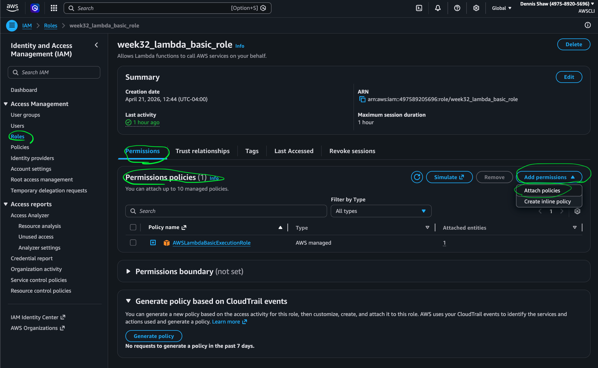

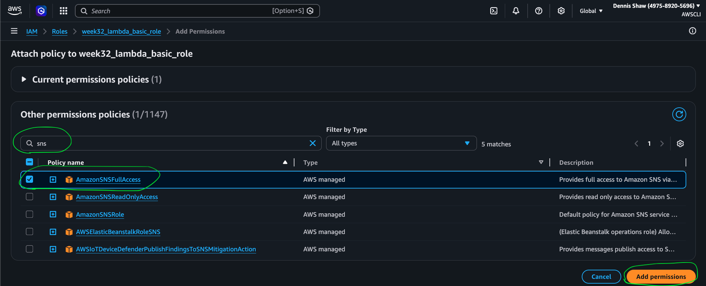

Done - Now your Lambda can send SNS messages.

---

- Go back to Lambda, click Deploy, then open your Function URL.
  
- Expected result:
  - Browser: Lambda SNS test successful
  - Email:
    - Subject: Lambda Test 1
    - Message: This is SNS email #1 from Lambda
---

Fixed a recurring problem with SNS subscriptions being automatically unsubscribed

aws sns confirm-subscription \
  --region us-east-1 \
  --topic-arn arn:aws:sns:us-east-1:497589205696:week32-lambda-sns \
  --token='REDACTED' \
  --authenticate-on-unsubscribe true

---

### 1. Create subscription

- SNS → Topics → week32-lambda-sns
- Click **Create subscription**

Set:
- Protocol: Email
- Endpoint: your email

---

### 2. Copy confirmation link

- Open AWS email don't confirm subscription
- Right-click **Confirm subscription**
- Copy link address

---

### 3. Extract token

From the link:

```
https://sns.us-east-1.amazonaws.com/?Action=ConfirmSubscription&TopicArn=...&Token=LONG_STRING&Endpoint=...
```

Copy only:

```
LONG_STRING
```

---

### 4. Open CloudShell

- AWS Console → CloudShell

---

### 5. Run confirm command

```
aws sns confirm-subscription \
  --region us-east-1 \
  --topic-arn arn:aws:sns:us-east-1:497589205696:week32-lambda-sns \
  --token 'PASTE_TOKEN_HERE' \
  --authenticate-on-unsubscribe true
```

---

### 6. Verify

- SNS → Topic → Subscriptions

Expected:

```
Status: Confirmed
```

---

## Lambda SNS Test

### Lambda Code

```
import json
import boto3

sns = boto3.client('sns')

def lambda_handler(event, context):
    sns.publish(
        TopicArn='arn:aws:sns:us-east-1:497589205696:week32-lambda-sns',
        Subject='Lambda Test 1',
        Message='This is SNS email #1 from Lambda'
    )

    return {
        'statusCode': 200,
        'body': json.dumps('Lambda SNS test successful')
    }
```

---

### Permissions

Attach to Lambda role:

```
AmazonSNSFullAccess
```

---

### Test

1. Deploy Lambda
2. Open Function URL
3. Refresh once

---

### Expected

Browser:
```
Lambda SNS test successful
```

Email:
```
Subject: Lambda Test 1
Message: This is SNS email #1 from Lambda
```

---

### Repeat for homework

- Change Subject
- Change Message
- Deploy
- Trigger

Goal: 6 emails total

## Troubleshooting (SNS Email)

### No email received

- Check SNS → Topic → Subscriptions
- Must show:
```
Status: Confirmed
```

---

### Status shows "Deleted" or auto-unsubscribes

- Use CloudShell confirm method:
```
aws sns confirm-subscription \
  --region us-east-1 \
  --topic-arn arn:aws:sns:us-east-1:497589205696:week32-lambda-sns \
  --token 'NEW_TOKEN' \
  --authenticate-on-unsubscribe true
```

---

### Token not working

- Token expired → create new subscription
- Copy a fresh token from new email

---

### Lambda runs but no email

- Check IAM role has:
```
AmazonSNSFullAccess
```

---

### Wrong ARN error

- Must use Topic ARN (not subscription ARN):
```
arn:aws:sns:us-east-1:497589205696:week32-lambda-sns
```

## Key Takeaways

- Lambda is event-driven compute
- No server management required
- Must understand:
  - IAM roles
  - Triggers
  - CloudWatch logs

---

## Step 13: Add SNS Publish to Lambda

- Go to Lambda -> Functions -> your function -> Code tab
- Add SNS publish logic with:
  - TopicArn
  - Subject
  - Message

### Example 
- (note: this is 6 of 6)

```python
import json
import boto3

sns = boto3.client('sns')

def lambda_handler(event, context):
    sns.publish(
        TopicArn='arn:aws:sns:us-east-1:497589205696:week32-lambda-sns',
        Subject='Lambda Test 6',
        Message='This is SNS email #6 from Lambda'
    )

    return {
        'statusCode': 200,
        'body': json.dumps('Lambda SNS test 6 successful')
    }
```

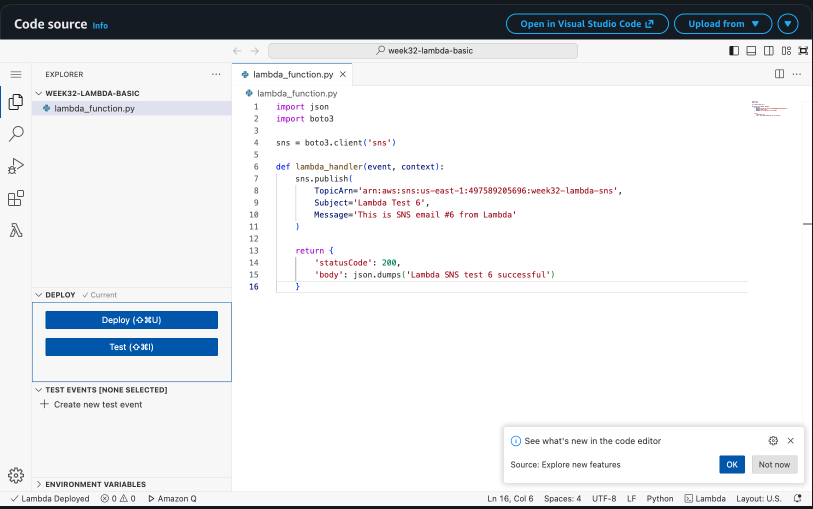

---

## Step 14: Test SNS Through Function URL

- Click **Deploy**
- Open Function URL
- Refresh once

### Verify

- Browser shows updated HTTP output
- Lambda runs successfully

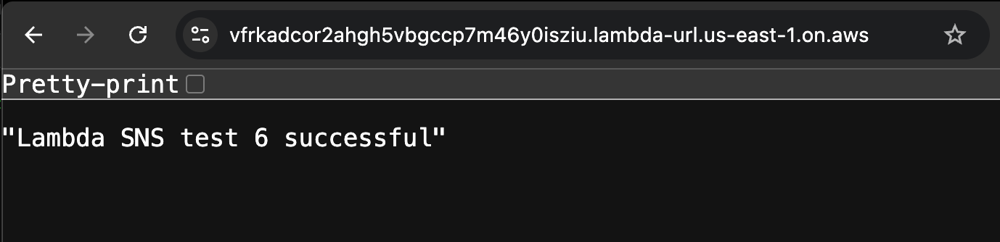

---

## Step 15: Verify SNS Emails

- Check email inbox
- Confirm separate SNS emails were received

### Verify

- 6 separate emails were generated
- Email subject changed
- Email message changed
- HTTP page output changed

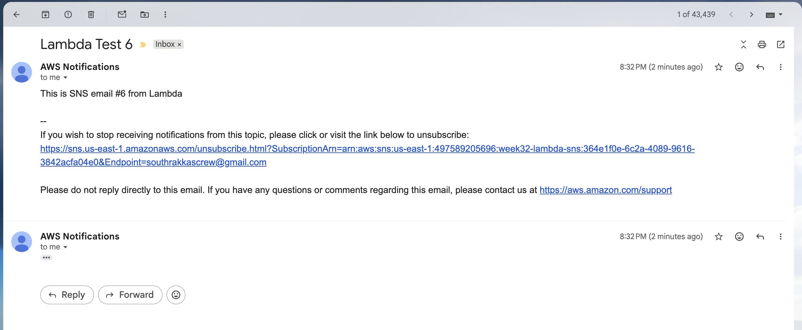

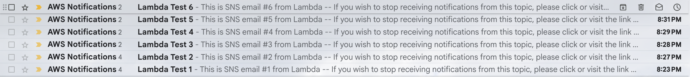

---

## SNS Email Subscription Fix

### Problem

- SNS email subscription confirmed successfully
- Subscription automatically changed to Deleted / Unsubscribed
- Emails were not being delivered

### Solution

- Create a new SNS email subscription
- Copy the confirmation link from the SNS email
- Extract the token from the URL
- Open AWS CloudShell
- Confirm the subscription with authenticated unsubscribe enabled

### Command Used

```bash
aws sns confirm-subscription \
  --region us-east-1 \
  --topic-arn arn:aws:sns:us-east-1:497589205696:week32-lambda-sns \
  --token 'REDACTED' \
  --authenticate-on-unsubscribe true
```

### Result

- SNS subscription remained stable
- Lambda -> SNS -> Email worked successfully

---