# WEEK 33 - CLASS 7: AWS and the Borg  
### Date: 2026-04-21

---

## Overview

This class focuses on:
- AWS Lambda (deep dive)
- API Gateway (HTTP + REST)
- Event-driven architecture
- Intro to Cognito, OAuth2, JWT
- Terraform integration
- WAF (Web Application Firewall)

Goal:  
Move toward a **fully serverless architecture** using Lambda + APIs
- have two lambdas running and an API Gateway

---

## Key Concepts

### Serverless (Lambda)
- Pure code execution (no infrastructure management)
- No patching required
- Reduced infrastructure vulnerabilities
- Focus shifts to:
  - code quality
  - logic
  - permissions

📌 “Lambda = pure code execution”

---

### Event-Driven Architecture
- Core pattern for modern cloud systems
- Services trigger each other via events
- Used with:
  - Lambda
  - API Gateway
  - S3
  - Future: AI integrations

---

### Authentication Direction (Preview)

Coming soon:
- OAuth2
- JWT (JSON Web Tokens)
- SSO (mainly in later class)

📌 These will be **required for future projects** 

---

## Lab Setup (Lesson B)

- https://github.com/balericaAI/lambda/tree/main/lessonb

### Lab Goal

- Create **2 Lambda functions**
  - 1 Python
  - 1 Node.js
- Connect them to **1 API Gateway**

📌 Simple setup, foundation for bigger systems

---

## ⚠️ Critical Lambda Rule

Before uploading code:

- You MUST:
  - Save code locally
  - **ZIP the file**
  - Upload ZIP to Lambda

📌 “You have to zip it… that’s the only way”

---

## Lab Walkthrough (Step-by-Step)
*note: there are 2 different methods being shown: **Python Lambda** and **Node.js Lambda**.

### Step 1 – Open AWS Console
- Go to Lambda

### Step 2 – Create Function

- Click: **Create Function**
- Choose:
  - Author from scratch
  - function name: python-function
  - Runtime: Python 3.14
  - **Create function**

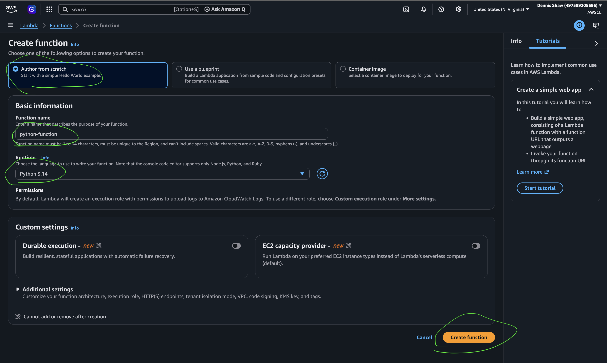

---

### Step 3 – Python Lambda
- code from Theo's repo: 
  - https://github.com/BalericaAI/lambda/tree/main/lessonb/lambda
- In the Lambda code editor, replace the default code with your Python function

- Click **Deploy**

Example:

```python
import json
from datetime import datetime, timezone

def lambda_handler(event, context):
    name = event.get("queryStringParameters", {}).get("name", "Unknown")

    response = {
        "message": f"Hello {name}, Dennis, Theo, Aaron from Python!",
        "timestamp": datetime.now(timezone.utc).isoformat()
    }

    return {
        "statusCode": 200,
        "headers": {"Content-Type": "application/json"},
        "body": json.dumps(response)
    }
```

---

### Step 4 – Upload Code 

Zip method:
- Open VS Code
- Create your Lambda file
- ZIP the file
- Upload to Lambda

I used the inline editor:
- Inline editor
- Paste code

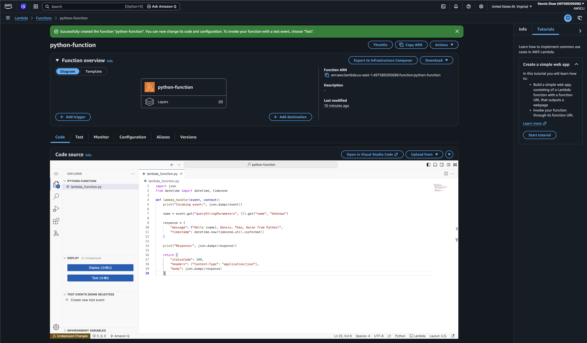

- Deploy
- Test
  - Create new test event
    - paste:
  
  ```json
  {
  "queryStringParameters": {
    "name": "Dennis"
   }
  }
  ```

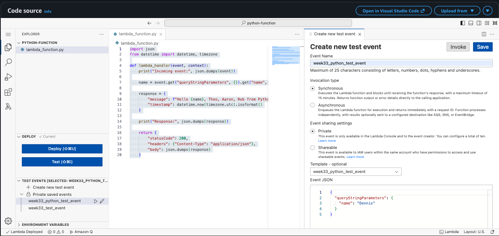

- Save
- Test

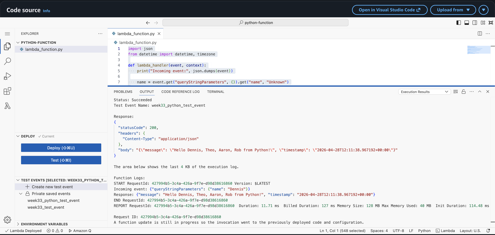

> [!NOTE]
> ### Supplemental note  
> **Lambda Code Workflow: Zip vs Inline Editor**
>
> **Option 1 — Inline Editor (Simple / Lab Use)**
> - Write or paste code directly in AWS Lambda console
> - Click **Deploy**
> - Test immediately
>
> Use this when:
> - Code is small
> - No external files or libraries
> - Quick testing or learning
>
> **Option 2 — Zip Upload (Real Deployment)**
> - Write code in VS Code (or locally)
> - Save file(s) (e.g., `lambda_function.py`)
> - Zip the files into one `.zip`
> - Upload `.zip` to AWS Lambda
> - AWS automatically unzips and runs your code
>
> Use this when:
> - You have multiple files
> - You use external libraries
> - You are deploying with Terraform or automation
>
> **Key Difference**
> - Inline = fast and simple (paste → deploy)
> - Zip = structured and scalable (build → package → upload)

- Click **Test**
- Create a test event:
  - Name: `test-python`

---

### Verify Lambda/Node Logs (CloudWatch) {#verify-lambda-logs}

#### a) – Open Lambda Functions
- Go to AWS Console
- Search: **Lambda**
- Click **Functions**

---

#### b) – Select Function
- Click your function:
  - `node-function` (or Python equivalent)

---

#### c) – Open Monitor Tab
- Click **Monitor**

---

#### d) – Open CloudWatch Logs
- Click **View CloudWatch Logs**

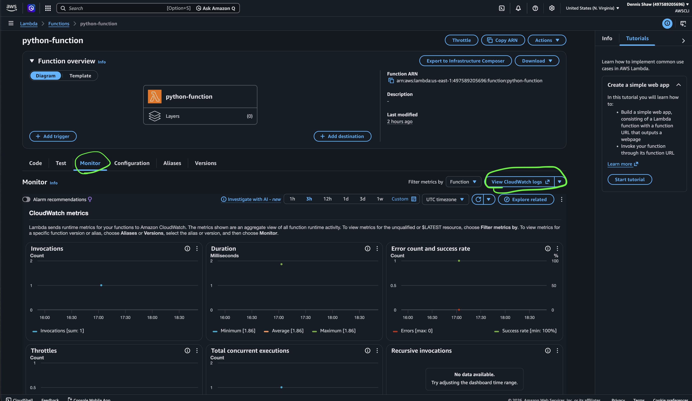

---

#### e) – Select Log Group
- Click:
  - `/aws/lambda/node-function`

---

#### f) – Open Latest Log Stream
- Click the most recent log stream:
  - Format: `YYYY/MM/DD/[$LATEST]...`

---

#### g) – Confirm Logs

Look for:

```text
Incoming event: {"queryStringParameters":{"name":"Dennis"}}
Response: {"message":"HELLO DENNIS, DENNIS, THEO, AARON FROM NODE!"}
```

---

#### Result

- Confirms Lambda executed successfully
- Confirms event input was received
- Confirms response output was generated
- Confirms logs are stored in CloudWatch

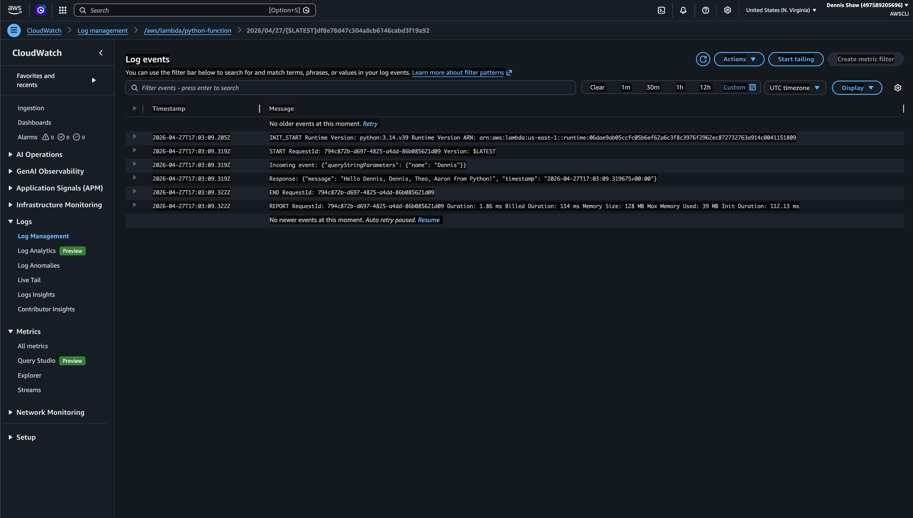

---
*now we build the same thing using node.js*

### Step 5 – Node.js Lambda

- Go to Lambda
- Click **Create function**
- Choose:
  - Author from scratch
  - Function name: `node-function`
  - Runtime: **Node.js 24.x**
- Click **Create function**

---

### Step 6 – Add Node.js Code
- code from Theo's repo: 
  - https://github.com/BalericaAI/lambda/tree/main/lessonb/lambda

- In the Lambda code editor, replace the default code with:

```javascript
export const handler = async (event) => {
    console.log("Incoming event:", JSON.stringify(event));

    const name = event.queryStringParameters?.name || "Unknown";

    const response = {
        message: `HELLO ${name.toUpperCase()}, DENNIS, THEO, AARON FROM NODE!`,
    };

    console.log("Response:", JSON.stringify(response));

    return {
        statusCode: 200,
        headers: { "Content-Type": "application/json" },
        body: JSON.stringify(response),
    };
};
```
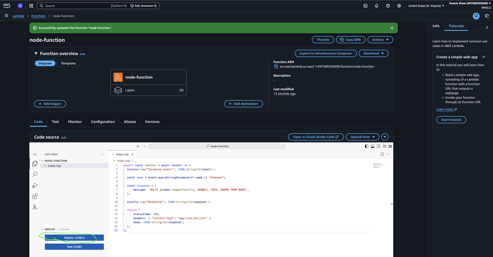

- Click **Deploy**

---

### Step 7 – Test Node.js Lambda

- Click **Test**
- Create a test event:
  - Name: `test-node`

Use this JSON:

```json
{
  "queryStringParameters": {
    "name": "Malgus"
  }
}
```

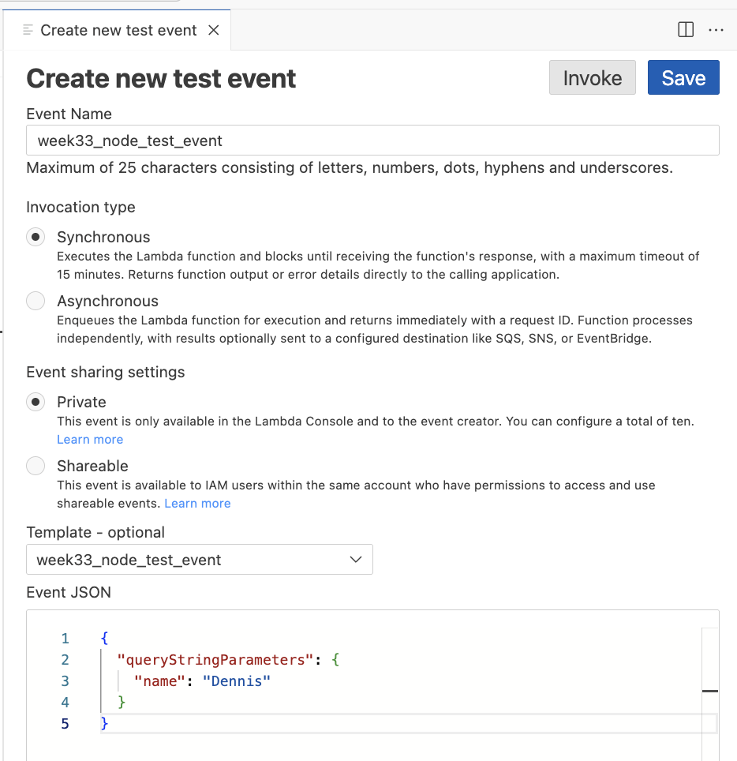

- Click **Save**
- Click **Test**

Expected result:
- Status: **Succeeded**
- Output contains:
  - `HELLO DENNIS, DENNIS, THEO, AARON FROM NODE!`

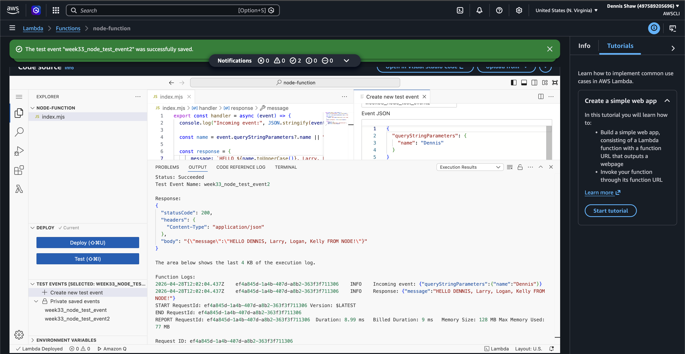

- Verify Node Logs (CloudWatch):
  - [Go to previous verify Logs instructions](#verify-lambda-logs)

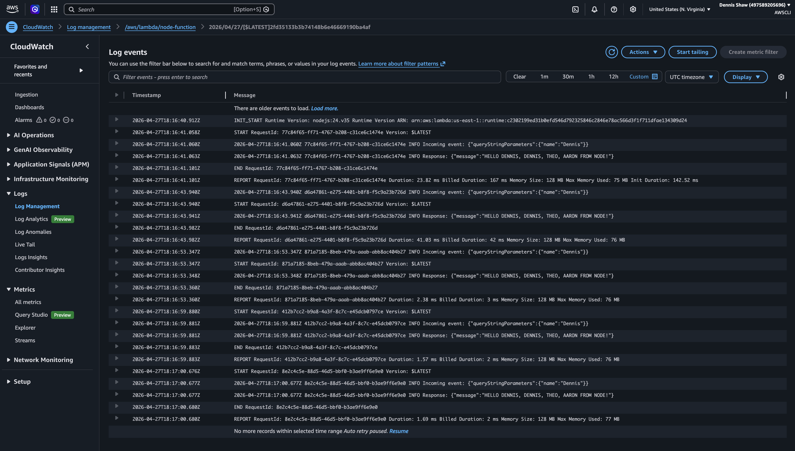

---
### Step 7 – HTTP API Gateway
### 🕒 1:19:30 

> [!NOTE]
> This lab uses **HTTP API, not REST API**.  
> HTTP API is faster, cheaper, and matches the teacher’s checklist.


- Create 1 API Gateway
- Connect BOTH Lambdas

Expected result:
- Each endpoint returns output (names)

---

- Go to console -> API Gateway
- Create API
- choose HTTP API -> click `Build`

**Configure API**
- API name: week33-http-api
- Integrations:
  - Add integration
    - Lambda
    - AWS Region: us-east-1
    - Lambda Function choose: python-function
    - version: 2.0
- Add integration (again)
    - Lambda
    - AWS Region: us-east-1
    - Lambda Function choose: node-function
    - version: 2.0
 - click 'Next'

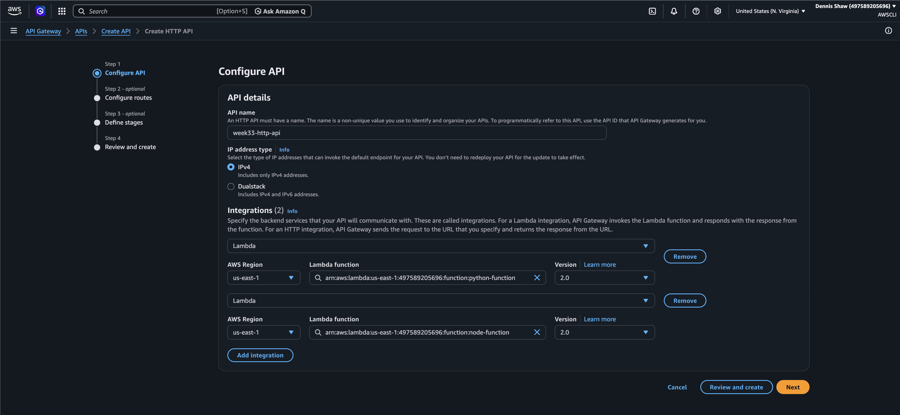

---

### Set Python route
On the routes screen, set:

**Configure routes**
- Add route:
  - Method: GET
  - Resource path: /python
  - Integration target: python-function

**Add Node route**
- Add route:
  - Method: GET
  - Resource path: /node
  - Integration target: node-function

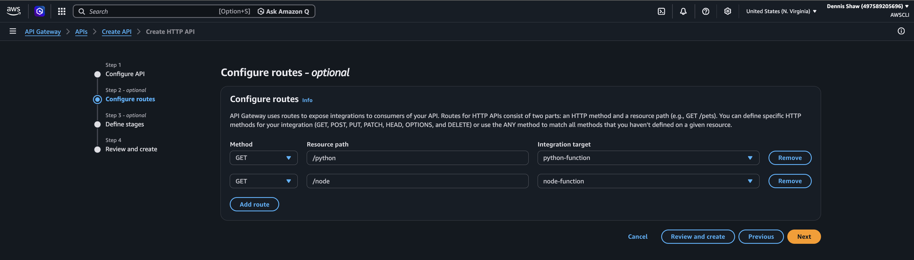

- click 'Next'

**Define stages**
change Stage name to: prod

-click `Next`

**Review and create**

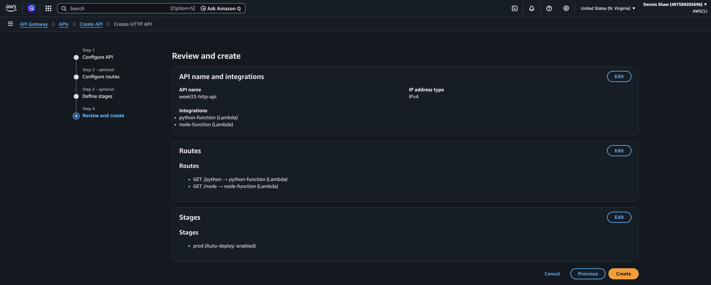

-click `Create`

click on your API endpoin URL

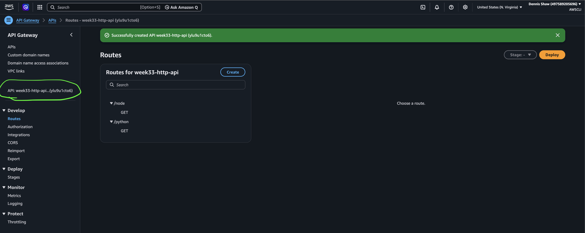

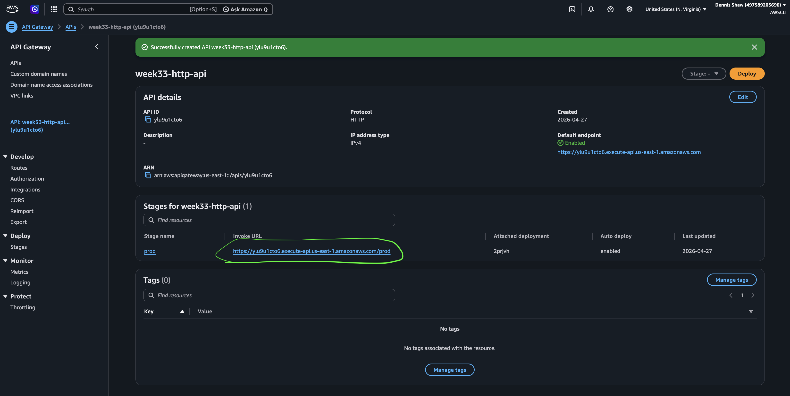

-https://ylu9u1cto6.execute-api.us-east-1.amazonaws.com/prod
  - you will get this message: {"message":"Not Found"}
  - need to add on
  - https://ylu9u1cto6.execute-api.us-east-1.amazonaws.com/prod<mark>/node?name=Dennis</mark>

> [!NOTE]
> ### How API Gateway URLs Work
>
> API Gateway gives you a **base URL**, but that alone does not call your Lambda.
>
> You must append additional parts to reach a specific function.
>
> #### URL Structure
>
> ```
> Base URL + Stage + Route + Query Parameters
> ```
>
> #### Example
>
> ```
> https://abc123.execute-api.us-east-1.amazonaws.com/prod/node?name=Dennis
> ```
>
> #### Breakdown
>
> - Base URL → API Gateway endpoint  
> - Stage → `/prod` (deployed version of the API)  
> - Route → `/node` (determines which Lambda runs)  
> - Query Parameter → `?name=Dennis` (input passed to the function)
>
> #### Key Idea
>
> - The base URL alone returns **"Not Found"**  
> - The **route** tells API Gateway which Lambda to execute  
> - Query parameters become part of the **event input**

### Deliverables

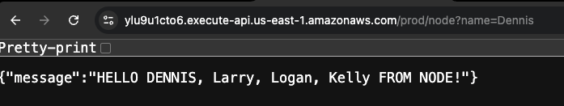

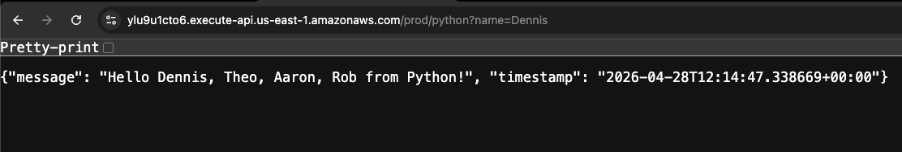

---

### Check Logs

1. Hit your working endpoint:
   - `.../prod/node?name=Dennis`

2. Go to:
   - Lambda → node-function → Monitor → View CloudWatch Logs → Recent invocations → click on LogStream

3. Open latest log stream

4. Confirm you see:

```text
Incoming event: {"queryStringParameters":{"name":"Dennis"}}
Response: {"message":"HELLO DENNIS, DENNIS, THEO, AARON FROM NODE!"}
```

That’s your “healthy” state.

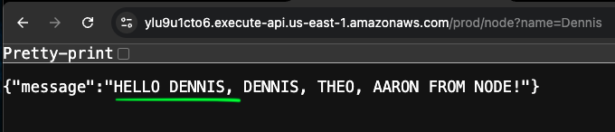

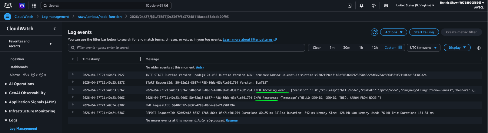

---

### Break Test — Missing Query String

Working URL:
`/prod/node?name=Dennis`

Broken URL:
`/prod/node`

Result:
- `rawQueryString` changed from `"name=Dennis"` to `""`
- `queryStringParameters` was missing
- Lambda used the fallback value: `"Unknown"`
- Response returned: `"HELLO UNKNOWN, DENNIS, THEO, AARON FROM NODE!"`

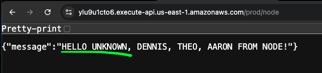

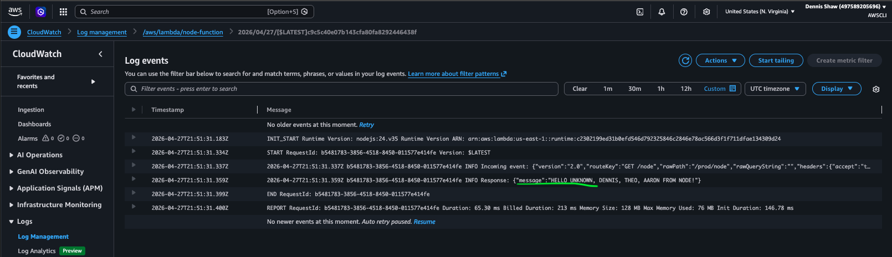

Key takeaway:
Logs show what actually changed in the event payload.

### WAF

go to consol -> WAF & Shield

Create Web ACL

verify the region you want *its regional not global
name: week33-waf

click -> **Next**

Step 1 — Add a rule

Click:
- Add rules → Add my own rules and rule groups

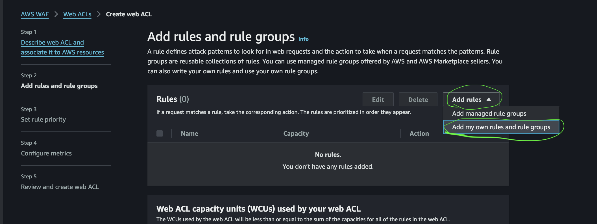

Then:
- Add rule → Rule builder
- name: block-query-missing
- Type: Regular rule
- If a request: matches the statement
- Statement
  - Inspect:
    - Query string
    - Size equals
    - Size in bytes
      - 0
- Then
  - Action: Block
- **Add rule**

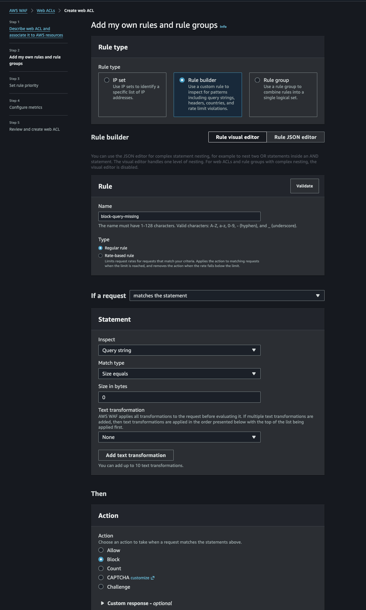

Add rules and rule groups (no changes)
- click **Next**

Set rule priority (no changes)
- click **Next**

Amazon CloudWatch metrics (no changes)
- click **Next**

Review and create web ACL

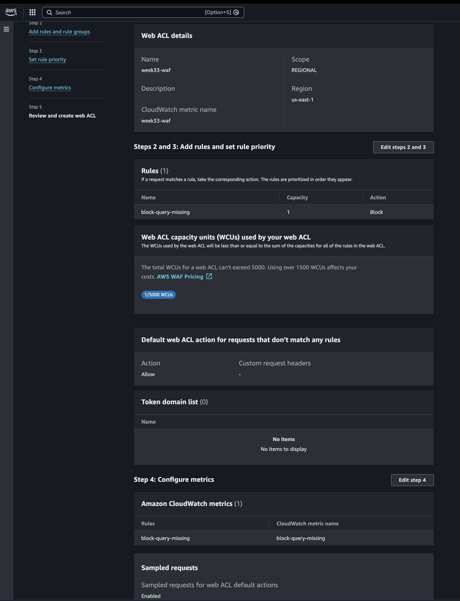

- click **Create web ACL**
  
> [!NOTE]
> WAF was created successfully but not attached to API Gateway because HTTP API does not support direct WAF association.  

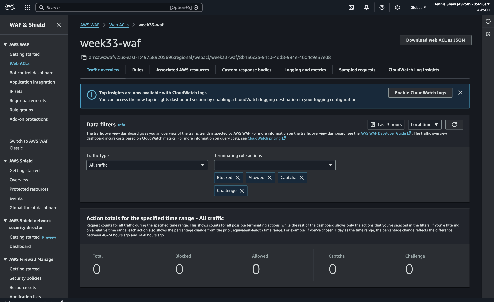

## What You Should Understand After Class

- How Lambda works
- How to deploy code to Lambda
- Why ZIP packaging is required
- How API Gateway connects to Lambda
- Basics of event-driven systems
- Direction toward:
  - authentication
  - serverless apps
  - AI integration

---

## What’s Coming Next

- Terraform automation of Lambda + API Gateway
- JWT authentication
- OAuth2 flows
- WAF protection
- AI + Lambda integration (Bedrock)

---

## Key Takeaways

- Serverless = future of cloud apps
- Lambda removes infrastructure complexity
- APIs are the gateway to everything
- Authentication is about to become critical
- Hands-on > watching

---

## Source

- [WEEK 33 - CLASS 7: AWS and the Borg (Apr 21)](https://youtu.be/C9oPbsL2FGk?si=RjwvXwm-FhGHF8cQ)
- Transcript: ../transcripts/week33-class7.txt