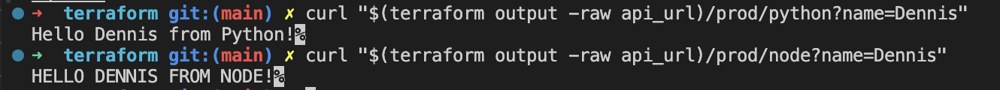
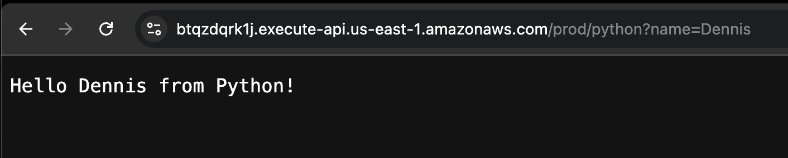

## source code:

- https://github.com/BalericaAI/lambda/tree/main/lessonc/terraform

# Week 33 Part 2

1. Created IAM role with basic execution policy (CloudWatch logging)

2. Created Lambda functions in Terraform:
   - function_name = node-function
   - runtime = nodejs18.x
   - handler = index.handler
   - function_name = python-function
   - runtime = python3.11
   - handler = index.handler

3. Prepared Lambda code:
   - created index.js
   - ensured it exports handler function
   - created index.py
   - ensured it defines handler function

4. Packaged Lambda code:
   - zipped index.js into node.zip
   - zipped index.py into python.zip
   - ensured index.js and index.py are at the root of their zip files

```
lambda git:(main) ✗ unzip -l python.zip
Archive:  python.zip
  Length      Date    Time    Name
---------  ---------- -----   ----
      272  05-05-2026 21:15   index.py
      163  05-05-2026 21:15   __MACOSX/._index.py
---------                     -------
      435                     2 files
```

I don't want the mac file here should only be 1 file


During Lambda packaging, the zip archives initially included macOS metadata (__MACOSX),
which can interfere with AWS Lambda execution.

This was resolved by recreating the zips using:

```bash
rm node.zip
zip -X node.zip index.js

rm python.zip
zip -X python.zip index.py
```
```
correct, no MACOSX
lambda git:(main) ✗ unzip -l python.zip
Archive:  python.zip
  Length      Date    Time    Name
---------  ---------- -----   ----
      272  05-05-2026 21:15   index.py
---------                     -------
      272                     1 file
```

This ensured only the required file was included at the root level of each archive.

---

## Run 
- terraform init
- terraform validate
- terraform plan
- terraform apply

I didn't destroy my clickops build so I had errors showing the lambda builds already exist. so I ran

```bash
terraform git:(main) ✗ terraform import aws_lambda_function.node node-function
terraform import aws_lambda_function.python python-function
```
This imported existing ClickOps resources into Terraform state,
allowing Terraform to fully manage and destroy them.

#### api.tf code
Theo's code seems to have some duplications.
- delete an add the duplicate resorces in API Gateway and replace them with

```hcl
resource "aws_apigatewayv2_api" "api" {
  name          = "week33-http-api"
  protocol_type = "HTTP"
}
```

IVPA

```bash
api_url = "https://btqzdqrk1j.execute-api.us-east-1.amazonaws.com"
```






---