 and Week 34 Lab Walkthrough


## Practice (ClickOps)

- Deploy a WAF in AWS and attach it to the API Gateway built last week  
- Return 3 different screenshots of the WAF allowing requests to the API Gateway  
 Spin up Terraform

---


Go to console -> WAF & Shield -> Create web ACL
- add name: week34-api-waf-clickops
- description is optional
- click `Next`


Go to Rules and add Rule (click droptown) choose `Add managed rule groups`
Select `AWS managed rule groups`
Scroll down to `Free rule groups` and select
- Anonymous IP list
- Core rule set
- Known bad inputs
Click `Add rules`

Go back to Rules -> `Add rules` (dropdown) 
choose `Add my own rules and rule groups`
Go to Rule and name it: week34-api-waf-clickops
below that is Type:
- Rate-based Rule
Rate-limiting criteria:
- in Rate limit put 100
in Add Rules and Rule groups 
- Click `Add rules`
in Set rule priority
- Click `Next`
in Configure metrics
- Click `Next`
in Review and create we ACL
- Click `Create web ACL`

Success!

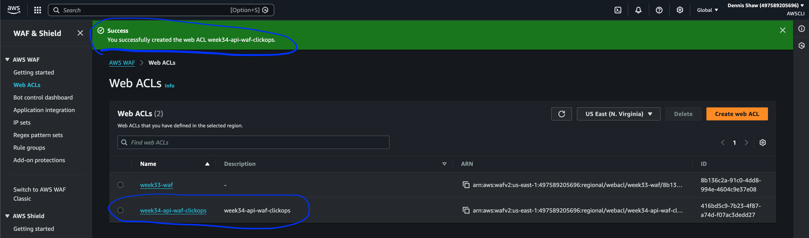

Click on the created ACL
Go to the tab: Associated AWS resources
click Add AWS resources
click the one you previously created
Click `Add`

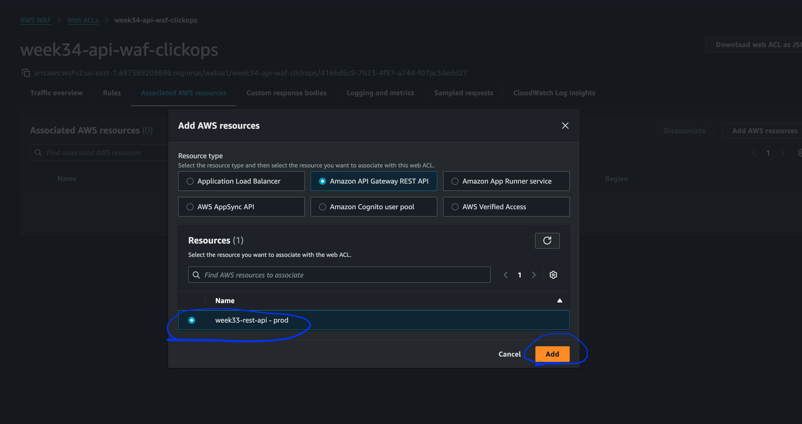

now open terminal and do a url request
- duplicate console go to api
- choose the rest api (available)
- go to `Stages` in the left menu
- copy Invoke URL: 
  - https://mbc99dd567.execute-api.us-east-1.amazonaws.com/prod and add /node?=Dennis

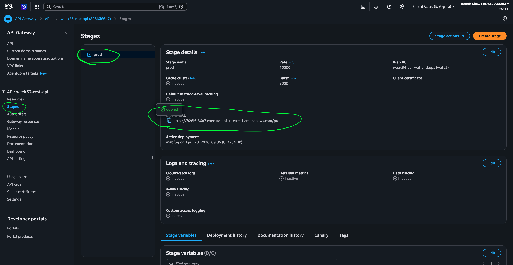

Submissions

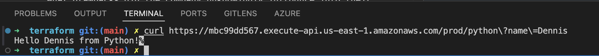

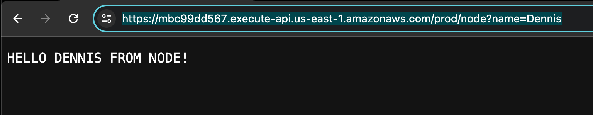

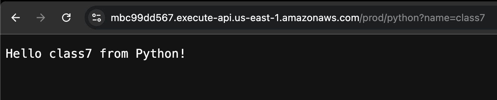

---

## Terraform

# 5-waf.tf

create .tf file and add code: 
- https://github.com/BalericaAI/lambda/blob/main/lessonc/terraform/waf.tf
- change name:
  - week34-api-waf-tf because I used week34-api-waf-clickops for the console

> [!NOTE]
> ## WAF + API Gateway Terraform Issue
>
> During the Week 34 Terraform WAF implementation, the WAF association failed with:
>
> ```text
> WAFInvalidParameterException: The ARN isn't valid
> ```
>
> Initial implementation used:
>
> ```hcl
> aws_apigatewayv2_api
> ```
>
> which creates an HTTP API (API Gateway v2).
>
> The Terraform configuration attempted to associate AWS WAF using:
>
> ```hcl
> resource "aws_wafv2_web_acl_association" "api_assoc"
> ```
>
> However, AWS WAF association support differs between:
>
> - REST APIs (`aws_api_gateway_rest_api`)
> - HTTP APIs (`aws_apigatewayv2_api`)
>
> Class walkthroughs and Terraform behavior indicated that WAF association support for API Gateway stages applies to REST API Gateway stage ARNs, not the HTTP API configuration used in this lab.
>[reference class video at 09:21 → 09:47 and 28:48 → 29:05](https://www.youtube.com/watch?v=QSplRFyYfSY&list=PLzfyR91ut1X3Dtxbub2F2kUuRrPK7_-Gs&index=3)
> As a result:
>
> - Week 33 Terraform HTTP API deployment worked correctly
> - Lambda integrations worked correctly
> - API Gateway routes worked correctly
> - WAF association failed because the API type and ARN format were incompatible with the WAF association resource
>
> Key takeaway:
>
> ```text
> REST API Gateway and HTTP API Gateway use different Terraform resources,
> different ARN formats, and different WAF association behavior.
> ```
>
> This issue highlighted an important AWS infrastructure distinction:
>
> - `aws_api_gateway_rest_api` → REST API Gateway
> - `aws_apigatewayv2_api` → HTTP API Gateway
>
> The original Terraform implementation used the HTTP API resource,
> while the WAF attachment workflow expected REST API behavior.

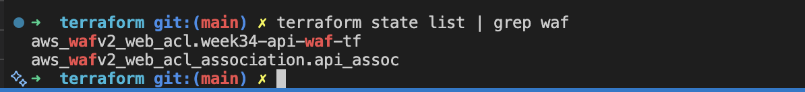

added a new api for rest
- `4-api-rest.tf`
- changed the `99-output.tf` to reflect this

Run:
- terraform validate
- terraform plan
- terraform apply

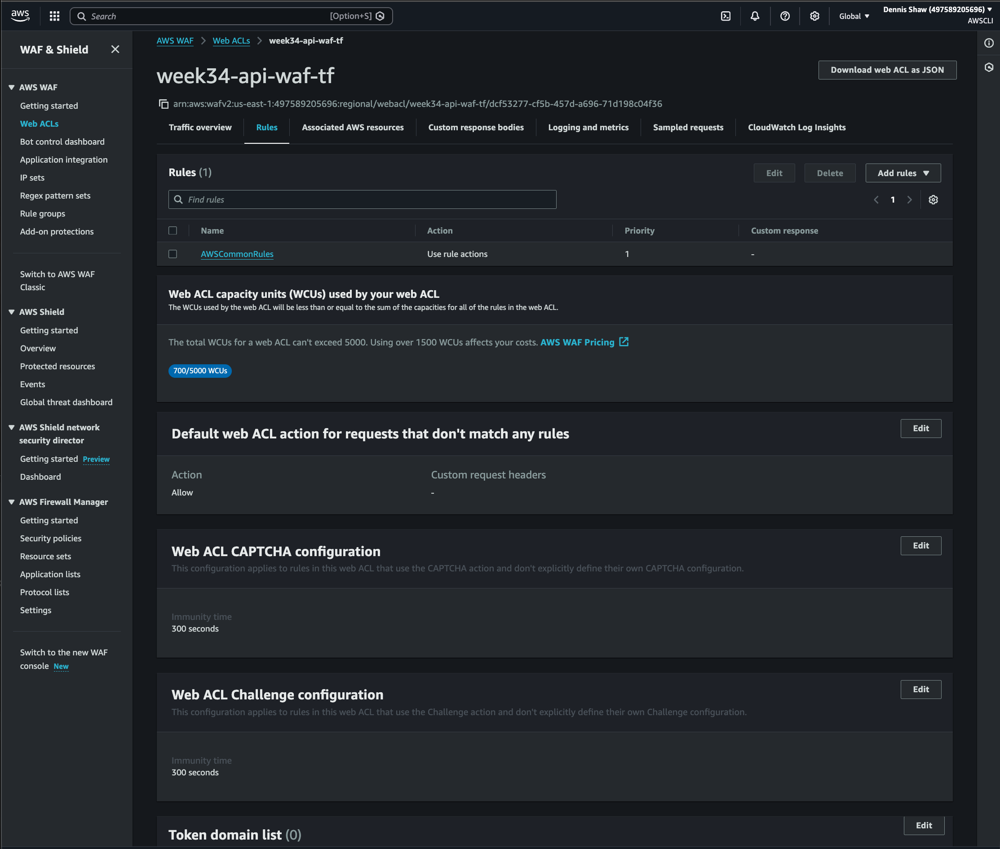

```bash
curl "$(terraform output -raw api_url)/python?name=Dennis"

curl "$(terraform output -raw api_url)/node?name=Dennis"
```

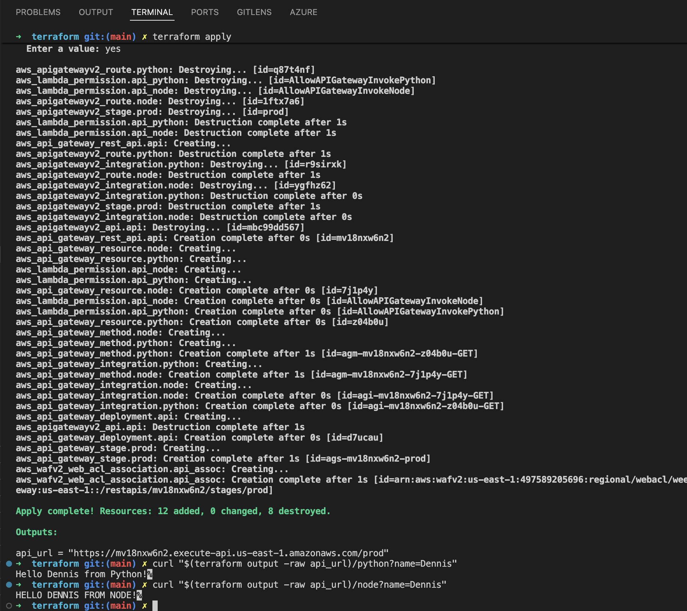

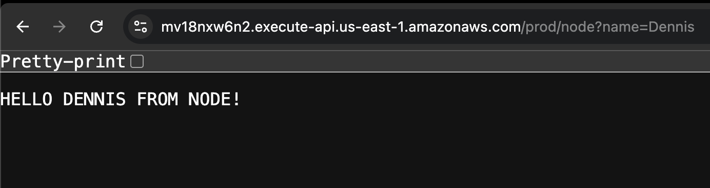

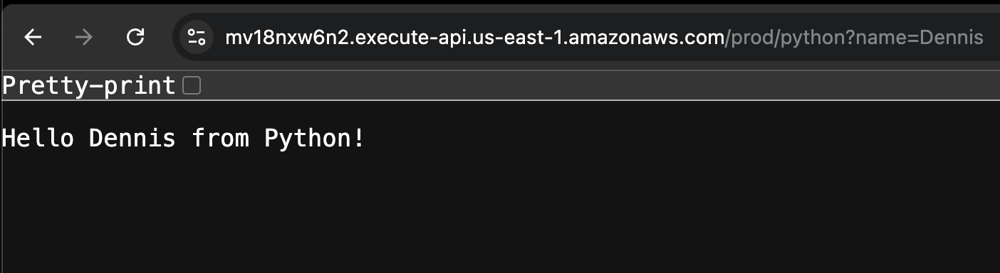

---

Add the extra rules laid out in class

Run:
- validate
- plan
- apply

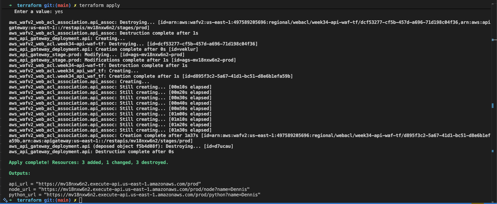

```bash
curl "$(terraform output -raw api_url)/python?name=Dennis"

curl "$(terraform output -raw api_url)/node?name=Dennis"
```

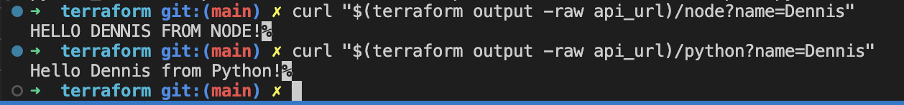

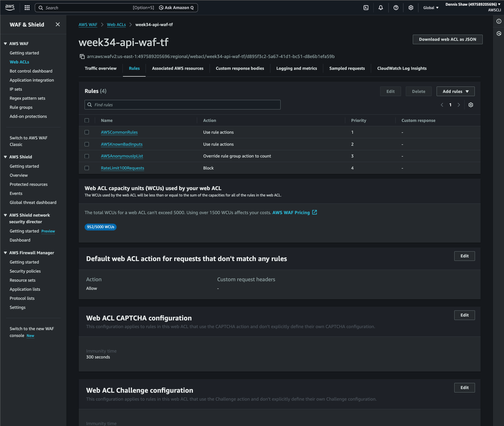

---

## Additional WAF Rules Added

Additional managed rule groups were added to align with class configuration examples.

Added rules:

- `AWSManagedRulesCommonRuleSet`
- `AWSManagedRulesKnownBadInputsRuleSet`
- `AWSManagedRulesAnonymousIpList`
- custom rate limit rule (`100 requests per 5 minutes per IP`)

Note:

The `AWSManagedRulesAnonymousIpList` rule initially blocked normal testing traffic and returned:

```text
{"message":"Forbidden"}
```

To allow valid lab testing traffic while still monitoring matches, the rule behavior was changed from:

```hcl
override_action {
  none {}
}
```

to:

```hcl
override_action {
  count {}
}
```

This allowed requests to continue while still logging/counting anonymous IP matches.

---

Tear Down:
- terraform destroy

---

Push to Github