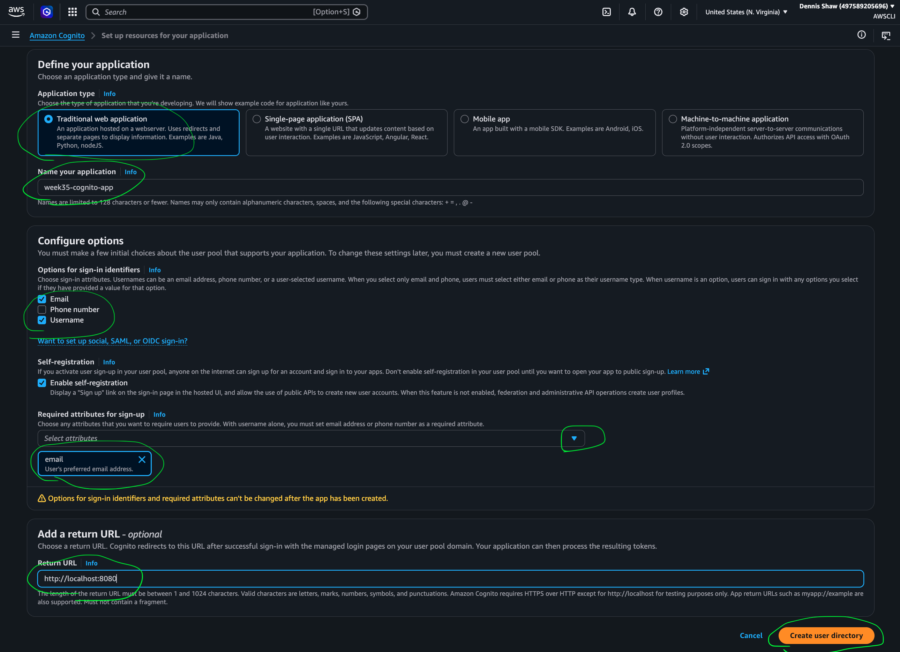
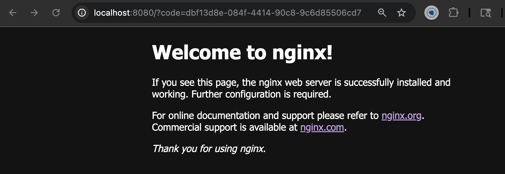
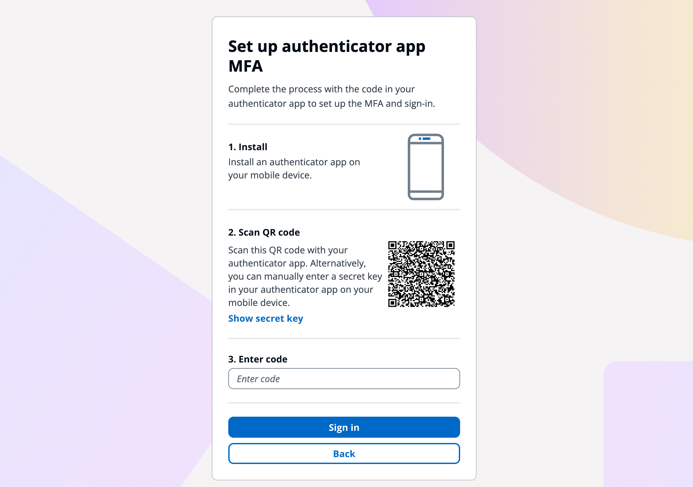
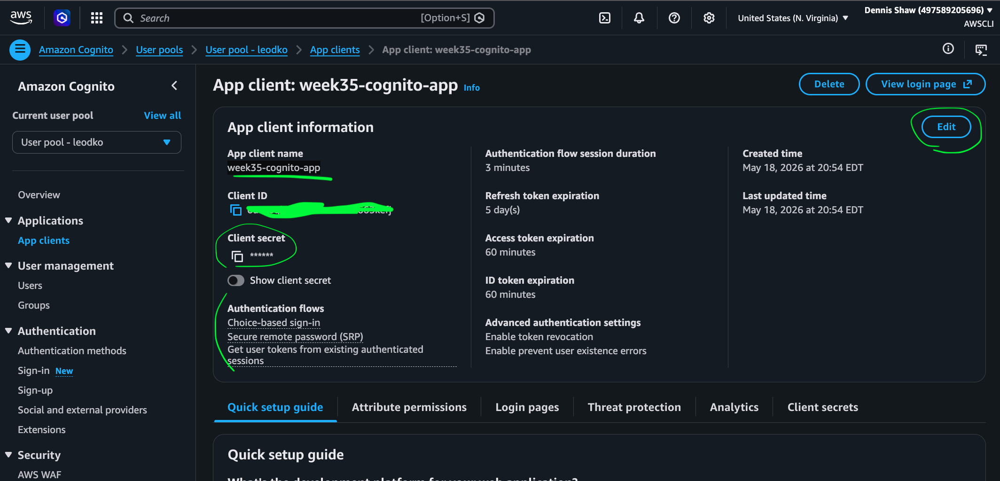
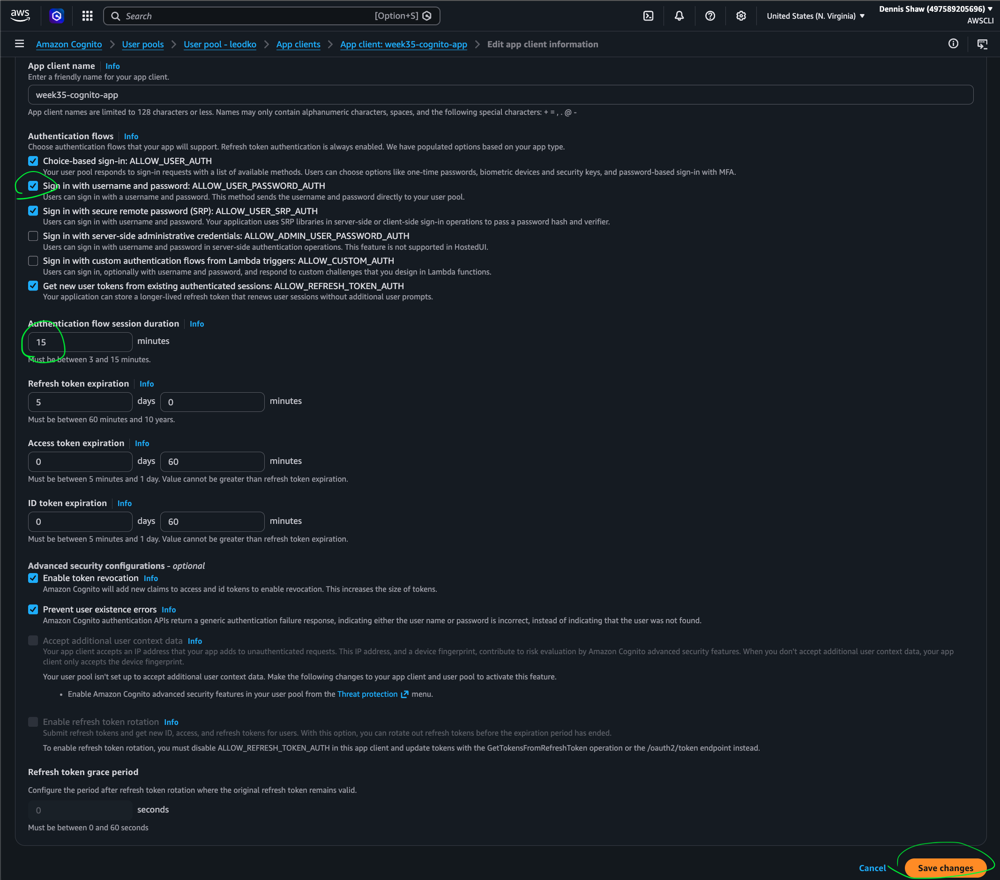
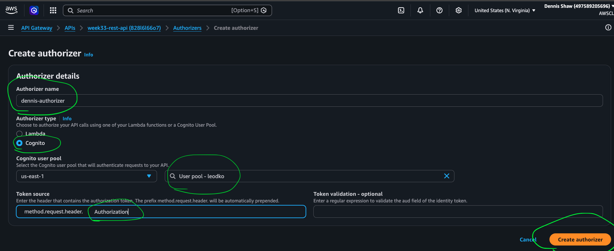
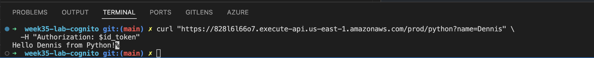

# Week 35 Class 7: Cognito ClickOps Lab Walkthrough

## Lab Goal

This lab adds authentication to an existing REST API.

The goal is not to build a login page.

The goal is to build an identity system that issues tokens, then use those tokens to protect API Gateway routes.

## Main Concept

Before Cognito, the API could be called by anyone.

After Cognito:

- A user authenticates first
- Cognito issues JWT tokens
- API Gateway checks the token before allowing the request
- Lambda only runs if the request is authorized

## Updated System Flow

```text
Client
  -> WAF
  -> API Gateway
  -> Cognito Authorizer
  -> Lambda
```

Important:

```text
If authentication fails, Lambda is never executed.
```

---

# Part 1: Create Cognito User Pool

## 1. Open Cognito

Go to:

```text
Cognito -> User Pools -> Create user pool
```

## 2. Define Application

Choose:

```text
Traditional web application
```

Application name:

```text
week35-cognito-app
```

## 3. Sign-In Options

Select:

```text
Username
Email
```

## 4. Self-Registration

Enable:

```text
Self-registration
```

## 5. Required Attributes

Select:

```text
email
```

## 6. Return URL

Set:

```text
http://localhost:8080
```

## 7. Create User Directory

Click:

```text
Create user directory
```



---

# Part 2: Register User Through Hosted Login Page

## 1. Open Login Page

After the user pool is created, click:

```text
View login page
```

If needed, go to:

```text
Applications -> App clients -> week35-cognito-app -> View login page
```


## 2. Create Account

On the hosted login page, click:

```text
Sign up
```

Create the test user:

```text
Username: dennis-cognito
Email: <your-real-email>
Password: <your-password>
```

Important:

```text
Do not commit real email or password to GitHub.
```

## 3. Verify Email

Check email for the Cognito verification code.

Enter the verification code on the hosted login page.

Expected result:

```text
The user account is confirmed.
```

After successful verification, Cognito redirects to:

```text
http://localhost:8080
```

If nginx appears, the redirect worked.



---

# Part 3: Enforce MFA

## 1. Open User Pool

Go to:

```text
Cognito -> User pools -> User pool - leodko
```

## 2. Open Sign-In Settings

Under Authentication, go to:

```text
Sign-in
```

## 3. Edit MFA

Find:

```text
Multi-factor authentication
```

Click:

```text
Edit
```

Set:

```text
MFA enforcement: Require MFA
MFA method: Authenticator apps
```

Click:

```text
Save changes
```

---

# Part 4: Set Up Authenticator App MFA

## 1. Open Hosted Login Page

Go to:

```text
Cognito -> User pools -> User pool - leodko
```

Then go to:

```text
Applications -> App clients -> week35-cognito-app
```

Click:

```text
View login page
```

## 2. Sign In

Sign in with the test user:

```text
Username: dennis-cognito
Password: <your-password>
```

## 3. Set Up Authenticator App

When Cognito prompts for MFA setup:

```text
Select Authenticator app
Scan the QR code
Enter the 6-digit code from the authenticator app
```

Use an authenticator app such as:

```text
Google Authenticator
Microsoft Authenticator
Authy
1Password
```



## 4. Confirm Successful Sign-In

After successful sign-in, Cognito redirects to:

```text
http://localhost:8080
```

If nginx appears, the redirect worked.


Expected result:

```text
The user signs in successfully with Authenticator app MFA.
```

---

# Part 5: Capture App Client Details

## 1. Open App Client

Go to:

```text
Cognito -> User pools -> User pool - leodko
```

Then go to:

```text
Applications -> App clients -> week35-cognito-app
```

## 2. Copy App Client Values

Copy:

```text
Client ID
Client secret
```

Save placeholders in notes:

```bash
client_id="<CLIENT_ID>"
client_secret="<CLIENT_SECRET>"
```

Important:

```text
Do not commit the real client secret to GitHub.
Treat the client secret like a password.
```



## 3. Confirm Authentication Flow

Open:

```text
Applications -> App clients -> week35-cognito-app
```

Click:

```text
Edit
```

Confirm these are enabled:

```text
ALLOW_USER_PASSWORD_AUTH
ALLOW_REFRESH_TOKEN_AUTH
```

Set:

```text
Authentication flow session duration: 15 minutes
```

Click:

```text
Save changes
```

Important:

```text
The CLI command uses USER_PASSWORD_AUTH.
If ALLOW_USER_PASSWORD_AUTH is not enabled, initiate-auth will fail.
```



---

# Part 6: Generate SECRET_HASH

Because this app client has a client secret, CLI auth must include:

```text
SECRET_HASH
```

## 1. Set Terminal Variables

In the terminal:

```bash
cognito_username="dennis-cognito"
password="<your-password>"
client_id="<CLIENT_ID>"
client_secret="<CLIENT_SECRET>"
region="us-east-1"
```

Important:

```text
Use lowercase variable names.
Do not use USERNAME as a variable name on macOS/zsh.
Do not commit real passwords, client secrets, secret hashes, sessions, or tokens to GitHub.
```

## 2. Create Secret Hash Helper File

Create a file:

```text
secret_hash.py
```

Add:

```python
import sys, hmac, hashlib, base64

# Unpack command line arguments
username, app_client_id, key = sys.argv[1:4]

# Create message and key bytes
message, key = (username + app_client_id).encode('utf-8'), key.encode('utf-8')

# Calculate secret hash
secret_hash = base64.b64encode(hmac.new(key, message, digestmod=hashlib.sha256).digest()).decode()

print(secret_hash)
```

## 3. Generate Secret Hash

Run:

```bash
secret_hash=$(python3 scripts/secret_hash.py "$cognito_username" "$client_id" "$client_secret")
```

Confirm it exists without showing it:

```bash
echo ${#secret_hash}
```

Expected result:

```text
44
```

---

# Part 7: Authenticate with AWS CLI

## 1. Initiate Auth

Run:

```bash
aws cognito-idp initiate-auth \
  --region "$region" \
  --auth-flow USER_PASSWORD_AUTH \
  --client-id "$client_id" \
  --auth-parameters USERNAME="$cognito_username",PASSWORD="$password",SECRET_HASH="$secret_hash"
```

Expected challenge:

```text
SOFTWARE_TOKEN_MFA
```

Copy the returned `Session` value into a variable:

```bash
session="<SESSION_TOKEN>"
```

Confirm it saved without showing it:

```bash
echo ${#session}
```

Expected result:

```text
A number greater than 20
```

Important:

```text
Use the entire Session string.
Do not include the surrounding quotes.
Do not commit the Session value to GitHub.
```

## 2. Respond to Authenticator App MFA Challenge

Get the current 6-digit code from the authenticator app.

Set:

```bash
mfa_code="<AUTHENTICATOR_APP_CODE>"
```

Run:

```bash
aws cognito-idp respond-to-auth-challenge \
  --region "$region" \
  --client-id "$client_id" \
  --challenge-name SOFTWARE_TOKEN_MFA \
  --challenge-responses USERNAME="$cognito_username",SOFTWARE_TOKEN_MFA_CODE="$mfa_code",SECRET_HASH="$secret_hash" \
  --session "$session"
```

Expected result:

```json
{
  "AuthenticationResult": {
    "AccessToken": "...",
    "IdToken": "...",
    "RefreshToken": "..."
  }
}
```

## 3. Save Tokens Locally

Save the `AccessToken` locally:

```bash
access_token="<ACCESS_TOKEN>"
```

Save the `IdToken` locally:

```bash
id_token="<ID_TOKEN>"
```

Confirm they saved without showing them:

```bash
echo ${#access_token}
echo ${#id_token}
```

Expected result:

```text
Large numbers
```

Important:

```text
Do not commit AccessToken, IdToken, RefreshToken, client secret, password, secret hash, or session values to GitHub.
```

---

# Part 8: Create API Gateway Cognito Authorizer

## 1. Open API Gateway

Go to:

```text
API Gateway -> REST API
```

Open:

```text
week33-rest-api
```

## 2. Open Authorizers

In the left menu, go to:

```text
Authorizers
```

Click:

```text
Create authorizer
```

## 3. Configure Cognito Authorizer

Set:

```text
Name: dennis-authorizer
Authorizer type: Cognito
Cognito User Pool: User pool - leodko
Token Source: Authorization
Token validation: blank
```

Click:

```text
Create authorizer
```



---

# Part 9: Attach Authorizer to API Methods

## 1. Open the Resource Method

Go to:

```text
Resources
```

For each protected route:

```text
GET /python
GET /node
```

open:

```text
Method Request
```

## 2. Set Authorization

Set:

```text
Authorization: dennis-authorizer
Authorization scopes: blank
```

Save changes.

Repeat for:

```text
GET /python
GET /node
```

---

# Part 10: Redeploy REST API

REST API changes do not apply until the API is redeployed.

Go to:

```text
Deploy API
```

Stage:

```text
prod
```

Click:

```text
Deploy
```

---

# Part 11: Test API

## 1. Test Without Token

Run:

```bash
curl https://828l6l66o7.execute-api.us-east-1.amazonaws.com/prod/python
```

Result:

```text
{"message":"Unauthorized"}
```

Meaning:

```text
API Gateway blocked the unauthenticated request.
Lambda did not run.
```

## 2. Test With Valid Token

For this setup, the method authorization scopes are blank, so I used the `IdToken`.

Run:

```bash
curl "https://828l6l66o7.execute-api.us-east-1.amazonaws.com/prod/python?name=Dennis" \
  -H "Authorization: $id_token"
```

Result:

```text
Hello Dennis from Python!
```



Meaning:

```text
The Cognito authorizer accepted the valid token.
API Gateway allowed the request.
Lambda executed successfully.
```

---

# Part 12: Verify Behavior

## 1. Did Lambda run when no token was sent?

Answer:

```text
No.
```

Test:

```bash
curl https://828l6l66o7.execute-api.us-east-1.amazonaws.com/prod/python
```

Result:

```text
{"message":"Unauthorized"}
```

The request was blocked before Lambda executed.

## 2. Where was the request blocked?

Answer:

```text
API Gateway blocked the request at the Cognito Authorizer step.
```

The request did not have a valid token, so API Gateway rejected it before sending it to Lambda.

## 3. What changed when a valid token was sent?

Answer:

```text
API Gateway accepted the token and allowed the request to reach Lambda.
Lambda returned the normal Python response.
```

Test:

```bash
curl "https://828l6l66o7.execute-api.us-east-1.amazonaws.com/prod/python?name=Dennis" \
  -H "Authorization: $id_token"
```

Result:

```text
Hello Dennis from Python!
```