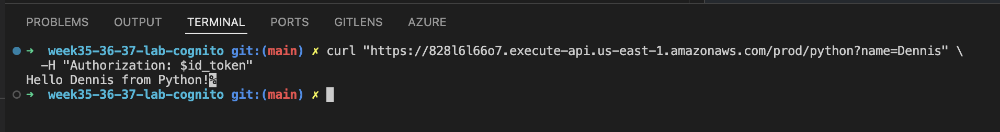

https://github.com/BalericaAI/lambda/blob/main/lessond_cognito/cognito_walkthru.md

# Week 36 Class 7: Cognito Token With API Gateway Authorizer

## Lab Goal

This lab uses the Cognito user pool from Week 35 to protect API Gateway routes.

The goal is to prove that API Gateway blocks requests without a valid token and allows requests with a valid Cognito token.

## What Was Already Completed in Week 35

The Cognito setup was completed in Week 35:

- Cognito user pool created
- Hosted login page used to create the user
- Email verification completed
- Authenticator app MFA completed
- `SECRET_HASH` generated
- CLI authentication returned tokens
- REST API authorizer created
- `/python` route successfully returned a response with a valid token

## Week 36 Focus

Week 36 focuses on the API Gateway side:

```text
Client
  -> WAF
  -> API Gateway REST API
  -> Cognito Authorizer
  -> Lambda
```

Expected behavior:

```text
No token -> Unauthorized
Valid token -> Lambda response
```

---

# Part 1: Confirm Existing Resources

## 1. Confirm Cognito User Pool

Use the Cognito user pool created in Week 35:

```text
User pool - leodko
```

## 2. Confirm App Client

Use the app client created in Week 35:

```text
week35-cognito-app
```

## 3. Confirm REST API (spin up terraform)

Use the REST API from the Lambda/API Gateway lab:

```text
week33-rest-api
```

Test URL:

```text
https://828l6l66o7.execute-api.us-east-1.amazonaws.com/prod
```

## 4. Confirm Lambda Backend

The backend Lambda functions came from the Week 34 Lambda/Terraform files included in this folder.

```text
python-function
node-function
```

These functions must exist before testing the protected API routes.

If the Lambda functions are missing, API Gateway can return a backend error even when Cognito authorization is working.

---

# Part 2: Confirm Cognito Authorizer

## 1. Open API Gateway

Go to AWS console:

```text
API Gateway -> APIs -> week33-rest-api
```

## 2. Open Authorizers

In the left menu, click:

```text
Authorizers
```

Confirm the authorizer exists:

```text
dennis-authorizer
```

## 3. Confirm Authorizer Settings

The authorizer settings are:

```text
Authorizer name: dennis-authorizer
Authorizer type: Cognito (you can see this in edit)
Cognito user pool: User pool - leodko
Token source: Authorization
Token validation: blank
```

Expected result:

```text
API Gateway has a Cognito authorizer connected to the Week 35 user pool.
```

---

# Part 3: Confirm Authorizer Is Attached to Routes

## 1. Open Resources

Go to:

```text
API Gateway -> APIs -> week33-rest-api -> Resources
```

## 2. Check Python Route

Open:

```text
/python -> GET -> Method request
```

Confirm:

```text
Authorization: dennis-authorizer
Authorization scopes: none (nothing filled in)
```

### 3. Check Node Route

Open:

```text
/node -> GET -> Method request
```

Confirm:

```text
Authorization: dennis-authorizer
Authorization scopes: none
```

---

# Part 4: Test Without Token

Run the Python route without an authorization token:

```bash
curl https://828l6l66o7.execute-api.us-east-1.amazonaws.com/prod/python
```

Expected result:

```text
{"message":"Unauthorized"}
```

Meaning:

```text
API Gateway blocked the request before Lambda ran.
```

---

# Part 5: Test With Valid Token

For this setup, the API Gateway method authorization scopes are set to:

```text
none
```

So I used the `IdToken`.

Run:

```bash
curl "https://828l6l66o7.execute-api.us-east-1.amazonaws.com/prod/python?name=Dennis" \
  -H "Authorization: $id_token"
```

Expected result:

```text
Hello Dennis from Python!
```

Meaning:

```text
API Gateway accepted the Cognito token.
The request passed the authorizer.
Lambda executed successfully.
```



---

# Final Result

Week 36 confirmed that API Gateway can use a Cognito User Pool authorizer to protect a REST API route.

Verified behavior:

```text
No token -> Unauthorized
Valid token -> Hello Dennis from Python!
```

Final flow:

```text
Client
  -> WAF
  -> API Gateway REST API
  -> Cognito Authorizer
  -> Lambda
```

Screenshot proof:

```text
screenshots/week36/01-successful-cognito-auth-api-invocation.png
```