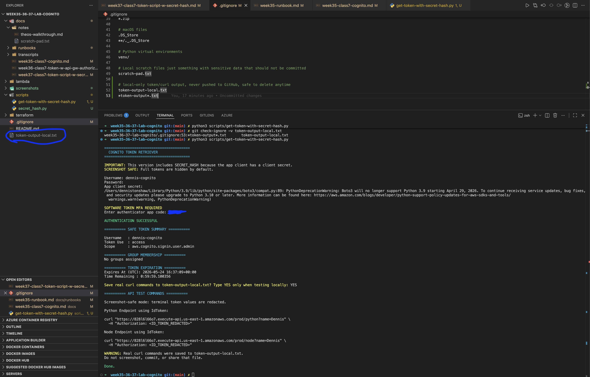
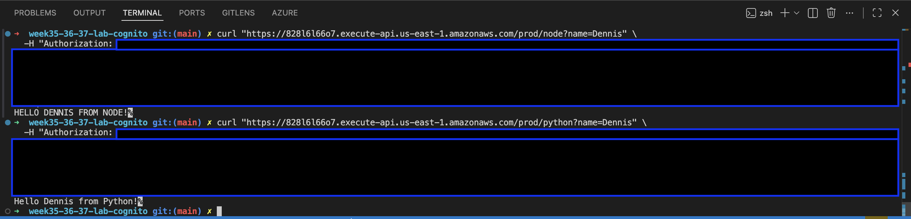

# Week 37 Class 7: Token Script With SECRET_HASH

## Lab Goal

This lab uses a Python script to authenticate with Cognito and return tokens.

The important part of this lab is that the app client has a client secret, so the script must include `SECRET_HASH`.

Expected result:

```text
The Python script runs successfully and returns Cognito tokens.
```

## What Was Already Completed

The Cognito setup was completed in Week 35:

```text
Cognito user pool: User pool - leodko
App client: week35-cognito-app
User: dennis-cognito
MFA: Authenticator app
```

Week 36 confirmed that API Gateway accepts a valid Cognito token and allows the request to reach Lambda.

## Week 37 Focus

Week 37 focuses on scripting the token flow:

```text
Python script
  -> USER_PASSWORD_AUTH
  -> SECRET_HASH included
  -> SOFTWARE_TOKEN_MFA challenge
  -> AuthenticationResult
```

> [!NOTE]
> Theo’s script assumes an app client without a client secret and SMS MFA.
> My app client has a client secret and uses authenticator app MFA.
> Therefore, I adapted the script to include `SECRET_HASH` and `SOFTWARE_TOKEN_MFA`.

---

## Part 1: Adapted Token Script

I adapted Theo’s Week 37 Cognito token script to match my existing Cognito setup.

The adapted script handles:

```text
App client with client secret
SECRET_HASH required
Authenticator app MFA
SOFTWARE_TOKEN_MFA
IdToken used for my current API Gateway test because authorization scopes are set to none
```

Script file:

```text
scripts/get-token-with-secret-hash.py
```

Helper script:

```text
scripts/secret_hash.py
```

I also updated the script so it is safer for screenshots:

```text
Real tokens are not printed in the terminal by default.
Terminal curl commands use <ID_TOKEN_REDACTED>.
Real curl commands can be saved locally only when I type YES.
The local token output file is ignored by git.
```

Local-only output file:

```text
token-output-local.txt
```

The local output file is ignored by git using:

```gitignore
token-output-local.txt
*token-output*.txt
```

Screenshot proof:



Result:

The script successfully authenticated with Cognito using SECRET_HASH and SOFTWARE_TOKEN_MFA.
The terminal output stayed redacted for safe homework screenshots.

---

## Part 2: API Curl Test With Token

After the script authenticated successfully, I ran it again in local test mode.

In local test mode, the script saves real curl commands to a local-only file:

```text
token-output-local.txt
```

This file is used only for local testing and is ignored by git.

I verified the file is ignored with:

```bash
git check-ignore -v token-output-local.txt
```

Result:

```text
week35-36-37-lab-cognito/.gitignore:53:*token-output*.txt       token-output-local.txt
```

Then I copied the curl commands from the local file and tested both protected API routes.

```bash
curl "https://828l6l66o7.execute-api.us-east-1.amazonaws.com/prod/node?name=Dennis" \
  -H "Authorization: <REAL_ID_TOKEN_FROM_FILE>"
```

```bash
curl "https://828l6l66o7.execute-api.us-east-1.amazonaws.com/prod/python?name=Dennis" \
  -H "Authorization: <REAL_ID_TOKEN_FROM_FILE>"
```
  
Node endpoint result:

```text
HELLO DENNIS FROM NODE!
```

Python endpoint result:

```text
Hello Dennis from Python!
```

Screenshot proof:



Result:

```text
API Gateway accepted the Cognito IdToken.
The protected Node route reached Lambda successfully.
The protected Python route reached Lambda successfully.
```

Security note:

```text
The real IdToken was used locally for the curl test.
The screenshot was redacted so the token is not exposed.
token-output-local.txt is ignored by git and should not be committed.
```

---

