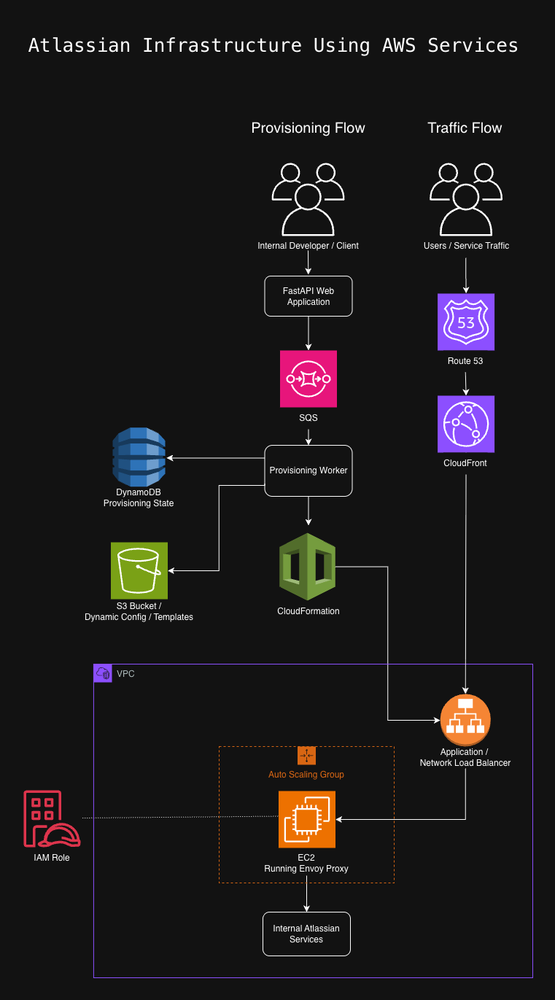
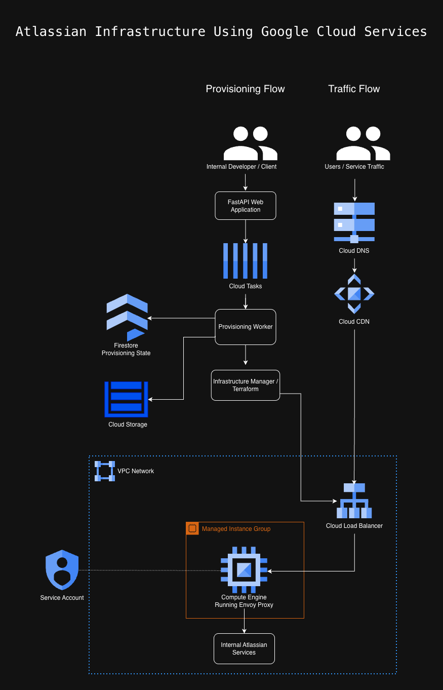

# Week 37 Watch, Read & Discuss

## Table of Contents

- [Assignment Focus](#assignment-focus)
- [Video: Systems Design with the fired Atlassian engineer](#video-systems-design-with-the-fired-atlassian-engineer)
- [AWS Services Mentioned in the Video](#aws-services-mentioned-in-the-video)
- [AWS to GCP Service Mapping](#aws-to-gcp-service-mapping)
- [Diagram AWS to GCP Service Mapping](#diagram-aws-to-gcp-service-mapping)
- [Non-AWS Components Included for Flow](#non-aws-components-included-for-flow)
- [Diagram 1: Atlassian Infrastructure Using AWS Services](#diagram-1-atlassian-infrastructure-using-aws-services)
- [Diagram 2: Atlassian Infrastructure Using Google Cloud Services](#diagram-2-atlassian-infrastructure-using-google-cloud-services)
- [Diagram Explanation](#diagram-explanation)
- [Example of Applying System Design Concepts in My Personal Life](#example-of-applying-system-design-concepts-in-my-personal-life)
- [Is System Design a Common Skill? Why / Why Not?](#is-system-design-a-common-skill-why--why-not)
- [What Is the Importance of System Design, Especially in the Cloud?](#what-is-the-importance-of-system-design-especially-in-the-cloud)
- [Describe Theo University’s Current System Design](#describe-theo-universitys-current-system-design)
  - [Where Theo University Is Good](#where-theo-university-is-good)
  - [Where Theo University Needs Improvement](#where-theo-university-needs-improvement)
  - [Where Theo University Falls Short or Overlooks Things](#where-theo-university-falls-short-or-overlooks-things)
  - [Overall Assessment](#overall-assessment)

## Assignment Focus

This homework is based on a systems design video about Atlassian infrastructure and two system design articles. The goal is to identify cloud services, compare AWS services with a second cloud provider, create infrastructure diagrams, and apply system design concepts to real-world examples.

For the cloud comparison, I chose Google Cloud because I do not know much about Azure yet. I have had an introduction to GCP through class, and I am currently using it to build a project. I think I will get more out of this assignment by getting more familiar with similar Google Cloud services.

## Video: Systems Design with the fired Atlassian engineer

Atlassian is a software company that makes collaboration and software development tools used by engineering, IT, and business teams to manage projects, code, documentation, and support work. Some of their well-known products include Jira and Trello, which I have heard of before in class, and Bitbucket, which is Git code hosting similar to GitHub/GitLab.

The video explains how Atlassian designed internal infrastructure systems to support routing, load balancing, provisioning, and service access at scale.

The main design I focused on is an internal self-service provisioning system. In this kind of system, a developer or internal team can request infrastructure through an application. The application does not manually build everything during the request. Instead, it sends long-running work to a queue, workers process the tasks in the background, and cloud resources are created or updated through automation.

At a high level, the system looks like this:

```text
Developer request
→ API / web application
→ queue
→ background worker
→ cloud infrastructure changes
→ proxy / load balancing layer
→ internal Atlassian services
```

The important system design idea is that the work is separated into smaller responsibilities. The API receives the request, the queue holds the work, the worker performs the task, the database stores state, and the proxy/load balancing layer routes traffic.

---

## AWS Services Mentioned in the Video

The table below lists the AWS services and AWS infrastructure components mentioned in the video, along with their Google Cloud equivalents.

## AWS to GCP Service Mapping
*source:* https://docs.cloud.google.com/docs/get-started/aws-azure-gcp-service-comparison

| AWS | Google Cloud |
|---|---|
| Amazon Application Load Balancer | Cloud Load Balancing |
| Network Load Balancer | Cloud Load Balancing |
| Route 53 | Cloud DNS |
| DynamoDB | Firestore / Bigtable / Spanner |
| SQS | Cloud Tasks / Pub/Sub |
| CloudFront | Cloud CDN |
| S3 | Cloud Storage |
| CloudFormation | Infrastructure Manager / Terraform |
| VPC | VPC Network |
| Subnet | Subnet |
| Internet Gateway | External IP / Cloud NAT / Cloud Router |
| Security Group | VPC Firewall Rules |
| Key Pair | SSH Keys / OS Login |
| IAM Role | IAM Roles / Service Accounts |
| Auto Scaling Group | Managed Instance Group with Autoscaling |
| EC2 | Compute Engine |
| AMI | Custom Machine Image |
| ACM | Certificate Manager |

---

For my diagrams, I am only including the services that show the main flow of the system. I am not including every AWS service or low-level setup detail mentioned in the video because that would make the diagram harder to understand.

The goal of my diagram is to show how the system works at a high level:

- a request starts from an internal developer or client
- the request goes to an API or web application
- long-running work is sent to a queue
- a worker processes the task
- state or configuration is stored
- traffic is routed through DNS, CDN, load balancing, and proxy services
- the request eventually reaches internal Atlassian services

## Diagram AWS to GCP Service Mapping

| AWS Service | Google Cloud Equivalent |
|---|---|
| SQS | Cloud Tasks / Pub/Sub |
| DynamoDB | Firestore / Spanner / Bigtable |
| S3 | Cloud Storage |
| Route 53 | Cloud DNS |
| CloudFront | Cloud CDN |
| Application Load Balancer / Network Load Balancer | Cloud Load Balancing |
| EC2 | Compute Engine |
| Auto Scaling Group | Managed Instance Group |
| VPC / Subnets / Security Groups / IAM Role | VPC Network / Subnets / Firewall Rules / Service Accounts |
| CloudFormation | Terraform / Infrastructure Manager |

## Non-AWS Components Included for Flow

| Architecture Component | Google Cloud Version |
|---|---|
| API / Web Application | API / Web Application on Cloud Run or Compute Engine |
| Provisioning Worker | Worker on Cloud Run or Compute Engine |
| Envoy Proxy Fleet | Envoy Proxy Fleet on Compute Engine |
| Internal Atlassian Services | Internal Atlassian Services |

I am using this smaller chart for the diagrams because these are the services and components that show the main flow of the system. I am leaving out lower-level details like key pairs, certificates, individual API calls, and every subnet/security rule because they matter for implementation but do not help explain the high-level architecture.

These are simplified high-level diagrams. I included the services and components that show the main provisioning and traffic flow. I left out lower-level implementation details so the diagrams stay readable.

## Diagram 1: Atlassian Infrastructure Using AWS Services



## Diagram 2: Atlassian Infrastructure Using Google Cloud Services



## Diagram Explanation

The AWS and Google Cloud diagrams use the same basic system design pattern.

The provisioning flow shows how an internal developer or client can request infrastructure through an application. The request goes to an API/web application, long-running work is placed into a queue, and a worker processes the task. State and configuration are stored separately, and infrastructure as code is used to create or update the cloud resources.

The traffic flow shows how users or services reach the internal Atlassian services after the infrastructure exists. Traffic goes through DNS, CDN, and load balancing before reaching compute instances running Envoy Proxy. Envoy then routes the request to the internal Atlassian services.

The main idea is that provisioning and traffic are related, but they are not the same flow. Provisioning builds or changes the infrastructure. Traffic uses the infrastructure.

---

## Example of Applying System Design Concepts in My Personal Life

One example of me applying system design concepts in my personal life is how I structured my time across school, work, travel, and project goals during a heavy six-month block.

The **system** I was designing was not a cloud application. It was my time, workload, and priorities.

The main inputs into the system were:

- my normal job
- intensive work projects
- travel
- AWS Class 7
- GCP Class 7.5
- my own project timeline

During this period, I had a work event in March that required organizing three days of travel and event coverage. After the event, I also needed about three or four days for video and photo editing.

Around the same time, I had just finished the Armageddon school project. Classes paused during that project, and after turning it in around mid-February, there were about three weeks before classes restarted. When classes restarted, I was not only continuing AWS Class 7, but also starting GCP Class 7.5.

During that three-week break, I also started researching and further planning an app idea. After several weeks of heavy workload, I realized the system was overloaded. I could not keep work, AWS, GCP, and the new project all running at full speed without losing quality or burning out.

From a system design point of view, this was a **capacity problem**. My available time and focus were limited resources. The workload coming into the system was higher than what the system could reliably handle.

To fix that, I had to make a **tradeoff**. I decided to defer GCP Class 7.5 to a later time, continue AWS Class 7, and prioritize getting my project ready for a pilot.

My timeline also had future constraints:

- have the pilot ready in the next couple of weeks
- have a version ready to test live in a Miami club sometime in July
- plan around a possible ten-day work trip at the end of July
- plan around a convention at the end of August
- plan around the Black Manosphere Conclave in early September, where I expect to work as a contracted videographer/photographer and attend classes

This connects to system design because I had to identify **requirements, constraints, dependencies, bottlenecks, and tradeoffs**. I had to decide what could run at the same time, what needed to be delayed, and what had to be completed before the next major event.

Just like in cloud architecture, adding too much load to a system without enough capacity creates failure. In my case, failure would mean missed deadlines, poor work quality, burnout, or not being prepared for the pilot.

The main lesson is that system design is not only about technology. It is about organizing resources to meet requirements under constraints. In my personal example, the resources were time, focus, and energy. The design decision was to reduce overload, prioritize the most important work, and create a realistic path toward the next milestone.

| System Design Idea | Personal Example |
|---|---|
| System | My time and workload |
| Inputs | School, work, travel, editing, and project deadlines |
| Constraints | Limited time, energy, and fixed travel dates |
| Bottleneck | Trying to run AWS, GCP, work, and project work at the same time |
| Tradeoff | Deferring GCP Class 7.5 while continuing AWS Class 7 |
| Design Decision | Prioritize the pilot timeline and reduce overload |

---

Is system design a common skill? Why / why not? Explain.

## Is System Design a Common Skill? Why / Why Not?

I don't think system design is a common skill at a deep level.

System design is more than knowing the names of services like load balancers, databases, queues, CDNs, or cloud platforms. It requires being able to see how different parts of a system work together, where the weak points are, and what decisions need to be made before problems occur.

In everyday life, it is already hard for many people to manage their own time, responsibilities, money, work, family, and long-term planning. System design requires another level of that same type of thinking. These skills are often found in leaders, heads of households, company owners, managers, and team leaders because those roles require people to think beyond one task and understand how multiple moving parts affect each other.

Most people contribute to a system, but they do not always see the whole system. For example, someone may complete one task at work without understanding how that task affects the customer, the team, the database, the budget, the schedule, or the next person in the workflow. System design requires a wider view. You have to think about inputs, outputs, dependencies, bottlenecks, failures, tradeoffs, and long-term maintenance.

This is why I think system design is not common as a strong skill. It takes practice and experience. A person may know how to build one part of an application, but designing the full system means asking bigger questions:

- What problem is the system solving?
- Who are the users?
- What happens when the system grows?
- What happens when something fails?
- Where are the bottlenecks?
- What should be simple now, and what needs to scale later?
- What tradeoffs are worth making?

The articles explain system design concepts like scalability, load balancing, caching, queues, databases, redundancy, monitoring, and reliability. Those are technical concepts, but the deeper skill is learning how to think through a whole system instead of only focusing on one part.

My conclusion is that system design is a learnable skill, but it is not a common natural skill. It requires practice, foresight, and the ability to recognize problems before they become failures.

---

## What Is the Importance of System Design, Especially in the Cloud?

System design is important because building something that works is not the same as building something that works well under pressure.

In the cloud, this matters even more. Just because AWS and Google Cloud give us a lot of services doesn't mean you can automatically create a good system.

You still have to understand:

- what problem you are solving
- who the users are
- what can fail
- what needs to scale
- what tradeoffs make sense
- how the services work together

The important part is not just knowing the service names. The important part is knowing **why** each service is there and how it supports the rest of the system.

System design is also important because it helps prevent **over-engineering**. A small app does not need the same design as a global company. The architecture should match the actual requirements.

My main takeaway is that **cloud services are building blocks, but system design is the plan**. Without good system design, a cloud architecture can become expensive, confusing, insecure, or unreliable.

---

Describe Theo’s current system design of Theo University; where it’s good, where it needs improvement, and where it utterly falls short or overlooks.

---

## Describe Theo University’s Current System Design

Theo University’s current system design is an online cloud training program built around:

- live Zoom classes
- recorded classes
- repeated weekly class options
- homework assignments
- cloud labs
- independent study
- team support
- career-change motivation

The school is great in many ways, and I am learning a lot. Personally, I did not come into the course with a foundation in IT, tech, or cloud computing, so the program has exposed me to a lot of information I would not have known how to find on my own.

## Where Theo University Is Good

One of the strongest parts of Theo University is that the classes are online and recorded. This gives students flexibility because if you miss a live class or do not understand something the first time, you can go back and watch the recording.

The school also repeats classes during the week, so students do not always have to attend every single live session. From a system design point of view, this creates redundancy. There is more than one opportunity to receive the same information.

The school is also good because it focuses on current workplace skills. Instead of spending all the time on theory, it pushes students toward hands-on cloud work, labs, homework, GitHub, documentation, and tools that are actually used in the industry.

Another strength is that the instructors are experts in their fields. They are not just teaching from a textbook. They have real-world experience, which helps expose students to what cloud and infrastructure work can look like outside of class.

## Where Theo University Needs Improvement

Where the system needs improvement is in how much information comes at students at once.

The school promises a lot: study hard, attend one of the repeated classes per week, put in one or two hours per day, and after one year it is possible to be ready for a six-figure job. That pitch is what sold me. But in practice, the workload can be much heavier than that, especially for someone without a technical foundation.

The school bypasses a lot of fundamental learning and focuses heavily on current, specific skills for the workplace. That can be useful, but it also means students may not fully understand the basics before being pushed into advanced tools and assignments.

For me, there is often not enough time to fully grasp the concepts before the next topic arrives. I can complete assignments and learn from them, but I also need outside resources like Udemy, independent study, documentation, and extra practice to really understand the material and honestly I am behind in the extra learning materials.

## Where Theo University Falls Short or Overlooks Things

The biggest thing Theo University overlooks is that many students are adults with jobs, families, responsibilities, and life changes happening at the same time. A lot of us are here because we want a career change, more independence, remote work, or the ability to travel while earning U.S. dollars giving us more flexibility in life.

Because of that, the system can become overwhelming. A lot of students find the workload too hard and end up quitting. That does not mean the school is bad, but it does show that the system may expect more available time, energy, and technical foundation than many students actually have.

Another weakness is that the school does not always have professional teachers in the traditional sense. The instructors are experts, which is valuable, but sometimes the psychology of teaching is missing. Knowing a subject deeply and teaching beginners effectively are not the same skill.

The school sometimes feels like it is showing us what we need to learn, but not always giving enough structure to fully learn it inside the class system itself. A lot of what I get from the school is direction: “these are the skills and tools I need to understand.” Then I use other sources to actually build the foundation around those topics.

## Overall Assessment

Overall, Theo University is a strong system because it gives access to real cloud skills, real instructors, repeated classes, recordings, labs, and career-focused assignments. It has helped me learn a lot and pushed me into work I probably would not have known how to approach on my own.

Where it struggles is with student load, fundamentals, pacing, and teaching structure. The system is powerful, but it can overload beginners who do not already have an IT or cloud foundation.

From a system design perspective, Theo University has strong inputs and strong goals, but the bottleneck is student capacity. If the workload, pacing, and foundation support are not balanced better, students can fail not because they are incapable, but because the system is pushing more throughput than they can reliably process.