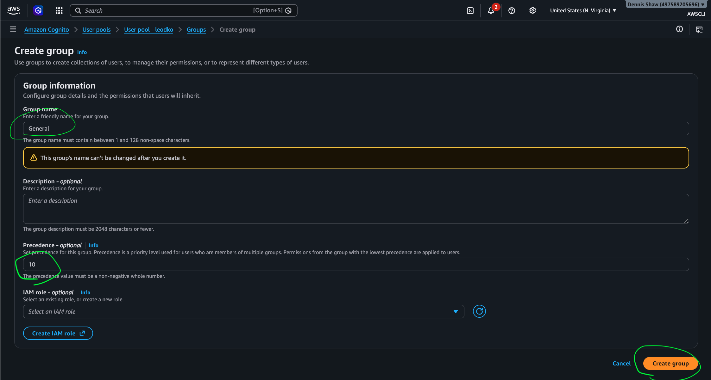
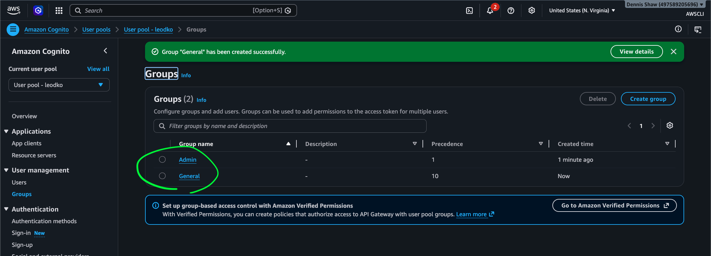
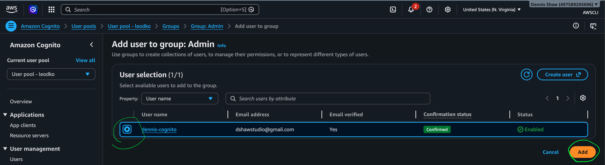
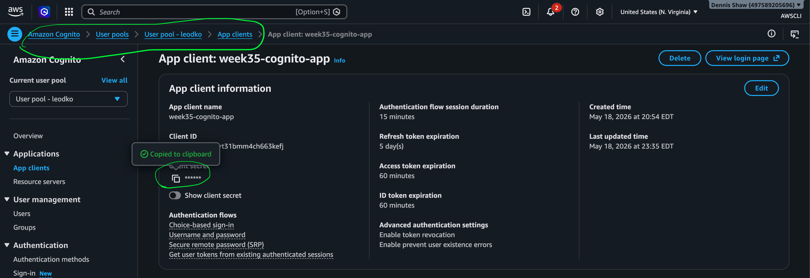
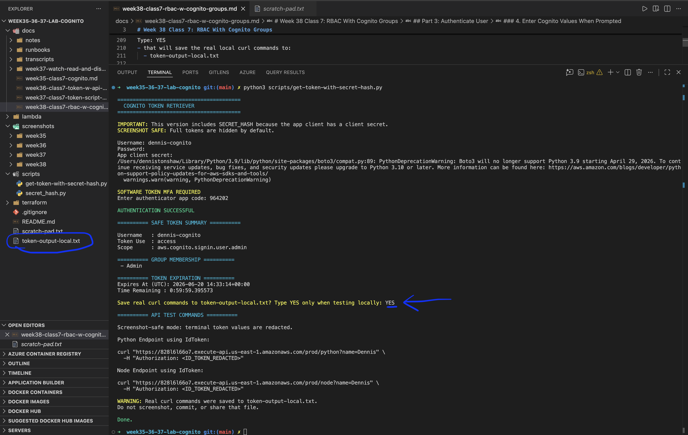
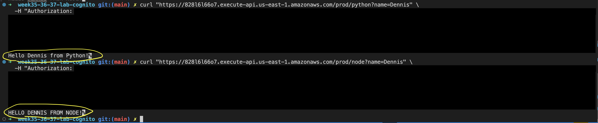
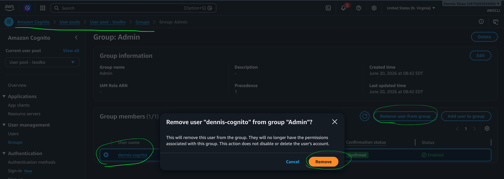
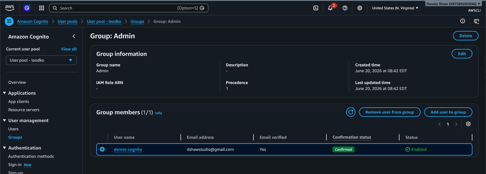
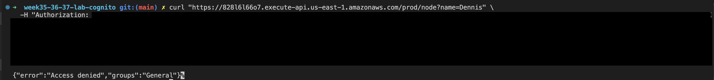
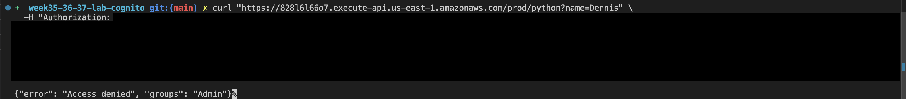

# Week 38 Class 7: RBAC With Cognito Groups

## Source

- https://github.com/BalericaAI/lambda/tree/main/lessond_cognito
- https://github.com/BalericaAI/lambda/tree/main/lessone_rbac

**RBAC (Role-Based Access Control)** is a security model where permissions are assigned to roles, and users receive permissions by being assigned to those roles.

## Lab Goal

This lab continues the Cognito environment built in Weeks 35-37 by introducing authorization using Cognito Groups.

No new Cognito user pool, app client, API Gateway authorizer, or Lambda functions are created in this lab.

The existing Cognito environment is extended with role-based access control (RBAC) using Cognito Groups.

The goal is not simply to verify that a user has a valid token.

The goal is to verify that authenticated users are only allowed to access routes that match their assigned role.

Expected result:

- Authenticated users receive valid Cognito tokens.
- Lambda reads Cognito group membership.
- Authorized users can access allowed routes.
- Unauthorized users receive Access Denied responses.

## Existing Environment

This lab continues using the existing AWS resources created in Weeks 35-37.

Existing resources:

- Cognito user pool: User pool - leodko
- App client: week35-cognito-app
- User: dennis-cognito
- MFA: Authenticator app
- API Gateway REST API: week33-rest-api
- Cognito authorizer: dennis-authorizer
- Lambda functions: python-function and node-function
- Token script: scripts/get-token-with-secret-hash.py

No existing resources are recreated during this lab.

Week 36 confirmed that API Gateway accepts a valid Cognito token and allows requests to reach Lambda.

Week 37 automated token retrieval using a Python script that includes:

- SECRET_HASH
- SOFTWARE_TOKEN_MFA
- AuthenticationResult
- IdToken retrieval

## Week 38 Focus

Week 38 focuses on authorization using Cognito Groups.

System flow:

```text
User
  -> Cognito Authentication
  -> JWT Token
  -> API Gateway Authorizer
  -> Lambda
  -> Group Check
  -> Allow or Deny
```

Important:

- Authentication proves identity.
- Authorization determines access.

---

## Part 1: Add Cognito Groups To Existing User Pool

### 1. Open Cognito

Go to:

```text
Cognito
  -> User Pools
  -> User pool - leodko
  -> User management
  -> Groups
```

### 2. Create Groups

Add the following groups to the existing Cognito user pool:

- Admin
- General

Optional precedence:

- Admin = 1
- General = 10



Expected result:

- The user pool now contains role-based groups.



---

## Part 2: Assign Existing User To Groups

### 1. Assign User To Admin Group

Assign:

- Click group (Admin)
- Group members
- Add user to group
- Add dennis-cognito

Expected result:

- The existing user is assigned to the Admin group.



### 2. Later Testing

For authorization testing, the same user can be moved between groups as needed.

Examples:

- dennis-cognito -> Admin
- dennis-cognito -> General

This avoids creating additional users unless required by the class.

---

## Part 3: Authenticate User

### 1. Open Terminal

From the repo root:

```bash
cd week35-36-37-lab-cognito
```

### 2. Confirm The Token Script Exists

Run:

```bash
ls scripts
```

Expected result:

- get-token-with-secret-hash.py exists.
- secret_hash.py exists.

### 3. Run The Token Script

Run:

```bash
python3 scripts/get-token-with-secret-hash.py
```

### 4. Enter Cognito Values When Prompted

Use the existing Week 35-37 Cognito setup:

- Cognito user pool: User pool - leodko
- App client: week35-cognito-app
- User: dennis-cognito
- MFA: Authenticator app

When prompted, enter the required values.

> NOTE: Retrieve the App Client Secret from the AWS Console.



Important:

- Do not commit real passwords.
- Do not commit client secrets.
- Do not commit access tokens.
- Do not commit ID tokens.
- Do not commit refresh tokens.
- Do not commit MFA session values.

### 5. Complete MFA

Open the authenticator app.

Enter the current 6-digit MFA code.

Expected result:

- Cognito accepts the MFA code.
- AuthenticationResult is returned.
- Cognito tokens are generated.



Type:

```text
YES
```

This saves local curl commands to:

```text
token-output-local.txt
```

### 6. Save Or Copy The ID Token Locally

View the generated curl commands:

```bash
cat token-output-local.txt
```

Expected result:

- A valid IdToken is available for testing.

Important:

- Generate a fresh token after changing Cognito group membership.
- Old tokens may not contain updated group membership.
- If the user is moved from Admin to General, rerun the token script.

Run both generated curl commands:

- Python endpoint
- Node endpoint

### 7. Screenshot Proof



### 8. Result

- The existing Cognito user authenticated successfully.
- Cognito returned a fresh token.
- The token can be used for authorization testing.

---

## Important Token Behavior

Cognito group membership is embedded into the token when the token is issued.

Changing a user's Cognito group does not modify previously issued tokens.

After changing group membership:

1. Generate a new token.
2. Save new curl commands.
3. Use the new token for testing.

Old tokens may continue to show previous group membership until expiration.

---

## Part 4: Add Authorization Logic

Authentication already occurs in Cognito.

Authorization occurs inside Lambda.

Reference source:

- https://github.com/BalericaAI/lambda/tree/main/lessone_rbac

Example logic:

```javascript
const claims = event.requestContext?.authorizer?.claims || {};
const groups = claims["cognito:groups"] || [];

if (!groups.includes("Admin")) {
    return {
        statusCode: 403,
        body: JSON.stringify({
            error: "Access denied"
        })
    };
}
```

Purpose:

- Verify that the authenticated user belongs to the required group.

Important:

- Valid token does not automatically mean access is allowed.
- The user's group must also be authorized.

### Week 38 Implementation Note

The RBAC reference code was obtained from:

- lessone_rbac/node/node_rbac.js
- lessone_rbac/python/python_rbac.py

The existing Node Lambda was configured with:

```text
Handler: index.handler
```

AWS Lambda therefore executes:

```text
lambda/index.js
```

not:

```text
lambda/node-lambda.js
```

The RBAC logic was merged into:

```text
lambda/index.js
```

and redeployed as:

```text
lambda/node.zip
```

The same process was later applied to:

```text
lambda/index.py
```

for Python RBAC testing.

---

## Part 5: Test Admin User

Assign:

- dennis-cognito -> Admin

Generate a fresh token.

Run the Node curl command generated in:

```text
token-output-local.txt
```

Expected result:

```text
HELLO DENNIS FROM NODE!
```

Meaning:

- Authentication succeeded.
- Authorization succeeded.
- Lambda executed successfully.

---

## Part 6: Test General User

Remove:

- dennis-cognito -> Admin



Add:

- dennis-cognito -> General



Generate a fresh token.

Save updated curl commands to:

```text
token-output-local.txt
```

Run the updated Node curl command from that file.

Expected result:

- Access denied
- 403 Forbidden





Meaning:

- Authentication succeeded.
- Authorization failed.
- Lambda denied access based on group membership.

Result:

- The user successfully authenticated.
- Cognito issued a valid token.
- The token contained the General group claim.
- API Gateway accepted the token.
- Lambda denied access because the user was not in the Admin group.
- Authorization succeeded by preventing unauthorized access.

---

## Authorization Results

| Group | Node Endpoint | Python Endpoint |
|--------|--------------|----------------|
| Admin | Allowed | Access Denied |
| General | Access Denied | Allowed |

---

## Hands-On Lab Complete

At this point the RBAC implementation has been successfully completed and verified.

Verified:

- Cognito Groups
- Authentication
- Authorization
- RBAC
- Group-based route protection
- Access denied responses

Parts 7-10 are conceptual topics discussed during class and are included for understanding and future implementation.

---

# Additional Concepts Discussed During Class

The remaining topics were discussed conceptually during class and were not implemented as part of the Week 38 lab.

These concepts help explain why authentication and authorization matter and provide a preview of future security and monitoring architectures.

## Authentication vs Authorization

Authentication and authorization are related but separate security controls.

### Authentication

Authentication answers:

```text
Who are you?
```

Examples:

- Logging in with a username and password
- Completing MFA
- Receiving a valid Cognito token

In this lab:

```text
dennis-cognito
    -> Cognito Login
    -> Valid JWT Token
```

Authentication proves identity.

### Authorization

Authorization answers:

```text
What are you allowed to do?
```

Examples:

- Accessing an admin route
- Viewing protected resources
- Performing privileged actions

In this lab:

```text
Admin
    -> Allowed

General
    -> Denied
```

Authorization determines access.

### Key Takeaway

A user can be:

- Authenticated
- Possess a valid token

and still be:

- Unauthorized

to access a protected resource.

---

## Understanding RBAC

RBAC stands for:

```text
Role-Based Access Control
```

Instead of assigning permissions directly to every user, permissions are assigned to roles.

Users receive permissions through their assigned role.

Example:

```text
Admin Role
    -> Access /node

General Role
    -> Access /python
```

In this lab:

```text
Cognito Groups
    = Roles

Admin
    = Administrator Role

General
    = General User Role
```

### Why RBAC Is Useful

RBAC simplifies permission management because permissions are assigned to groups rather than individual users.

Benefits:

- Easier administration
- More consistent security
- Scales to large numbers of users
- Reduces permission mistakes

---

## Session Tracking Concepts

The Saturday class introduced the idea of tracking user sessions.

A session represents an authenticated interaction between a user and a system.

Example:

```text
User Login
    -> Token Issued
    -> Session Created
```

A future system could record session information in a database.

Example architecture:

```text
User Login
    -> Cognito
    -> Token Issued
    -> Session Record
    -> DynamoDB
```

Possible uses:

- Audit logging
- Security investigations
- User activity tracking
- Session expiration monitoring

### Important

Session tracking was discussed conceptually.

No DynamoDB tables, session records, or tracking systems were implemented as part of the Week 38 lab.

---

## EventBridge Monitoring Concepts

The Saturday class also introduced the concept of automated security monitoring.

One possible future design uses EventBridge to periodically check session records.

Example architecture:

```text
EventBridge Schedule
    -> Detection Lambda
    -> Session Check
    -> Status Update
```

Possible uses:

- Detect expired sessions
- Monitor inactive users
- Generate security alerts
- Perform automated cleanup tasks

### Important

EventBridge monitoring was discussed conceptually.

No EventBridge rules, schedules, or monitoring Lambdas were created during the Week 38 lab.

---

## Week 38 Summary

Hands-on implementation completed:

- Cognito Groups
- Authentication
- Authorization
- RBAC
- Group-based route protection
- Allow and deny testing

Concepts introduced for future learning:

- Authentication vs Authorization
- RBAC design principles
- Session tracking
- EventBridge monitoring
- Security automation

The primary objective of Week 38 was to extend the existing Cognito authentication system by implementing authorization using Cognito Groups and RBAC.