# Week 39 Class 7: Token Tracking, SOAR, and Bedrock

## Source
- https://github.com/BalericaAI/lambda/tree/main/lessonf
- https://github.com/BalericaAI/lambda/tree/main/lessong_SOAR

## Lab Goal

The goal of this lab is to extend the existing Cognito authentication and RBAC system by adding token tracking, unused-token detection, scheduled monitoring, and AI-assisted incident summarization.

Previous weeks focused on:

```text
Week 35 -> Cognito authentication
Week 36 -> API Gateway token validation
Week 37 -> Programmatic token retrieval with secret hash
Week 38 -> Cognito Groups and RBAC
```

Week 39 moves the lab into security monitoring and response:

```text
Token Issued
    -> Token Tracked
    -> Token Used or Unused
    -> Detection Lambda
    -> EventBridge Schedule
    -> CloudWatch Alert
    -> SOAR / Bedrock Enrichment
```

## Existing Environment

This lab continues from the existing Cognito lab environment.

Existing resources:

- Cognito User Pool
- Cognito App Client with client secret
- Cognito Groups
- Node Lambda
- Python Lambda
- API Gateway routes
- Cognito Authorizer
- Token retrieval script with secret hash support

## Lesson F: Token Tracking

The first part of Week 39 adds token lifecycle tracking.

Instead of only generating and using a JWT token, the system now records when a token is issued and whether that token was later used against the protected API.

Token Script -> Cognito Authentication -> Token Issued -> DynamoDB Record Created

---

### Step 1: Create DynamoDB Token Tracking Table

Go to: AWS Console -> DynamoDB -> Tables -> Create table

Create the table:

```text
Table name: token-tracking
Partition key: token_id
Partition key type: String
```

Leave all remaining settings at their defaults and create the table.

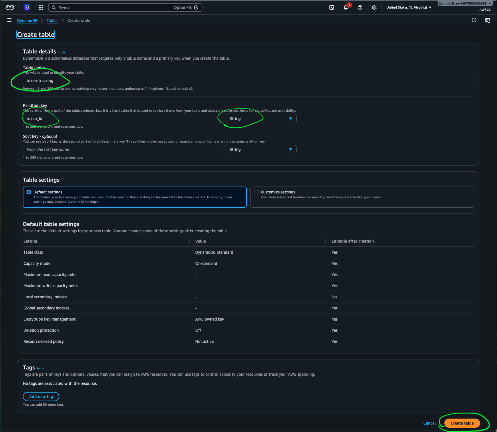

This table will be used throughout the Week 39 lab to track token usage and support future security monitoring workflows.

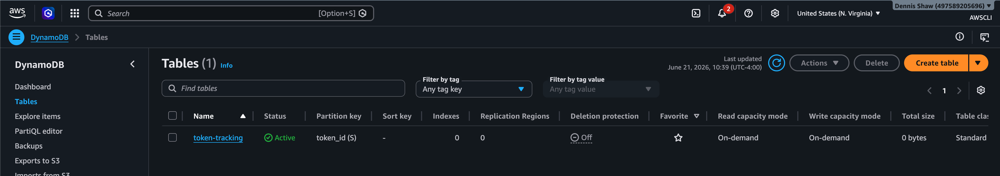

---

### Step 2: Create Week 39 Token Tracking Script

The Week 37 token script was preserved so earlier labs remain reproducible.

A new Week 39 version was created from the existing script.

```bash
cp scripts/get-token-with-secret-hash.py scripts/week39-get-token-with-tracking.py
```

---

### Step 3: Add DynamoDB Write Logic to the Token Script

The `token-tracking` table is empty after creation. The next step is to update the Week 39 token script so each successful Cognito login creates a new item in the table.

Update this file:

```text
scripts/week39-get-token-with-tracking.py
```
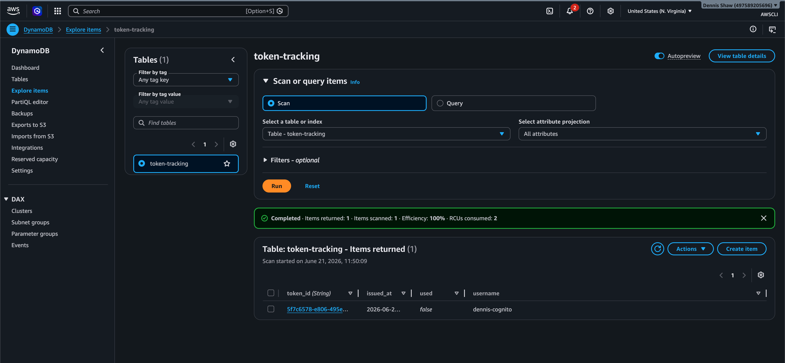

---

## Step 4 — Mark Token Used

### Objective

Update the existing Lambda functions so a successful API request marks the matching token record as used in DynamoDB.

---

### Add DynamoDB Permission to Lambda Role

Go to:
IAM -> Roles -> week33_lambda_role -> Permissions -> Add permissions -> Create inline policy

Select:
- JSON


Paste:

```json
{
  "Version": "2012-10-17",
  "Statement": [
    {
      "Sid": "AllowTokenTrackingUpdates",
      "Effect": "Allow",
      "Action": "dynamodb:UpdateItem",
      "Resource": "arn:aws:dynamodb:us-east-1:497589205696:table/token-tracking"
    }
  ]
}
```

Click: Next

Policy name: DynamoDBTokenTrackingUpdatePolicy


Click: Create policy

---

### Update Python Lambda

Open:

```text
lambda/index.py
```

Replace the file contents with the Week 39 version that:

```text
Reads x-token-id
Updates token-tracking table
Sets used = true
Returns API response
```
---

### Update Node Lambda

Open:

```text
lambda/index.js
```

Replace the file contents with the Week 39 version that:

```text
Reads x-token-id
Updates token-tracking table
Sets used = true
Returns API response
```

---

### Rebuild Lambda Deployment Packages

From the repository root:

```bash
cd lambda

zip -r python.zip index.py
zip -r node.zip index.js

cd ..
```

Expected output:

```text
updating: index.py
updating: index.js
```

---

### Upload Python Lambda Package

Go to: Lambda -> Functions -> python-function -> Code -> Upload from -> .zip file

Select: lambda/python.zip

Click: Update

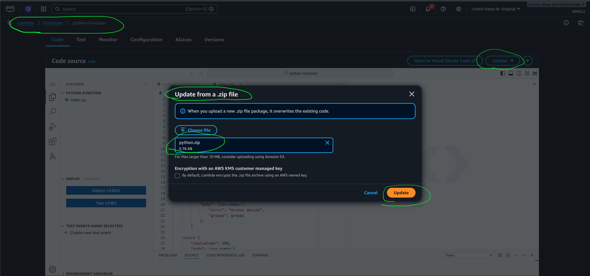

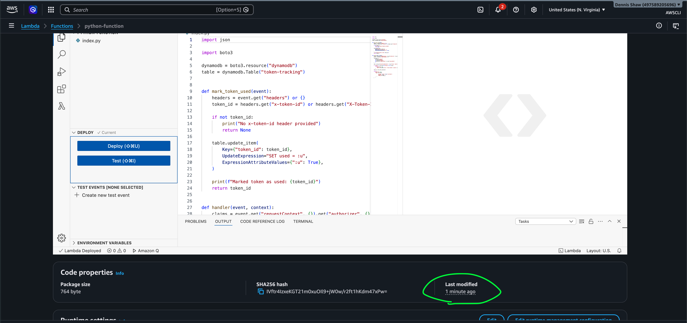

---

### Upload Node Lambda Package

Go to: Lambda -> Functions -> node-function -> Code -> Upload from -> .zip file

Select: lambda/node.zip

Click: Update

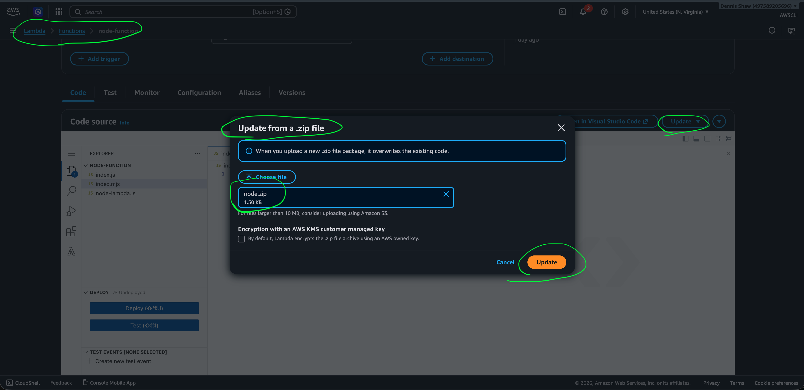

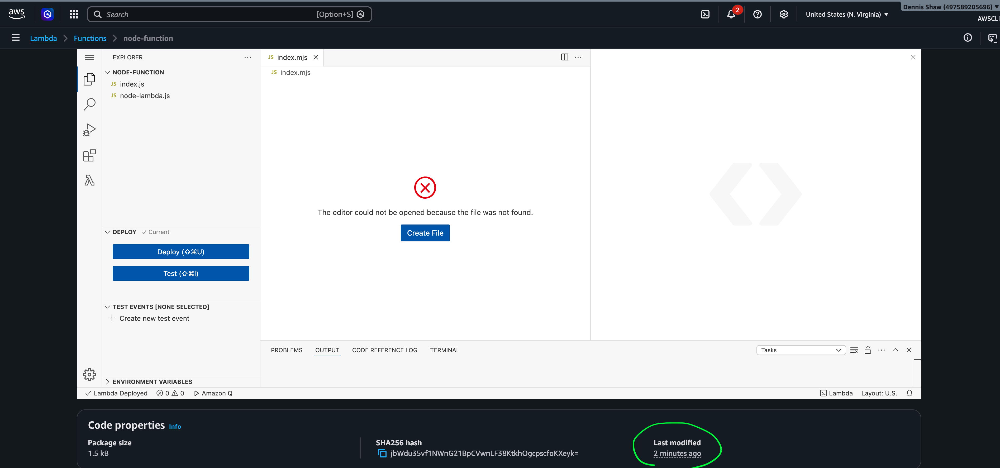

---

### Generate a New Token Record

Run:

```bash
python3 scripts/week39-get-token-with-tracking.py
```

Complete:

```text
Username
Password
App Client Secret
MFA Code
```

When prompted:

```text
Save real curl commands to token-output-local.txt?
```

Enter: YES

---

### Test the Node Endpoint

Open:

```text
token-output-local.txt
```

Copy the Node curl command and execute it.

Expected response:

```json
{
  "message": "HELLO DENNIS FROM NODE!",
  "groups": ["Admin"],
  "token_id": "<token-id>"
}
```

---

### Verify DynamoDB Update

Go to: DynamoDB -> Explore items -> token-tracking

Select: `Scan`

Click: `Run`

Locate the token_id returned by the Node endpoint.

Verify: used = true

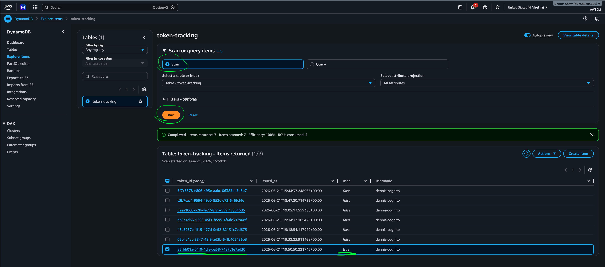

---

## Step 5 — Create Unused Token Detector Lambda

### Objective

Create a Lambda function that scans the token-tracking DynamoDB table and identifies tokens that:

```text
used = false
```

and

```text
issued_at is older than 10 minutes
```

This simulates a simple security monitoring workflow that can later be expanded into automated detection and response.

---

### Create Detector Lambda

Go to: Lambda -> Functions -> Create function

**Configuration:**
- Author from scratch

**Function name:**
- unused-token-detector

**Runtime:**
- Python 3.14

**Open: Additional Settings**
- Enable Custom execution role
- In the **Configure custom exectution role** panel, select:
  - **Execution role:**
    - week33_lambda_role
- Click: `Save`

Click: `Create function`

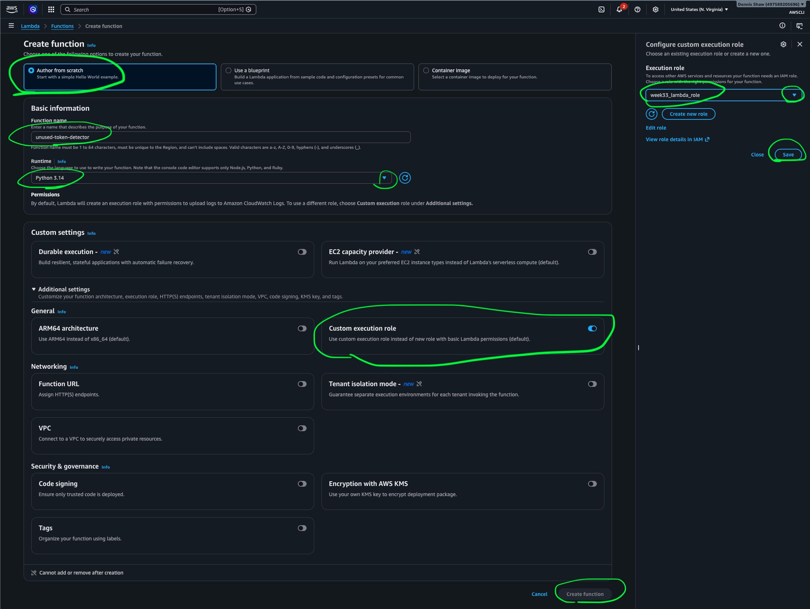

---

### Add DynamoDB Read Permission

Go to: IAM -> Roles -> week33_lambda_role -> Permissions -> Add permissions -> Create inline policy

Select: `JSON`

Paste:

```json
{
  "Version": "2012-10-17",
  "Statement": [
    {
      "Sid": "AllowTokenTrackingRead",
      "Effect": "Allow",
      "Action": [
        "dynamodb:Scan"
      ],
      "Resource": "arn:aws:dynamodb:us-east-1:497589205696:table/token-tracking"
    }
  ]
}
```

Click: `Next`

Policy name: `DynamoDBTokenTrackingReadPolicy`

Click: `Create policy`

---

### Create Detector Code

File:

```text
lambda/unused-token-detector.py
```

Contents:

```python
from datetime import datetime, timedelta, timezone

import boto3

dynamodb = boto3.resource("dynamodb")
table = dynamodb.Table("token-tracking")


def handler(event, context):
    response = table.scan()
    alerts = []

    for item in response["Items"]:
        if item.get("used") is False:
            issued = datetime.fromisoformat(item["issued_at"])

            if issued.tzinfo is None:
                issued = issued.replace(tzinfo=timezone.utc)

            if datetime.now(timezone.utc) - issued > timedelta(minutes=10):
                alert = f"ALERT: Token unused for user {item['username']}"
                print(alert)
                alerts.append(alert)

    return {
        "alerts": alerts,
        "count": len(alerts)
    }
```

---

### Build Deployment Package

From repository root:

```bash
cd lambda

cp unused-token-detector.py index.py

zip -r unused-token-detector.zip index.py

cd ..
```

Expected output:

```text
adding: index.py
```

---

### Deploy Lambda Package

Go to: Lambda -> Functions -> unused-token-detector -> Code -> Update from .zip file

Select:

```text
lambda/unused-token-detector.zip
```

Click: `Save`

---

### Configure Lambda Handler

go to: Lambda -> Functions -> unused-token-detector -> Code -> Runtime settings -> Edit

Set:

```text
Handler: 
index.handler
```

Click: `Save`

---

### Create Test Event

Go to: Lambda -> Functions -> unused-token-detector -> Test

Configuration:

```text
Event name: test

Template: hello-world
```

Click: `Save`


---

### Execute Detector

Click: Test

Expected result:
- Executing function: succeeded

Function output:

```json
{
  "alerts": [
    "ALERT: Token unused for user dennis-cognito"
  ],
  "count": <number_of_unused_tokens>
}
```

CloudWatch log output should contain:

```text
ALERT: Token unused for user dennis-cognito
```

for each matching unused token.

---
**Create Unused token detector test**

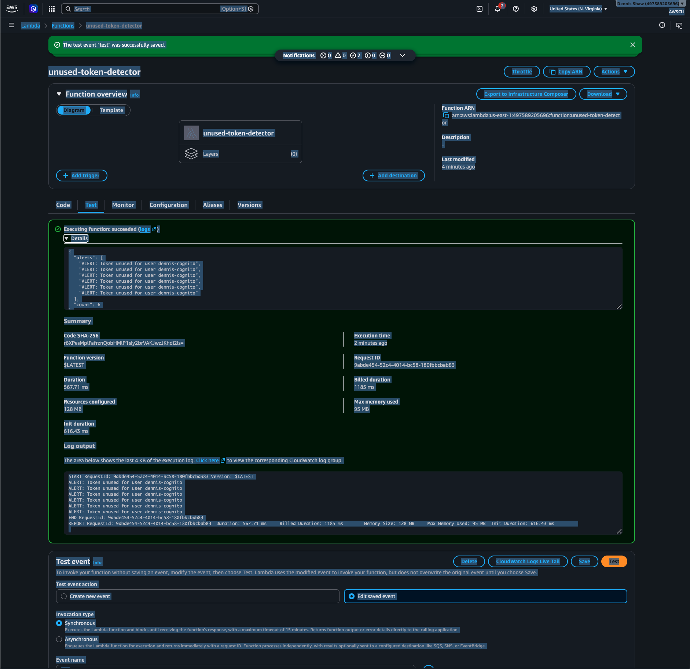

Shows:

```text
Successful detector execution
Alert output
Unused token count
```

---

### Step 5 Complete

Validated:

```text
Lambda detector function
DynamoDB Scan operation
Unused token detection logic
CloudWatch alert generation
Security monitoring foundation
```

---

### Step 6 Create EventBridge Schedule

### Objective

Automatically run the unused-token-detector Lambda every 5 minutes.

Instead of manually testing the detector, EventBridge Scheduler will invoke the Lambda on a recurring schedule and generate CloudWatch alerts whenever unused tokens are detected.

Go to: Amazon EventBridge -> Scheduler -> Schedules -> Create schedule

**Configuration:**

- Schedule name: `unused-token-check`

- Schedule pattern: `Recurring schedule`

- Select:Rate-based schedule

- Then enter:
  - Rate expression: 5 minutes

- Rate expression: `rate(5 minutes)`

- Flexible time window: Off

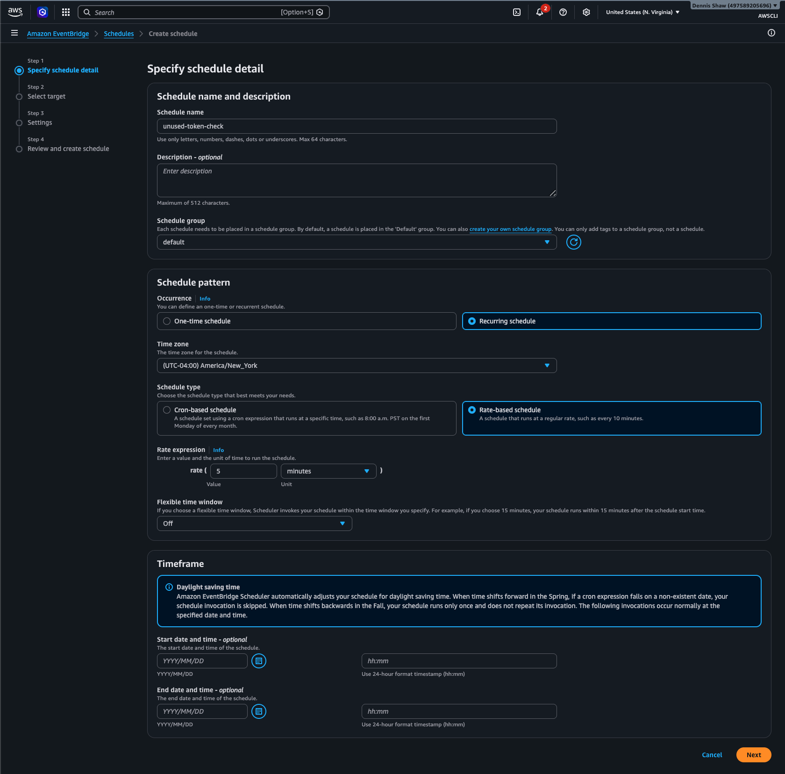

Click: `Next`

---

### Select Target

Target type:

```text
AWS service
```

Select:

```text
Lambda Invoke
```

Target Lambda:

```text
unused-token-detector
```
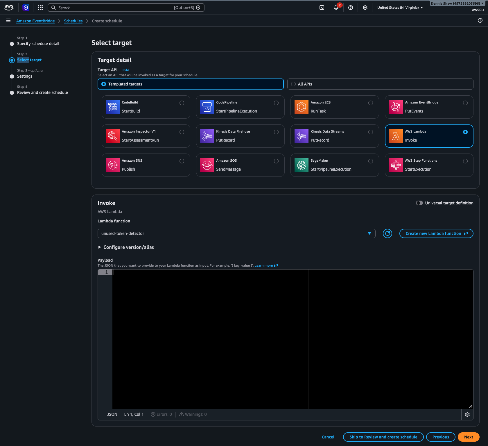

Click: `Next`

---

### Configure Schedule Settings

**Verify:**

- Schedule state: Enable

- Action after schedule completion: None

- Retry policy: Default

- Dead-letter queue: None

- Permissions: Create new role for this schedule

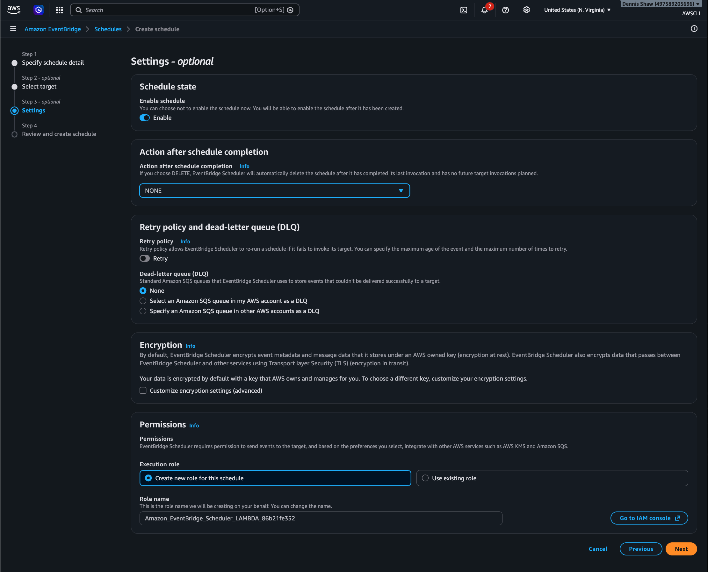

Click: `Next`
---

### Review and Create

**Verify:**

- Schedule name: unused-token-check

- Target: unused-token-detector

- Rate: 5 minutes

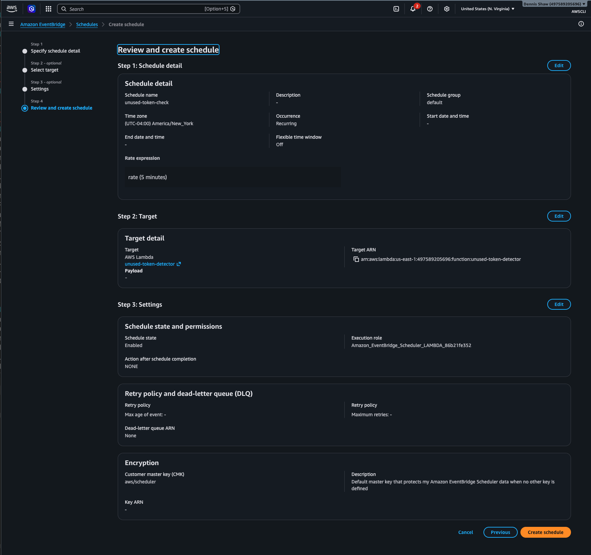

Click: `Create schedule`

---

### Verify Schedule

Go to: Amazon EventBridge -> Scheduler -> Schedules

Verify:
- Schedule: unused-token-check
- Status: Enabled

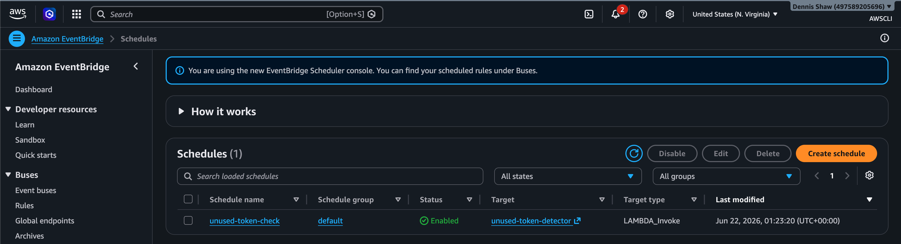

---

### Verify Automatic Execution

Wait approximately: 5 minutes

Then go to: Lambda -> Functions -> unused-token-detector -> Monitor

Verify new invocations are occurring automatically.

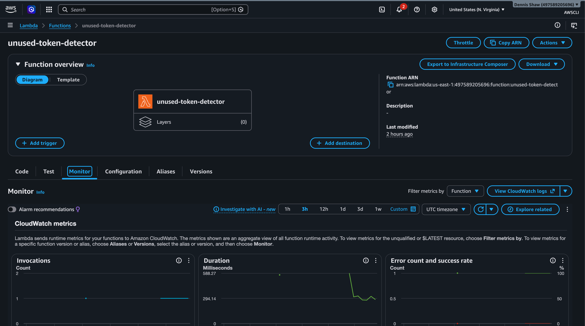

---

### Step 6 Complete

Validated:

```text
EventBridge Scheduler
Recurring Lambda invocation
Automatic detector execution
CloudWatch integration
Scheduled security monitoring
```

---

## Step 7 — Verify CloudWatch Alert Generation

### Objective

Verify that scheduled detector executions generate alert messages in CloudWatch Logs when unused tokens are found.

---

### Open CloudWatch Logs

Go to: Lambda -> Functions -> unused-token-detector -> Monitor -> View CloudWatch logs

Open the newest log stream.

Verify entries similar to:

```text
ALERT: Token unused for user dennis-cognito
```

are present.

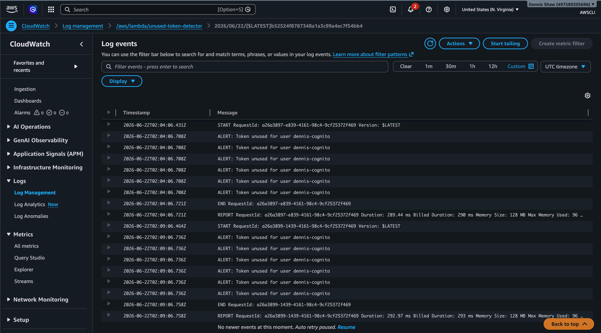

---

### Step 7 Complete

Validated:

```text
CloudWatch Logs integration
Unused token detection
Alert generation
Scheduled monitoring workflow
Security event visibility
```