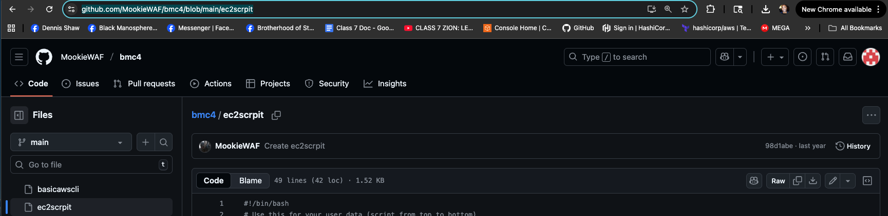

## HW - BE A MAN CHALLENGE 4.1 (10 pts)

- Must be in github repo link
- Create a VPC in your preferred region (must have at least 3 availability zones).  
- Inside your VPC, build a single Windows bastion host within a public subnet, 
- and one Linux web server per availability zone, all  in different private subnets. 
- Each Linux web server should also display different text and pictures. 
- Take screenshots of the running WIndows bastion host, the three Linux servers (highlighting the three different AZs in each photo), 
- and a screenshot of a successful SSH connection to each Linux server from within the bastion host.

##### GetFresh network architecture

Region = Virginia (us-east-1)  
VPC subnet mask = 10.71.0.0/16  

Subnets
| col 1 | col 2| col 3|
| --- | --- | --- |  
| Public | Zone a | 10.71.1.0/24 | 
| Private | Zone a | 10.71.11.0/24 |
| Private | Zone b | 10.71.12.0/24 |
| Private | Zone C | 10.71.13.0/24 |

### Create VPC  
VPC settings  
- VPC and more  

Name tag auto-generation  

- get-fresh  

IPv4 CIDR block
- 10.71.0.0/16

Number of Availabiility Zones (AZs)  
- 3

Number of public subnets
- 1

Number of private subnets
- 3

Customize subnets CIDR blocks
- see subnets above or picture below

Nat gateways ($)  
- In 1 AZ

VPC endpoints
- none

Fill out VPC info

Create VPC

View VPC

### Create Security Groups 

#### Public

#### Private

### Create Instances

Go to ec2 instances 

### Launch public instance

Name an Tags
- get-fresh-public-bastion

Application and OS Images (Amazon Machine Inmage)
- choose window server

Instance Type
- m7i-flex.large

Key pair (login)
- create key pair
- named it get-fresh-public-bastion

Network Settings
- choose edit 

VPC required
- choose vpc created

Subnet
- choose get-fresh-subnet-public1-us-east-1a

Auto-assign public IP
- enable

Firewall (security groups)
- Select existing security group

Common security groups
- get-fresh-public-bastion

Launch instance

### Launch private instance for zone 1a

Amazon Linux

Create Key Pair
get-fresh-private.pem

Network settings
- edit

VPC - required
- choose my vpc created

Subnet
- choose private subnet get-fresh-subnet-private1-us-east-1a

Auto-assign public IP
- disable

Firewall (securtiy groups)
- Select existing securtiy group

Common security groups
- choose private    get-fresh-private

Advanced details
- add script from github <https://github.com/MookieWAF/bmc4/blob/main/ec2scrpitto> to user data
- note: I will manipulate the code after I confirm everything works

### Launch private instance for zone 1b

Launch Instance  - private zone 1a

Launch Instance -private zone 1b

Launch Instance -private zone 1c

Launch instance

### View all instances

### Connect to instance (Windows Bastion)

- copy private IP DNS name  

- go to RDP client  

-  Download remote desktop get-fresh-public.bastion.rdp file

- click get password
- upload private key file
>>- navigate to your get-fresh-public-bastion.pem file and open this creates your begin rsa private key now decrypt password
>>- copy password and run the get-fresh-public.bastion.rdp file and paste the password note user name will be Administrator
>>- password: k%&f0X46?h)1(myH1*Dwm&wJJCxg?!YD

open a terminal in the windows bastion

ping each of your private instances to verify each

go into windows exporer internet and view the private instances
- go to AWS highlight the instances copy the private 1Pv4 addresses or the Private IP DNS names and type in the bastion host http:// + these addresses

>>- zone1a    http://ip-10-72-1-113.ec2.internal (bastion host)
>>- zone1a    http://ip-10-72-11-248.ec2.internal
>>- zone1b    http://ip-10-72-12-82.ec2.internal
>>- zone1c    http://ip-10-72-13-114.ec2.internal

